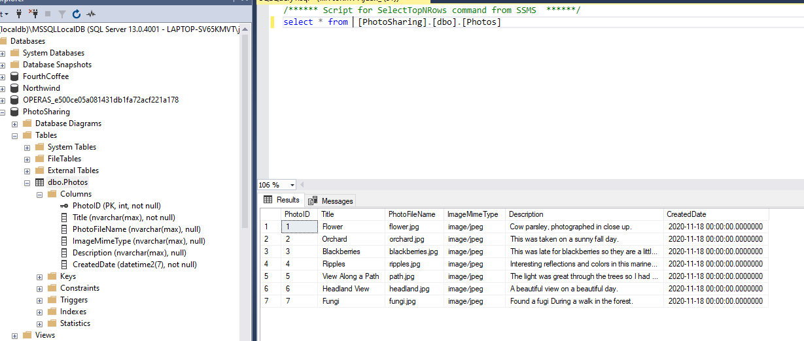
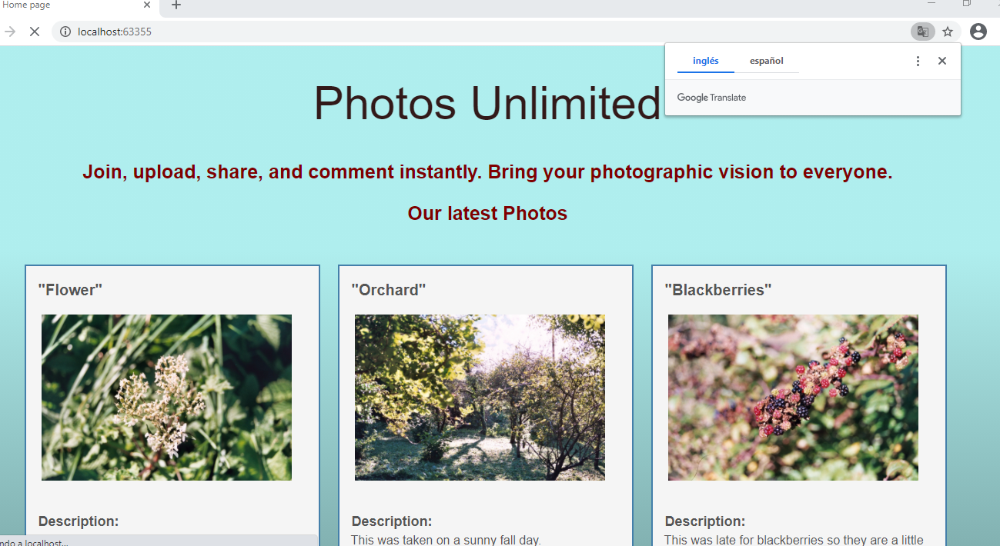

### Module 1: Exploring ASP.NET Core MVC

#### DEMO How to Explore an ASP.NET Core MVC Application

La práctica consiste en explorar la Aplicación MVC 01_PhotoSharingSample


Modelos

Clase Photo
(interesante tema DataAnnotations y tema imagenes)
```c#
`.........
using System.ComponentModel.DataAnnotations;
..........
 public class Photo
    {
        public int PhotoID { get; set; }

        [Required]
        public string Title { get; set; }

        [DisplayName("Picture")]
        [MaxLength]
        public string PhotoFileName { get; set; }

        [HiddenInput(DisplayValue = false)]
        public string ImageMimeType { get; set; }

        [DataType(DataType.MultilineText)]
        public string Description { get; set; }

        [DataType(DataType.DateTime)]
        [DisplayName("Created Date")]
        [DisplayFormat(DataFormatString = "{0:dd/MM/yy}", ApplyFormatInEditMode = true)]
        public DateTime CreatedDate { get; set; }
    }
```
clase PhotoSharingSample :
Microsoft.EntityFrameworkCore  
hereda de DbContext  
el metodo  protected override void OnModelCreating(ModelBuilder modelBuilder)
        {
            modelBuilder.Entity<Photo>().HasData(  

que lo que hace es insertar datos en la base de datos cuando 
crea el modelo
{
  "ConnectionStrings": {
    "PhotoSharingContext": "Server=(localdb)\\MSSQLLocalDB;Database=PhotoSharing;Trusted_Connection=True;MultipleActiveResultSets=true"
  }
}
	
  
	
````
using Microsoft.EntityFrameworkCore;
using System;
using System.Collections.Generic;
using System.Linq;
using System.Threading.Tasks;

namespace PhotoSharingSample.Models
{
    public class PhotoSharingDB : DbContext
    {
        public PhotoSharingDB(DbContextOptions<PhotoSharingDB> options)
           : base(options)
        {

        }

        public DbSet<Photo> Photos { get; set; }

        protected override void OnModelCreating(ModelBuilder modelBuilder)
        {
            modelBuilder.Entity<Photo>().HasData(
                new Photo
                {
                    PhotoID = 1,
                    Title = "Flower",
                    Description = "Cow parsley, photographed in close up.",
                    PhotoFileName = "flower.jpg",
                    ImageMimeType = "image/jpeg",
                    CreatedDate = DateTime.Today
                },
   
````

De los constroladores

fijate en 
```
public IActionResult Index()
        {
            return View(_dbContext.Photos.ToList());
        }
````
y  IActionResult GetImage(int PhotoId) no retorna una vista sino un fichero

````
 public IActionResult GetImage(int PhotoId)
        {
            Photo requestedPhoto = _dbContext.Photos.FirstOrDefault(p => p.PhotoID == PhotoId);
            if (requestedPhoto != null)
            {
                string webRootpath = _environment.WebRootPath;
                string folderPath = "\\images\\";
                string fullPath = webRootpath + folderPath + requestedPhoto.PhotoFileName;

                FileStream fileOnDisk = new FileStream(fullPath, FileMode.Open);
                byte[] fileBytes;
                using (BinaryReader br = new BinaryReader(fileOnDisk))
                {
                    fileBytes = br.ReadBytes((int)fileOnDisk.Length);
                }
                return File(fileBytes, requestedPhoto.ImageMimeType);
            }
            else
            {
                return NotFound();
            }
        }
````

y en los constructores.


y por último la vista
Interensante @model IEnumerable<PhotoSharingSample.Models.Photo>  
no usa layout
usa   @Html.DisplayNameFor(model => model.Description): y @Html.DisplayFor(model => item.Description)  
y la imagen la carga llamando al controlador src="@Url.Action("GetImage", "Home", new { PhotoId = item.PhotoID })"   
````
@model IEnumerable<PhotoSharingSample.Models.Photo>

@{
    Layout = null;
}

<!DOCTYPE html>

<html>
<head>
    <meta name="viewport" content="width=device-width" />
    <title>Home page</title>

    <link type="text/css" rel="stylesheet" href="~/css/photo-sharing-styles.css" />
</head>
<body>
    <h1 class="main-title">Photos Unlimited</h1>
    <p class="into">Join, upload, share, and comment instantly. Bring your photographic vision to everyone.</p>
    <p class="into">Our latest Photos</p>
    <br />
    @foreach (var item in Model)
    {
        <div class="photo-index-card">
            <h3 class="display-picture-title">
                "@Html.DisplayFor(modelItem => item.Title)"
            </h3>
            @if (item.PhotoFileName != null)
            {
                <div class="photo-display">
                    
                </div>
            }

            <div>
                <span class="display-label">
                    @Html.DisplayNameFor(model => model.Description):
                </span>
                <br />
                <span class="display-field">
                    @Html.DisplayFor(model => item.Description)
                </span>
            </div>

            <div>
                <span class="display-label">
                    @Html.DisplayNameFor(model => model.CreatedDate):
                </span>
                <span class="display-field">
                    @Html.DisplayFor(model => item.CreatedDate)
                </span>
            </div>
        </div>
    }
</body>
</html>

````


  
