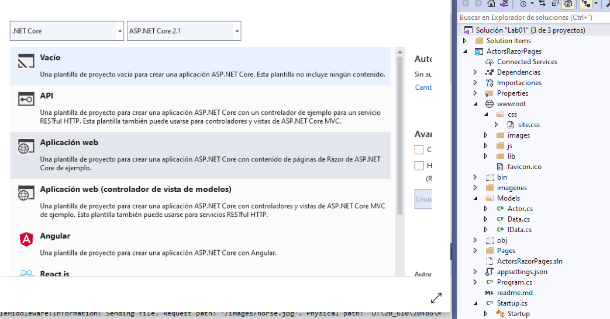
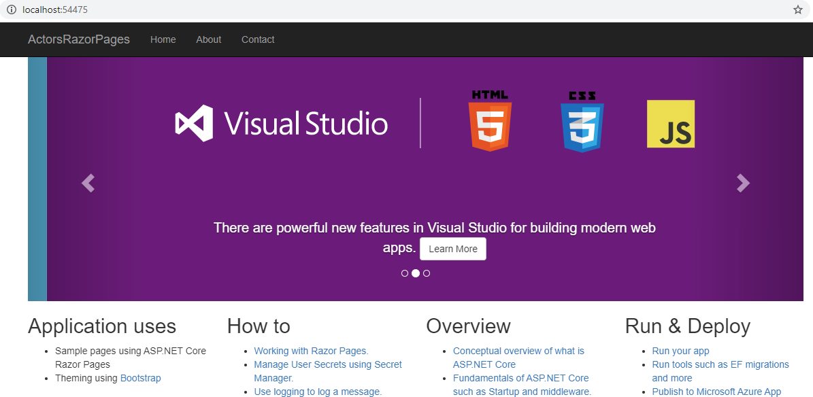
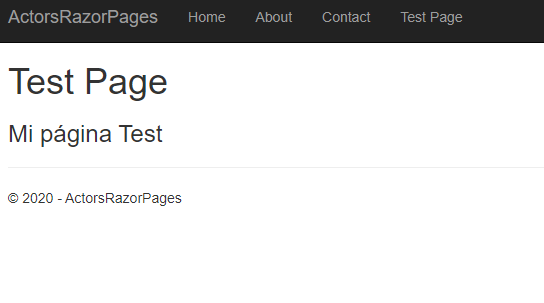
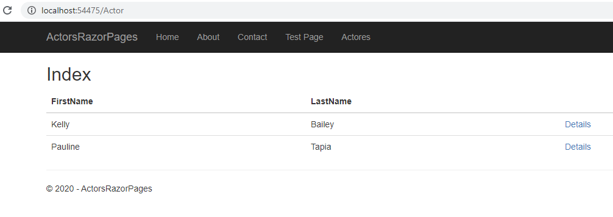
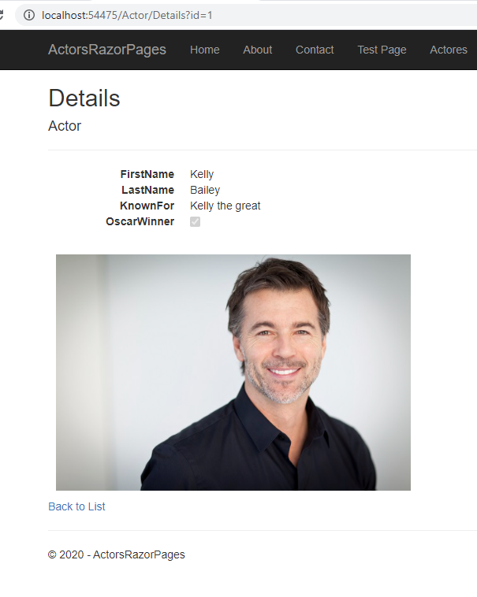
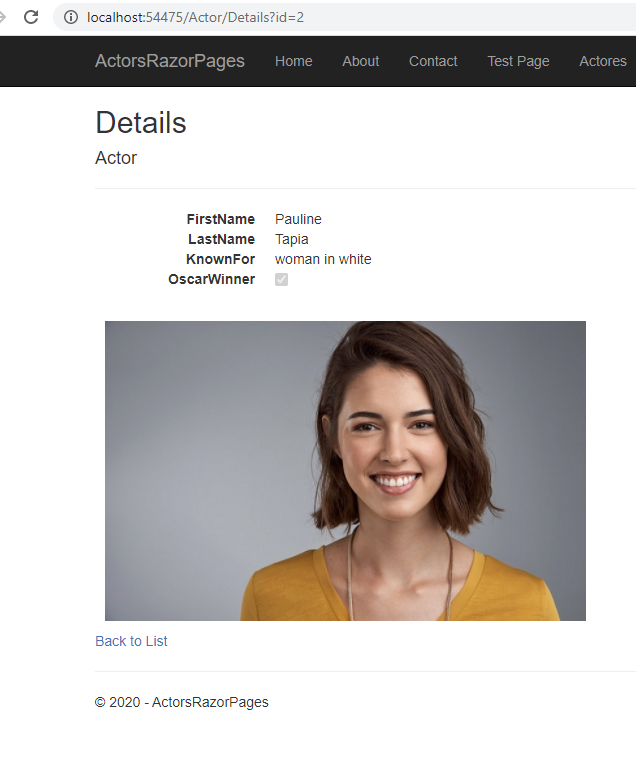

## LABORATORIO: Module 1: Exploring ASP.NET Core MVC

### Lab: Exploring ASP.NET Core MVC  

#### 1 ASP.NET Core Web Application

Creamos el proyecto y lo examinamos 

  

Oserva com esta la carpeta wwwroot donde vamos a guardar los css, js ,imagenes, etc..

(me he creado la carpeta imagenes para las imagenes del readme)

y ejecutamos

 


Añadimos una nueva Página de razorTest: Test.cshtml

```cshtml
@page                         // Esta directiva hace que incluya todo el código _layout
@model TestModel              // indica el modelo


@{
    ViewData["Title"] = "Test Page";
}

<h1>@ViewData["Title"]</h1>
<h3>@Model.Message</h3>      
````  

Test.cshtml.cs

````c#
using System;
using System.Collections.Generic;
using System.Linq;
using System.Threading.Tasks;
using Microsoft.AspNetCore.Mvc;
using Microsoft.AspNetCore.Mvc.RazorPages;

namespace ActorsRazorPages.Pages
{
    public class TestModel : PageModel
    {
        public string Message { get; set; }

        public void OnGet()
        {
            Message = "Mi página Test";
        }
    }
}
```` 


y añadimos el enlace en _Layout.cshtml  
```c#
<div class="navbar-collapse collapse">
    <ul class="nav navbar-nav">
        <li><a asp-page="/Index">Home</a></li>
        <li><a asp-page="/About">About</a></li>
        <li><a asp-page="/Contact">Contact</a></li>
        <li><a asp-page="/Test">Test Page</a></li>
    </ul>
</div>
````


 

Con que poquito se hace una página razor ;)

bueno la práctica también nos pide añadir una pagina de Actores que cargará una tabla de una lista de Actores y se podrá acceder al detalle del actor seleccionado.


Lo prinero vamos a crear el Modelo de Datos (es importante entenderlo ya que el resto de las aplicaciones sequiran esta técnica)

una clase Actor con las propiedades de los Actores  
una interfaz IData que expone una Lista < Actor >,  un Metodo ActorsInitializeData que carga los datos y devuelve una Lista<Actor> y un metodo Get (int? Id)  
y nos traemos la clase Data que implementa la Interfaz

````c#
public class Actor 
{
    public int Id { get; set; }
    public string FirstName { get; set; }
    public string LastName { get; set; }
    public string KnownFor { get; set; }
    public bool OscarWinner { get; set; }
    public string ImageName { get; set; }
}

public interface IData
{
    List<Actor> ActorsList { get; set; }
    List<Actor> ActorsInitializeData();
    Actor GetActorById(int? id);
}

public class Data : IData
{
    public List<Actor> ActorsList { get; set; }

    public List<Actor> ActorsInitializeData()
    {
        ActorsList = new List<Actor>()
        {
            new Actor(){Id = 1,FirstName="Kelly",LastName="Bailey" ,KnownFor="Kelly the great",OscarWinner=true,ImageName="actor.jpg"},
            new Actor(){Id = 2,FirstName ="Pauline ",LastName="Tapia" ,KnownFor="woman in white",OscarWinner=true,ImageName="actress.jpg"}
        };

        return ActorsList;
    }

    public Actor GetActorById(int? id)
    {
        if (id == null)
        {
            return null;
        }
        else
        {
            return ActorsList.SingleOrDefault(a => a.Id == id);
        }
    }
}
``````


Una vez que tenemos el modelo de datos creamos la página Actores.Index
este es el codebehind  
````c#
using System;
using System.Collections.Generic;
using System.Linq;
using System.Threading.Tasks;
using ActorsRazorPages.Models;
using Microsoft.AspNetCore.Mvc;
using Microsoft.AspNetCore.Mvc.RazorPages;

namespace ActorsRazorPages.Pages.Actors
{
    public class IndexModel : PageModel
    {
        private IData _data;          // campo _data de tipo IData (tenía una propiedad lista, un metodo que inicializaba la lista y un getactor())

        public IndexModel(IData data) // el contructor, carga _data
        {
            _data = data;
        }

        public IList<Actor> Actors { get; set; }  // una lista publcia

        public void OnGet()
        {
            Actors = _data.ActorsInitializeData();  // cuando carga la página se inicializa
        }
    }
}
````

y esto es el razor (no tiene nada utiliza el models de Actors.IndexModel, y presenta la lista en la tabla )   

````html
@page
@model ActorsRazorPages.Pages.Actors.IndexModel
@{
    ViewData["Title"] = "Index";
}

<h2>Index</h2>

<table class="table">
    <thead>
        <tr>
            <th>
                @Html.DisplayNameFor(model => model.Actors[0].FirstName)
            </th>
            <th>
                @Html.DisplayNameFor(model => model.Actors[0].LastName)
            </th>
            <th></th>
        </tr>
    </thead>
    <tbody>
        @foreach (var item in Model.Actors)
        {
            <tr>
                <td>
                    @Html.DisplayFor(modelItem => item.FirstName)
                </td>
                <td>
                    @Html.DisplayFor(modelItem => item.LastName)
                </td>
                <td>
                    <a asp-page="./Details" asp-route-id="@item.Id">Details</a> <!-- interesante el routing !!!->
                </td>
            </tr>
        }
    </tbody>
</table>
````

el enlace va a la página Details y le pasa el id del actor


````c#
 public class DetailsModel : PageModel
    {
        private IData _data;

        public Actor Actor { get; set; }

        public DetailsModel(IData data)
        {
            _data = data;
        }

        public IActionResult OnGet(int? id)   // aqui esta el quiz
        {
            if (id == null)
            {
                return NotFound();
            }

            Actor = _data.GetActorById(id);

            if (Actor == null)
            {
                return NotFound();
            }
            return Page();
        }
    }
````
el cshtml es sencillo`ya que en el onget(int id) recuperamos el actor solo queda randerizarlo con en Actor.Index()
````
@page
@model ActorsRazorPages.Pages.Actors.DetailsModel
@{
    ViewData["Title"] = "Details";
}

<h2>Details</h2>

<div>
    <h4>Actor</h4>
    <hr />
    <dl class="dl-horizontal">
        <dt>
            @Html.DisplayNameFor(model => model.Actor.FirstName)
        </dt>
        <dd>
            @Html.DisplayFor(model => model.Actor.FirstName)
        </dd>
        <dt>
            @Html.DisplayNameFor(model => model.Actor.LastName)
        </dt>
        <dd>
            @Html.DisplayFor(model => model.Actor.LastName)
        </dd>
        <dt>
            @Html.DisplayNameFor(model => model.Actor.KnownFor)
        </dt>
        <dd>
            @Html.DisplayFor(model => model.Actor.KnownFor)
        </dd>
        <dt>
            @Html.DisplayNameFor(model => model.Actor.OscarWinner)
        </dt>
        <dd>
            @Html.DisplayFor(model => model.Actor.OscarWinner)
        </dd>
    </dl>
    <div style="padding:10px;">
        @if (Model.Actor.ImageName != "")
        {
            
        }
    </div>
</div>
<div>
    <a asp-page="./Index">Back to List</a>
</div>
````


Por últimp añadimos el enlace a Shared/_layout.cshtml
````html
<div class="navbar-collapse collapse">
                <ul class="nav navbar-nav">
                    <li><a asp-page="/Index">Home</a></li>
                    <li><a asp-page="/About">About</a></li>
                    <li><a asp-page="/Contact">Contact</a></li>
                    <li><a asp-page="/Test">Test Page</a></li>
                    <li><a asp-page="/Actor/Index">Actores</a></li> <!-- Observa que es a /Actor/Index  y no a /Index">
                </ul>
            </div>
`````


Finalmente modificamos el Startup.cs 
añadiendo el modelo de datos y el services.AddSingleton<IData, Data>();

````
using Microsoft.Extensions.DependencyInjection;
.......
using ActorsRazorPages.Models
..................

// This method gets called by the runtime. Use this method to add services to the container.
public void ConfigureServices(IServiceCollection services)
{
    services.AddSingleton<IData, Data>();
    services.Configure<CookiePolicyOptions>(options =>
    {
        // This lambda determines whether user consent for non-essential cookies is needed for a given request.
        options.CheckConsentNeeded = context => true;
        options.MinimumSameSitePolicy = SameSiteMode.None;
    });


    services.AddMvc().SetCompatibilityVersion(CompatibilityVersion.Version_2_1);
}
`............
````


  


  
Observa que el id se pasa por querystring
  