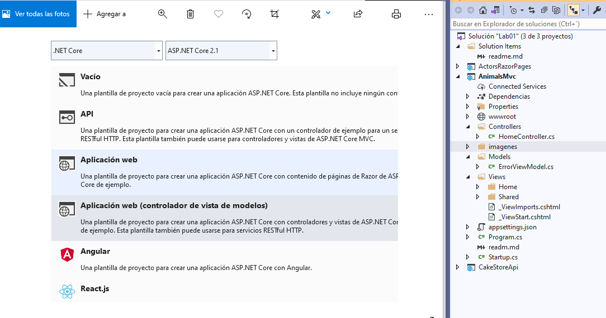

## LABORATORIO: Module 1: Exploring ASP.NET Core MVC

### Lab: Exploring ASP.NET Core MVC  

#### 2 ASP.NET Core Web Application MVC

Ahora el Proyecto es Aplicación Web (controlodaor vista de Modelos) MVC

  


Lo Primero Modelos crearemos una clase animals.cs una interfaz IData y una clase Data igual que los ejercicios anteriores (ya esta explicado..)

```` c#
    public class Animal
    {
        public int Id { get; set; }
        public string Name { get; set; }
        public string ImageName { get; set; }
        public string UniqueInformation { get; set; }
        public String Category { get; set; }
    }

    public interface IData
    {
        List<Animal> AnimalsList { get; set; }
        List<Animal> AnimalsInitializeData();
        Animal GetAnimalById(int? id);
    }

    public class Data : IData
    {
        public List<Animal> AnimalsList { get; set; }

        public List<Animal> AnimalsInitializeData()
        {
            AnimalsList = new List<Animal>()
            {
                new Animal(){
                    Id = 1,
                    Name = "Lion",
                    Category = "Mammal",
                    UniqueInformation = "white lions exist in South Africa.",
                    ImageName = "lion.jpg"},
                new Animal(){Id = 2,
                    Name = "Horse",
                    Category = "Mammal",
                    UniqueInformation = "Acording to previous Studies horses can  understand  words.",
                    ImageName = "horse.jpg"},
                new Animal(){Id = 3,
                    Name = "Swan",
                    Category = "Bird",
                    UniqueInformation = "Swans can fly approximately 60 miles per hour.",
                    ImageName = "swan.jpg"},
                new Animal(){Id = 4,
                    Name = "Octopus",
                    Category = "Fish",
                    UniqueInformation = "Acording to previous Studies octopus learn easily by observation of another octopus.",
                    ImageName = "octopus.jpg"}
            };

            return AnimalsList;
        }

        public Animal GetAnimalById(int? id)
        {
            if (id == null)
            {
                return null;
            }
            else
            {
                return AnimalsList.SingleOrDefault(a => a.Id == id);
            }
        }
    }

````

Àhora al controlador en este caso creamos Controlador MVC Vacio y los llamamos AnimalsController 


  


necesitaremos añadirle el modelo using AnimalsMvc.Models;  
e  implementar dos metodos al controloador index y Details  
Similar a los ejercicios anterires tendremos un campo IData _data que se creará en el constructor  
el metodo Index cargará los datos desde la Inizialición  y lo cargará en un onjeto IndexViewModel (es un simple public List<Animal> Animals { get; set; } para pasarle a la vista solo lo que necesita)
y retronara a la vista pasandole el objeto

el metodo IActionResult Details(int? id)  cargara el animal y lo retornará a la vista(animal)

```` c#
using System;
using System.Collections.Generic;
using System.Linq;
using System.Threading.Tasks;
using Microsoft.AspNetCore.Mvc;
using AnimalsMvc.Models;

namespace AnimalsMvc.Controllers
{
    public class AnimalsController : Controller
    {
        private IData _tempData;

        public AnimalsController(IData tempData)
        {
            _tempData = tempData;
        }

        public IActionResult Index()
        {
            List<Animal> animals = _tempData.AnimalsInitializeData();
            IndexViewModel indexViewModel = new IndexViewModel();
            indexViewModel.Animals = animals;
            return View(indexViewModel);
        }

        public IActionResult Details(int? id)
        {
            var model = _tempData.GetAnimalById(id);
            if (model == null)
            {
                return NotFound();
            }
            return View(model);
        }
    }
}

````

Bueno me había dejado el IndexViewModel

````
using System;
using System.Collections.Generic;
using System.Linq;
using System.Threading.Tasks;

namespace AnimalsMvc.Models
{
    public class IndexViewModel
    {
        public List<Animal> Animals { get; set; }
    }
}
````


Ahora un poquito de mágia.
Nos situamos sobre Index pulsamos botón derecho y crear la vista

Nos creamos las vistas asociadas a cada metodo del controlador
  

De forma similar al ejercicio de razor las implementamos.
Observa que ya no hay code behind ya que el code behind es el controlador  

````html
@model IndexViewModel` // fijate que es la lista que pasamos desde el controlador

@{
    ViewData["Title"] = "Index";
}

<h2>Index</h2>

<table class="table">
    <thead>
        <tr>
            <th>
                @Html.DisplayNameFor(model => model.Animals[0].Name)
            </th>
            <th>
                @Html.DisplayNameFor(model => model.Animals[0].Category)
            </th>
            <th></th>
        </tr>
    </thead>
    <tbody>
        @foreach (var item in Model.Animals)
        {
            <tr>
                <td>
                    @Html.DisplayFor(modelItem => item.Name)
                </td>
                <td>
                    @Html.DisplayFor(modelItem => item.Category)
                </td>
                <td>
                    <a asp-action="Details" asp-route-id="@item.Id">Details</a>
                </td>
            </tr>
        }
    </tbody>
</table>


@model Animal

@{ ViewData["Title"] = "Details"; }

<h2>Details</h2>

<div>
    <h4>Animal</h4>
    <hr />
    <dl class="dl-horizontal">
        <dt>
            @Html.DisplayNameFor(model => model.Name)
        </dt>
        <dd>
            @Html.DisplayFor(model => model.Name)
        </dd>
        <dt>
            @Html.DisplayNameFor(model => model.Category)
        </dt>
        <dd>
            @Html.DisplayFor(model => model.Category)
        </dd>
        <dt>
            @Html.DisplayNameFor(model => model.UniqueInformation)
        </dt>
        <dd>
            @Html.DisplayFor(model => model.UniqueInformation)
        </dd>
    </dl>

    <div style="padding:10px;">
        @if (Model.ImageName != "")
        {
}

    </div>
</div>
<div>
    <a asp-action="Index">Back to List</a>
</div>
````

ya sólo falta aáñadir el enlace al menu nav de layout
````c#
<div class="navbar-collapse collapse">
    <ul class="nav navbar-nav">
        <li><a asp-area="" asp-controller="Home" asp-action="Index">Home</a></li>
        <li><a asp-area="" asp-controller="Home" asp-action="About">About</a></li>
        <li><a asp-area="" asp-controller="Home" asp-action="Contact">Contact</a></li>
        <li><a asp-area="" asp-controller="Animals" asp-action="Index">Animals</a></li>
    </ul>
````
Observa que en MVC  
 asp-controller="Animals" nos dice ve al controlador  
 y ejecuta asp-action="Index" , que es un metodo ue me va a devolver una vista

(ojo no todos los metodos devuelven vistas).


y el tema del AddSingleton en Startup.cs ya que si no nos un errorazo
````
 using AnimalsMvc.Models;

public void ConfigureServices(IServiceCollection services)
        {
            services.AddSingleton<IData, Data>();

            services.Configure<CookiePolicyOptions>(options =>
            {
                options.CheckConsentNeeded = context => true;
                options.MinimumSameSitePolicy = SameSiteMode.None;
            });

            services.AddMvc().SetCompatibilityVersion(CompatibilityVersion.Version_2_1);
        }
``````

Para que veas el error sin AddSingleton no pasa nada añadelo en  Startup.cs 
  

Solucionado


  
  