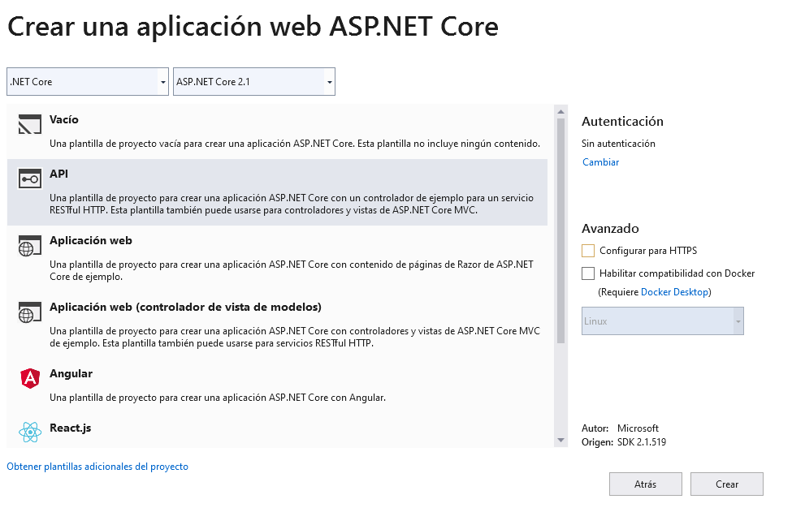
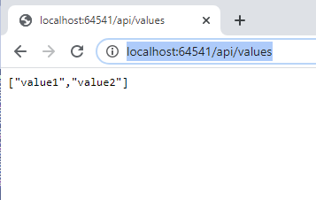
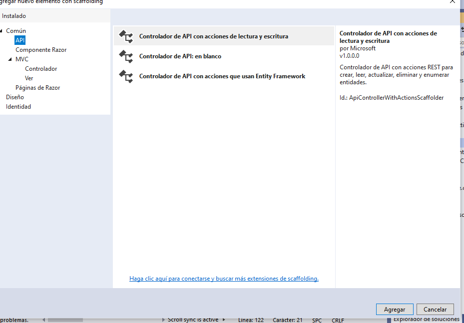
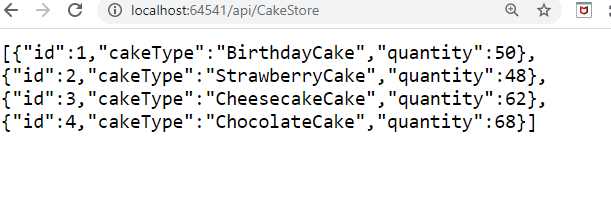
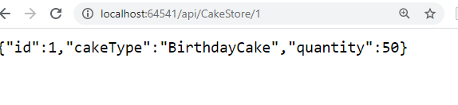

## LABORATORIO: Module 1: Exploring ASP.NET Core MVC

### Lab: Exploring ASP.NET Core MVC  

#### 2 ASP.NET Core Web API Application

Creamos el proyecto pero esta vez API WEB

  

Una web Api no implementa una capa de usuario sino que reccibe peticiones ya sea a traves de GET, POST, PUT ..... comunicandose con aplicaciones externas atraves de Json ó XML normalmente.


Net proporciona una carpeta Controllers y dentro de ella ValuesController.cs
nosotros vamos a implementar el método GET en este caso que es el metodo por defecto  
por defecto la routa es api/values  GET  
[Route("api/[controller]")]  

  

````c# 
using Microsoft.AspNetCore.Mvc;
using System;
using System.Collections.Generic;
using System.Linq;
using System.Threading.Tasks;

namespace CakeStoreApi.Controllers
{
    [Route("api/[controller]")]
    [ApiController]
    public class ValuesController : ControllerBase
    {
        // GET api/values
        [HttpGet]
        public ActionResult<IEnumerable<string>> Get()
        {
            return new string[] { "value1", "value2" };
        }

        // GET api/values/5
        [HttpGet("{id}")]
        public ActionResult<string> Get(int id)
        {
            return "value";
        }

        // POST api/values
        [HttpPost]
        public void Post([FromBody] string value)
        {
        }

        // PUT api/values/5
        [HttpPut("{id}")]
        public void Put(int id, [FromBody] string value)
        {
        }

        // DELETE api/values/5
        [HttpDelete("{id}")]
        public void Delete(int id)
        {
        }
    }
}
````

bueno pues al lio.

La aplicación va a crear una clase CakeStore, e igual que en el ejercicio anterior una Interfaz IData y una clase Data que implemetara esta interfaz
revisa el modelo anterior porque sique la misma metodología.

````c#
public class CakeStore
{
    public int Id { get; set; }
    public string CakeType { get; set; }
    public int Quantity { get; set; }

}
public interface IData
{
    List<CakeStore> CakesList { get; set; }
    List<CakeStore> CakesInitializeData();
    CakeStore GetCakeById(int? id);
}

public class Data : IData
    {
        public List<CakeStore> CakesList { get; set; }

        public List<CakeStore> CakesInitializeData()
        {
            CakesList = new List<CakeStore>()
            {
                new CakeStore(){Id = 1,CakeType = "BirthdayCake", Quantity = 50},
                new CakeStore(){Id = 2,CakeType = "StrawberryCake",Quantity = 48},
                new CakeStore(){Id = 3,CakeType = "CheesecakeCake",Quantity = 62},
                new CakeStore(){Id = 4, CakeType = "ChocolateCake", Quantity = 68}
            };

            return CakesList;
        }

        public CakeStore GetCakeById(int? id)
        {
            if (id == null)
            {
                return null;
            }
            else
            {
                return CakesList.SingleOrDefault(a => a.Id == id);
            }
        }
    }
````

ya tenemos el modelo ahora el controlador (lo llaamaremos CakeStoreApiController en la carpeta Controllers)

  

````c#
using Microsoft.AspNetCore.Http;
using Microsoft.AspNetCore.Mvc;
using System;
using System.Collections.Generic;
using System.Linq;
using System.Threading.Tasks;
using CakeStoreApi.Models;

namespace CakeStoreApi.Controllers
{
    [Route("api/[controller]")]
    [ApiController]
    public class CakeStoreApiController : ControllerBase
    {
        private IData _data;                      // campo _data de tipo IData

        public CakeStoreApiController(IData data)  // el constructor recibe un Idata y se lo asigna a _data 
        {
            _data = data;
        }

        [HttpGet("/api/CakeStore")]                   // Metodo Get api/cakeSotre
        public ActionResult<List<CakeStore>> GetAll() // ejecutar este método
        {
            return _data.CakesInitializeData();       // retorna la lista inicializada
        }

        [HttpGet("/api/CakeStore/{id}", Name = "GetCake")] // Metodo Get api/cakeSotre/id  ejemplo//  api/cakeSotre/1
        public ActionResult<CakeStore> GetById(int? id)
        {
            var item = _data.GetCakeById(id);               //ejecuta el metodo GetCakeById(id);  y si existe lo devuelve
            if (item == null)
            {
                return NotFound();
            }
            return new ObjectResult(item);
        }
    }
}

````


Modificamos el Straup.cs con el AddSingleton

ya que si no da error...
````
using CakeStoreApi.Models;
services.AddSingleton<IData, Data>();

````


  

 


Por último si quieres que la ruta api/CakeStore sea por defecto 
modifica el Propierties/launchSettings.json
````
{
  "$schema": "http://json.schemastore.org/launchsettings.json",
  "iisSettings": {
    "windowsAuthentication": false, 
    "anonymousAuthentication": true, 
    "iisExpress": {
      "applicationUrl": "http://localhost:64541",
      "sslPort": 0
    }
  },
  "profiles": {
    "IIS Express": {
      "commandName": "IISExpress",
      "launchBrowser": true,
      "launchUrl": "api/CakeStore",
      "environmentVariables": {
        "ASPNETCORE_ENVIRONMENT": "Development"
      }
    },
    "CakeStoreApi": {
      "commandName": "Project",
      "launchBrowser": true,
      "launchUrl": "api/CakeStore",
      "applicationUrl": "http://localhost:5000",
      "environmentVariables": {
        "ASPNETCORE_ENVIRONMENT": "Development"
      }
    }
  }
}
``````````