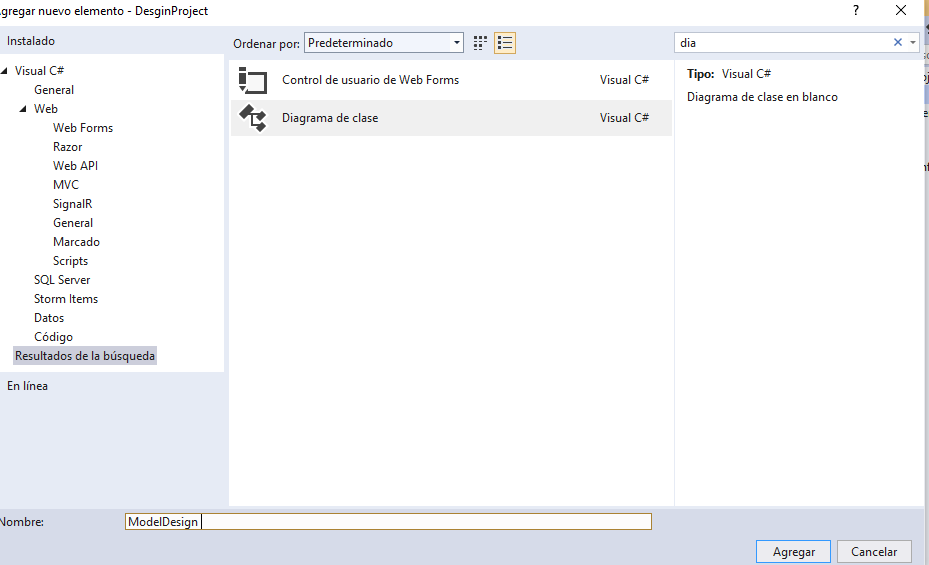
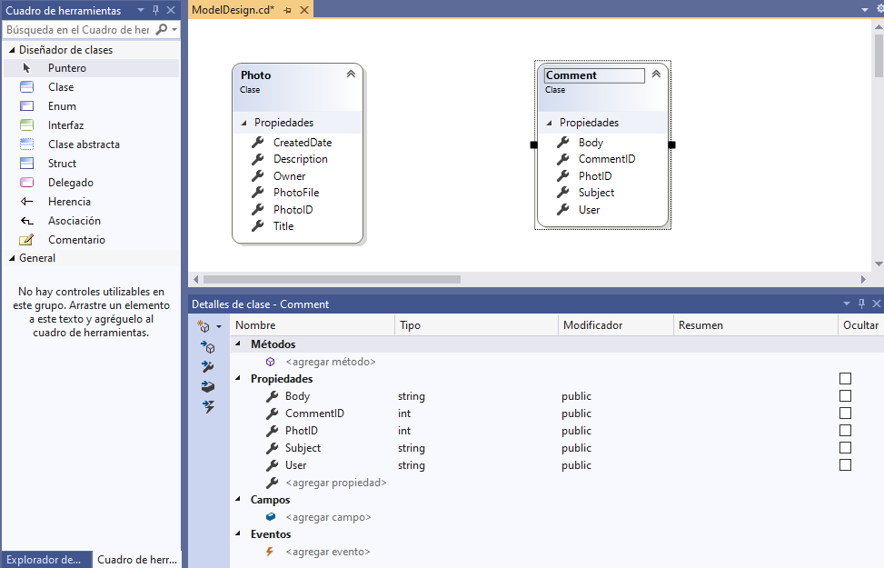
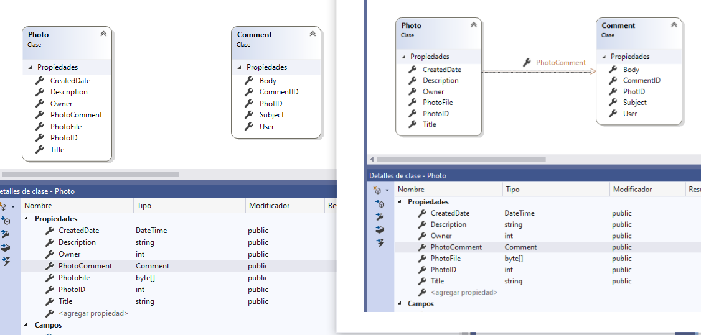
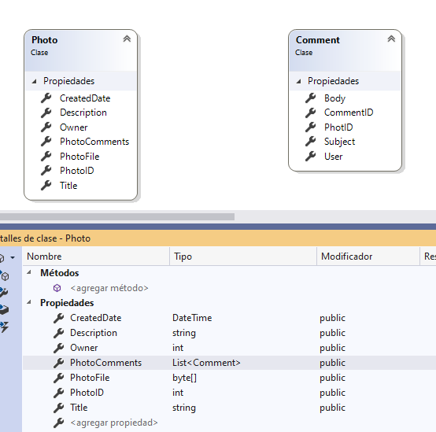
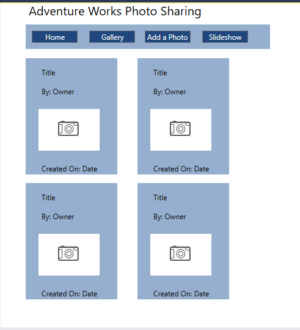
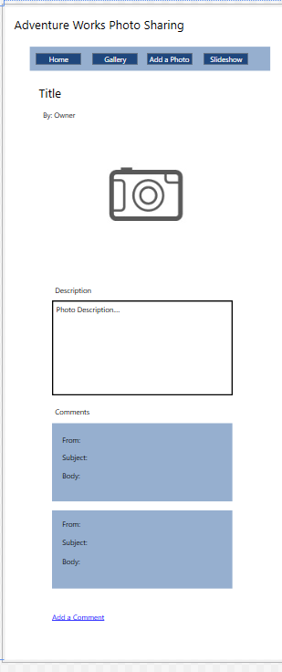

## Module 2: Designing ASP.NET Core MVC Web Applications

###  LABORATORIO Lab: Designing ASP.NET Core MVC Web Applications

Se trata de realizar un analisis inicial de un proyecto de aplicación web para compartir fotos.

Para ello disponemos del documento [InitialInvestigation_ES.docx](documentacion/InitialInvestigation_ES.docx)

Con los datos expuestos nos piden rellenar la documentación [DetailedPlanningDocument_ES.docx](documentacion/DetailedPlanningDocument_ES.docx)

Así mismo haremos uso de la herramienta de Diseñador de Clases de VBStudio 2019.

| Modelo de Clases | Descripción | Propiedades |Tipos de Datos
| :---: | --- | :---: |  :---:
| Photo | Id de la foto | __PhotoID__ | Integer
| |	Titulo |  Title	| String
| | Fichero en format byte[] |PhotoFile | Byte[]
| | Descripcion | Description |	String
| | Feha de creacción | CreatedDate	| Datetime
| | Owner (id del usuario, ya se implementara) | Owner | Integer
| Comment | Id  | __CommentID__  | Integer
| | User  string ya que puede ser anonimo  | User  |  String
| | Asunto | Subject | String
| | Cuerpo del comentario | Body | String
| | Id de la foto | __PhotoID__  | Integer


Una vez que tenemos definidas las clases abriremos un nuevo proyecto en VBStudio (en el documento pone WPF FrameWork 4.7) , y añadiremos un nuevo Diagrama de Clases.
yo he utilizado un MVC F 4.8.



una vez creadas las clases pulsamos sobre ella botón derecho ver código y modificamos el get de las propiedades get => default(<Tipo>); 

````c#
public int PhotoID
{
	get => default(int);
	set
	{
	}
}
````

Para finalizar añadiremos la asociación entre las dos clases
 Photo 1 : N Comment
 
 Para ello en la barra de Herramientas pinchamos asociación despues click en Photo y despues click En Comment
 
  
 
 Le cambiamos el nombre por PhotoComent y grabamos el diagrama.
 
Es posible mostrarla como asociación o como propiedad  
 
  
 
 
 La asociacion lo que nos hace es una relación 1 : 1  
 public Comment PhotoComment  
 Para hacerla 1: N modificamos el código por 		
 public List<Comment> PhotoComments  
 
 y con ello ya estaría el Modelo de Clases.
 
  
 
 ````c# 
using System;
using System.Web;
using System.Web.Services;
using System.Web.Services.Protocols;
using System.ComponentModel;

namespace DesginProject
{
    public class Comment
    {
        public int CommentID
        {
            get => default(int);
            set { }
        }

        public string User
        {
            get => default(string);
            set { }
        }

        public string Subject
        {
            get => default(string);
            set { }
        }

        public string Body
        {
            get => default(string);
            set { }
        }

        public int PhotID
        {
            get => default(int);
            set { }
        }
    }
}

using System;
using System.Web;
using System.Web.Services;
using System.Web.Services.Protocols;
using System.ComponentModel;
using System.Collections.Generic;

namespace DesginProject
{
    public class Photo
    {
        public int PhotoID
        {
            get => default(int);
            set { }
        }

        public string Title
        {
            get => default(string);
            set { }
        }

        public byte[] PhotoFile
        {
            get => default(byte[]);
            set { }
        }

        public string Description
        {
            get => default(string);
            set { }
        }

        public DateTime CreatedDate
        {
            get => default(DateTime);
            set { }
        }

        public int Owner
        {
            get => default(int);
            set { }
        }


        public List<Comment> PhotoComments
        {
            get => default;
            set { }
        }

    }
}
````
 
 
 El resto del laboratorio es identificar los controladores , las vistas y complemetar el documento [DetailedPlanningDocument_ES.docx](documentacion/DetailedPlanningDocument_ES.docx)


 Por  último habría que presentar un boceto de la vista FotoGalleria

  


  y Detalle Photo.

