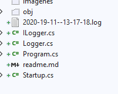

## Module 3: Configuring Middleware and Services in ASP.NET Core

### Lesson 2: Configuring Services


#### Demonstration: How to Use Dependency Injection


Partimos de una web Core 2.1 Vacia y modifcamos el starup.cs


Añadimos una clase Logger.cs y una interfaz ILogger

```c#

namespace ConfigureServiceExample.Services
{
    public interface ILogger
    {
        void Log(string logData);
    }
}


using System;
using System.Collections.Generic;
using System.Linq;
using System.Threading.Tasks;
using System.IO;

namespace ConfigureServiceExample.Services
{
    public class Logger : ILogger
    {
        string _fileName;
        public Logger()
        {
            _fileName = $"{DateTime.UtcNow.ToString("yyyy-dd-MM--HH-mm-ss")}.log";
        }
        public void Log(string logData)
        {
            File.AppendAllText(_fileName, $"{DateTime.UtcNow}: {logData}");
        }
    }
}
````

Modificamos el starup.cs

````

using Microsoft.AspNetCore.Builder;
using Microsoft.AspNetCore.Hosting;
using Microsoft.AspNetCore.Http;
using Microsoft.Extensions.DependencyInjection;
using System;
using System.Collections.Generic;
using System.Linq;
using System.Threading.Tasks;
using ConfigureServiceExample.Services;


namespace ConfigureServiceExample
{
    public class Startup
    {
        // This method gets called by the runtime. Use this method to add services to the container.
        // For more information on how to configure your application, visit https://go.microsoft.com/fwlink/?LinkID=398940
        public void ConfigureServices(IServiceCollection services)
        {
            services.AddSingleton<ILogger, Logger>();
        }

        // This method gets called by the runtime. Use this method to configure the HTTP request pipeline.
        public void Configure(IApplicationBuilder app, ILogger logger)
        {
           
            app.Run(async (context) =>
            {
                logger.Log("Logged line");
                await context.Response.WriteAsync("This text was generated by the app.Run middleware.!");
            });
        }
    }
}
````

y el resultado es el mismo pero...ha creado el archivo de log




```txt
19/11/2020 13:17:18: Logged line19/11/2020 13:17:19: Logged line
''''