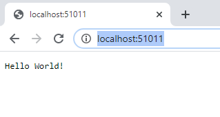
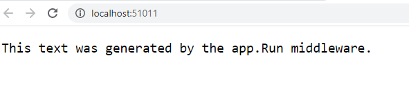
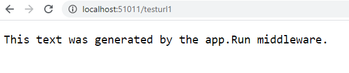
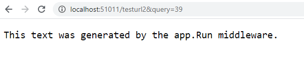
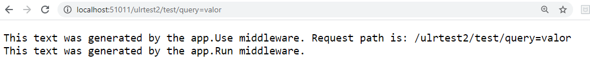

## Module 3: Configuring Middleware and Services in ASP.NET Core

### Lesson 1: Configuring Middleware

Creamos una Web Core  Vacia

Al ejecutarla vemos el resultado.



Esto es por la llamada desde el Main a la clase starup.cs

```c#
---- Program.cs

public class Program
    {
        public static void Main(string[] args)
        {
            CreateWebHostBuilder(args).Build().Run();
        }

        public static IWebHostBuilder CreateWebHostBuilder(string[] args) =>
            WebHost.CreateDefaultBuilder(args)
                .UseStartup<Startup>();
    }


--- starup.cs

 public void Configure(IApplicationBuilder app, IHostingEnvironment env)
        {
            if (env.IsDevelopment())
            {
                app.UseDeveloperExceptionPage();
            }

            app.Run(async (context) =>
            {
                await context.Response.WriteAsync("Hello World!");
            });
        }
```

si modificamos el metodo de Configure de starup  

```c#
public void Configure(IApplicationBuilder app)
{
    app.Run(async (context) =>
    {
        await context.Response.WriteAsync("This text was generated by the app.Run middleware.");
    });
}
```

  
Comprobamos tambien que el MidleWare nos genera el mismo texto indpendientemente de la url

  



Podemos añadirle más tareas al MiddleWare

````
 public void Configure(IApplicationBuilder app)
{

    // app.Use(async (context, next) => permite pasarle el context y un la siguiente tarea
    // context.Request.Path.Value accedo a la url
    // await next.Invoke();  Invoca a la siguiente tarea
    app.Use(async (context, next) =>
    {
        await context.Response.WriteAsync("This text was generated by the app.Use middleware. Request path is: " + context.Request.Path.Value + "\n");
        await next.Invoke();  
    });

    app.Run(async (context) =>
    {
        await context.Response.WriteAsync("This text was generated by the app.Run middleware.");
    });
}
````
