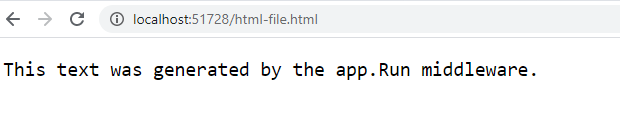
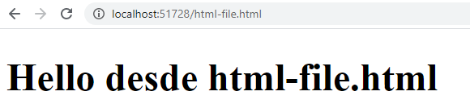
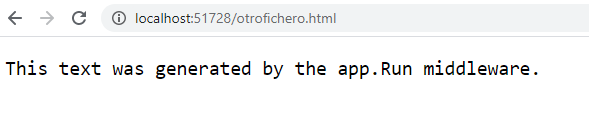

## Module 3: Configuring Middleware and Services in ASP.NET Core

### Lesson 1: Configuring Middleware


#### Demonstration: How to Work with Static Files

La Demo consiste en hacer uso de del metodo UseStaticFiles(); https://docs.microsoft.com/es-es/aspnet/core/fundamentals/static-files?view=aspnetcore-5.0  

Por defecto todos los ficheros estaticos (html / imagenes / css / ... estan en la carpeta wwwroot 

Creamos la Web core 2.1 Empty personalizamos e mensaje en la starup.cs y lanzamos la aplicación con la url http://localhost:[PORT]/html-file.html  

Observamos que nos presenta 




Bien creamos en wwwroot un archivito html


Modificamos el configure añadiendolo app.UseStaticFiles();  

```c#
        public void Configure(IApplicationBuilder app)
        {
            app.UseStaticFiles();
            app.Run(async (context) =>
            {
                await context.Response.WriteAsync("This text was generated by the app.Run middleware.");
            });
        }
```
y ejecutamos con un archivo que existe  



con un archivo que no existe  


