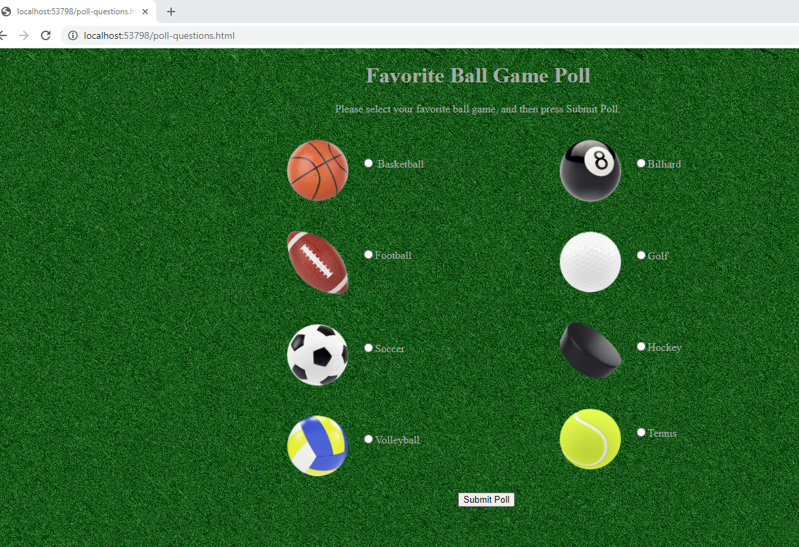
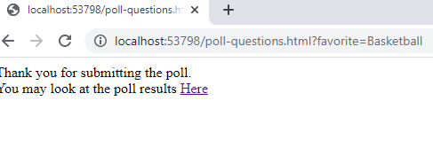
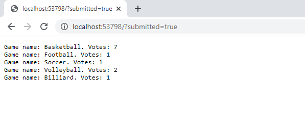
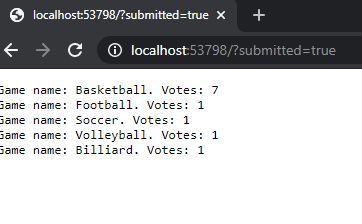
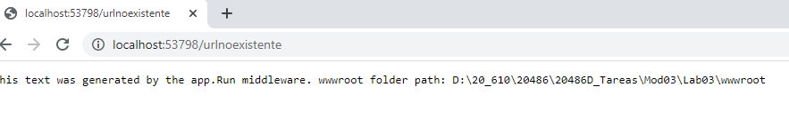

## Module 3: Configuring Middleware and Services in ASP.NET Core3

### Lab: Configuring Middleware and Services in ASP.NET Core

El laboratorio se ha realizado en clase por lo que los resultados intermedios es posible no los presento.

Básicamente se trata de realizar una encuesta sobre el deporte preferido

utilizará injeccion de dependencia para almaenar los datos.

El código final :

Del MidleWare nos interesa ver:

. utiliza injeccion de dependencia y Singleton !!! y MVC

. cuando entra si Context.Request.Query.ContainsKey("favorite")) llama al metodo  pollResults.AddVote(selectedGame);  por injeccion de depencia
 y presenta un context.Response.Headers.Add("content-type", "text/html"); con un enlace a < a href=' /?submitted=true' >Here< /a >.");


. Permite usuar  staticos por lo que si la ruta es pool-question.html la presentará   
. Permite Mvc con el esquema de ruta /HOME/Index /?id   app.UseMvcWithDefaultRoute();  
. en caso de que no pueda enrutar nos presenta un env.WebRootPath


```c#

using Microsoft.AspNetCore.Builder;
using Microsoft.AspNetCore.Hosting;
using Microsoft.AspNetCore.Http;
using Microsoft.Extensions.DependencyInjection;
using System;
using System.Collections.Generic;
using System.Linq;
using System.Threading.Tasks;
using PollBall.Services;

namespace PollBall
{
    public class Startup
    {
        // This method gets called by the runtime. Use this method to add services to the container.
        // For more information on how to configure your application, visit https://go.microsoft.com/fwlink/?LinkID=398940
        public void ConfigureServices(IServiceCollection services)
        {
            services.AddSingleton<IPollResultsService, PollResultsService>();
            services.AddMvc();
        }

        // This method gets called by the runtime. Use this method to configure the HTTP request pipeline.
        public void Configure(IApplicationBuilder app, IHostingEnvironment env, IPollResultsService pollResults)
        {
            if (env.IsDevelopment())
            {
                app.UseDeveloperExceptionPage();
           }
            app.Use(async (context, next) =>
            {
                if (context.Request.Query.ContainsKey("favorite"))
                {
                    string selectedValue = context.Request.Query["favorite"];
                   
                    SelectedGame selectedGame = (SelectedGame)Enum.Parse(typeof(SelectedGame), selectedValue, true);
                    pollResults.AddVote(selectedGame);
                    await context.Response.WriteAsync("Thank you for submitting the poll. You may look at the poll results <a href='/?submitted=true'>Here</a>.");
                }
                else
                {
                   await next.Invoke();
                }

            });

            app.UseStaticFiles();
            app.UseMvcWithDefaultRoute();
            app.Run(async (context) =>
            {
                await context.Response.WriteAsync("This text was generated by the app.Run middleware. wwwroot folder path: " + env.WebRootPath);
            });
        }
    }
}

````


de la clase servicio ver el metodo AddVote y el GetVoteResult

````c#
using System;
using System.Collections.Generic;
using System.Linq;
using System.Threading.Tasks;

namespace PollBall.Services
{
    public class PollResultsService : IPollResultsService
    {
        private Dictionary<SelectedGame, int> _selectionVotes;

        public PollResultsService()
        {
            _selectionVotes = new Dictionary<SelectedGame, int>();
        }

        public void AddVote(SelectedGame game)
        {
            if (_selectionVotes.ContainsKey(game))
            {
                _selectionVotes[game]++;
            }
            else
            {
                _selectionVotes.Add(game, 1);
            }
        }

        public SortedDictionary<SelectedGame, int> GetVoteResult()
        {
            return new SortedDictionary<SelectedGame, int>(_selectionVotes);
        }
    }
}

````

y del controlador àdemas de la injection de dependencia.
la condicion de la accion index y el redireccionamoento

````c#

using System;
using System.Collections.Generic;
using System.Linq;
using System.Threading.Tasks;
using Microsoft.AspNetCore.Mvc;
using PollBall.Services;
using System.Text;

namespace PollBall.Controllers
{
    public class HomeController : Controller
    {
        IPollResultsService _pollResults;

        public HomeController(IPollResultsService pollResults)
        {
            _pollResults = pollResults;
        }

        public IActionResult Index()
        {
            if (Request.Query.ContainsKey("submitted"))
            {
                StringBuilder results = new StringBuilder();
                SortedDictionary<SelectedGame, int> voteList = _pollResults.GetVoteResult();

                foreach (var gameVotes in voteList)
                {
                    results.Append($"Game name: {gameVotes.Key}. Votes: {gameVotes.Value}{Environment.NewLine}");
                }

                return Content(results.ToString());
            }
            else
            {
                return Redirect("poll-questions.html");
            }
        }
    }
}
````

La llamada http://localhost:53798/ ó http://localhost:53798/Home ó http://localhost:53798/Home/Index se redirrecciona a 
http://localhost:53798/poll-questions.html que la coge del wwwrrot Static



una vez que damos al submit el Middleware evalua si la qyery contiene la key favorite y si es por injection llama al metodo Addvote y pinta esta pantalla



al hacer click en Here manda a la ruta href='/?submitted=true que como sigue el modelo MVC va al controlador y como ContainsKey("favorite")) pinta los resultados



como es Singketon comparten todas las instancias de la aplicación




Por último si no cumple el modelo MVC ni esta en wwwroot pinta la pantalla siguiente desde el Middleware


