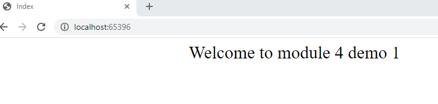
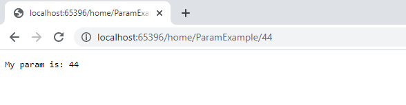
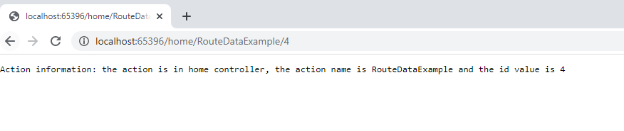
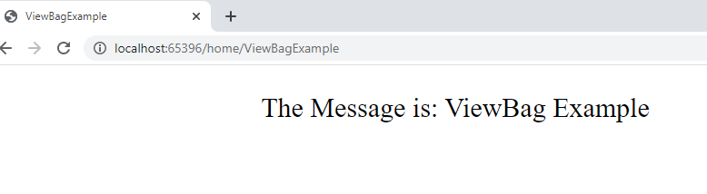
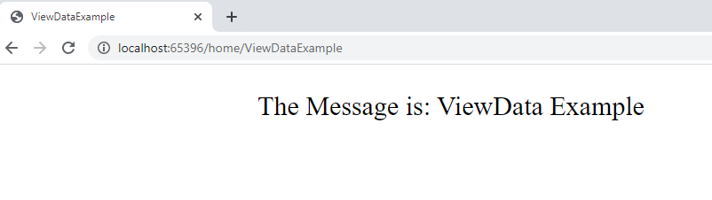

## M�dulo 4: Desarrollo de controladores

### Lecci�n 1: Escritura de controladores y acciones

#### Demostraci�n: c�mo escribir controladores y acciones

Usamos el repositorio 01_ControllersExample_begin


Nos creamos el HomeController.cs que usar� la clase ExampleModel de .Models

```c# 
namespace ControllersExample.Models
{
    public class ExampleModel
    {
        public string Sentence { get; set; }
    }
}
````

Se trata de ver las diferentes formas de pasar informaci�n a las vistas.

---

La accion Index usara creara una instacia de ExampleModel y la pasara como parametro a la vista

```` c#
namespace ControllersExample.Controllers

public class HomeController : Controller
    {
        public IActionResult Index()
        {
            ExampleModel model = new ExampleModel() { Sentence = "Welcome to module 4 demo 1" };
            return View(model);

            // la vista Index                    @model ControllersExample.Models.ExampleModel
            // y lo pinta                        @Model.Sentence
        }
````
  


---

ParamExample pintara el id que se le pasa por parametro  Home/Action/id  

```` c#  

        public IActionResult ParamExample(string id)
        {
            return Content("My param is: " + id);  // directamente escribe el parametro id
        }
````   
  


---

RouteDataExample accede a los RouteDataExample  

```` c#  
        public IActionResult RouteDataExample()
        {
            string controller = (string)RouteData.Values["Controller"];
            string action = (string)RouteData.Values["action"];
            string id = (string)RouteData.Values["id"];
            return Content($"Action information: the action is in {controller} controller, the action name is {action} and the id value is {id}");
            // Accedemos a RouteData.Values

        }
````  
  


---

Acceso a ViewBag.Message

```` c#  
        public IActionResult ViewBagExample()
        {
            ViewBag.Message = "ViewBag Example";
            return View();
            // pinta  The Message is: @ViewBag.Message
        }
````  
  


---

Acceso a ViewData["Message"]  


```` c#    
      public IActionResult ViewDataExample()
        {
            ViewData["Message"] = "ViewData Example";
            return View();

            //pinta The Message is: @ViewData["Message"]
        }

    }
````
  
