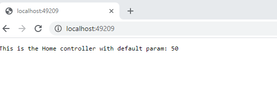
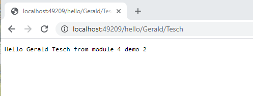
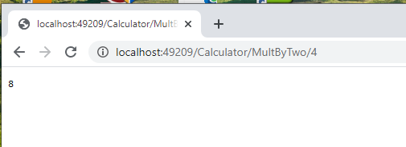
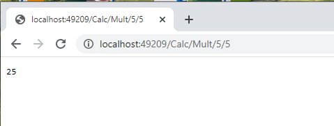
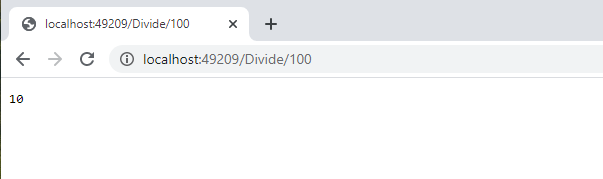

## Módulo 4: Desarrollo de controladores

### Lección 2: Configurar rutas

#### Demostración: cómo agregar rutas

Bueno esta vez anrimos el repositorio 02_RoutesExample_begin ejecutamos la solución y verificamos el puerto http://localhost:49209/  

como no hay controlador nos da un 404

Creamos el Homecontroler y un Calcultarocontroller y se trata de hacer varias pruebas

lo primero vamos a ver el MiddleWare

Define dos posibles plantillas de rutas
{controller}/{action}/{id?}  siendo por defecto   controller = "Home", action = "Index" y   

{controller}/{action}/{num:int} 

```c#
 public void ConfigureServices(IServiceCollection services)
        {
            services.AddMvc();
        }

        public void Configure(IApplicationBuilder app)
        {
            app.UseMvc(routes =>
            {
                routes.MapRoute(
                    name: "firstRoute",
                    template: "{controller}/{action}/{num:int}");

                routes.MapRoute(
                    name: "secondRoute",
                    template: "{controller}/{action}/{id?}",
                    defaults: new { controller = "Home", action = "Index" });
            });
        }
````


y ahora vamos a ir probando las acciones de los controladores   

---  

http://localhost:49209/

al Home/Index   * (el id lo mete el fijo=50)

```c#
public IActionResult Index(int id = 50)
{
    return Content("This is the Home controller with default param: " + id);
}
````




---  


http://localhost:49209/Hello/Gerald/Tesch

plantilla {controller}/{action}/{id?}
va al Home por defecto y busca si tiene alguna Ruta con el /Hello/Gerald/Tesch


```c#
[Route("Hello/{firstName}/{lastName}")]
public IActionResult Greeting(string firstName, string lastName)
{
    return Content($"Hello {firstName} {lastName} from module 4 demo 2");
}
````




---  


http://localhost:49209/Calculator/MultByTwo/4


plantilla  {controller}/{action}/{num:int}

````c#
CalculatorController :
public IActionResult MultByTwo(int num)
{
    int result = num * 2;
    return Content(result.ToString());
}
````




---  


http://localhost:49209/Calc/Mult/5/5


````c#
CalculatorController :

[Route("Calc/Mult/{num1:int}/{num2:int}")]
public IActionResult Mult(int num1, int num2)
{
    int result = num1 * num2;
    return Content(result.ToString());
}

````




---


http://localhost:49209/Divide/100


````c#

CalculatorController :

 [HttpGet("Divide/{param?}")]
        public IActionResult DivideByTen(int param)
        {
            int result = param / 10;
            return Content(result.ToString());

        }

````




----

http://localhost:49209/Divide

````c#

CalculatorController :


 [HttpGet("Divide/{param?}")]
        public IActionResult DivideByTen(int param)
        {
            int result = param / 10;
            return Content(result.ToString());

        }

````


---

Nota : si existe duplicidad 
que haya el mismo [HttpGet("Divide/{param?}")] en dos controladores  
nos dará un error 500  