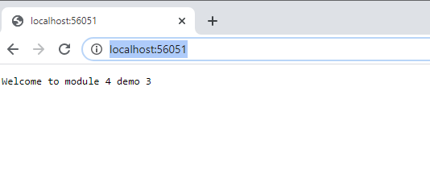
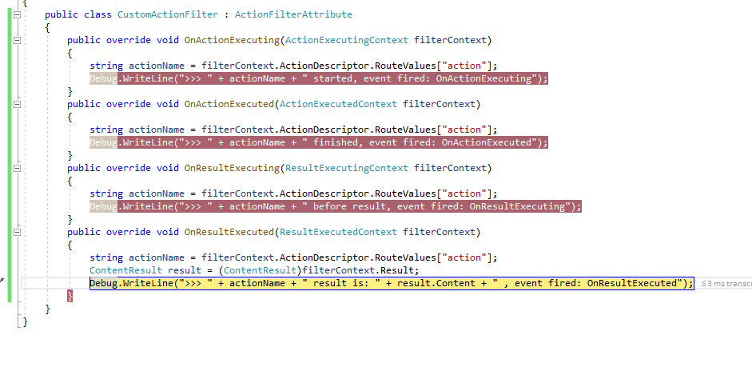
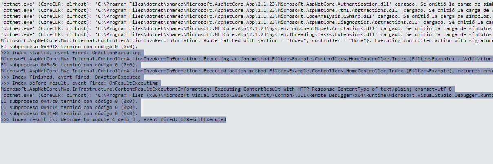

## Módulo 4: Desarrollo de controladores

### Lesson 3: Writing Action Filters

#### Demostración: cómo agregar rutas


Abrimeros la solición deel repositoro 03_FiltersExample_begin

Examinamos el Middleware (para saber de que se trata)

solo UseMvcWithDefaultRoute() con lo cual por defecto va a Home / Index

````c#
public void ConfigureServices(IServiceCollection services)
        {
            services.AddMvc();
        }

        public void Configure(IApplicationBuilder app)
        {
            app.UseMvcWithDefaultRoute();
        }
````


No piden que cremos un filter

```c#
using System.Diagnostics;
using Microsoft.AspNetCore.Mvc;
using Microsoft.AspNetCore.Mvc.Filters;

namespace FiltersExample.Filters
{
    public class CustomActionFilter : ActionFilterAttribute
    {
        public override void OnActionExecuting(ActionExecutingContext filterContext)
        {
            string actionName = filterContext.ActionDescriptor.RouteValues["action"];
            Debug.WriteLine(">>> " + actionName + " started, event fired: OnActionExecuting");
        }
        public override void OnActionExecuted(ActionExecutedContext filterContext)
        {
            string actionName = filterContext.ActionDescriptor.RouteValues["action"];
            Debug.WriteLine(">>> " + actionName + " finished, event fired: OnActionExecuted");
        }
        public override void OnResultExecuting(ResultExecutingContext filterContext)
        {
            string actionName = filterContext.ActionDescriptor.RouteValues["action"];
            Debug.WriteLine(">>> " + actionName + " before result, event fired: OnResultExecuting");
        }
        public override void OnResultExecuted(ResultExecutedContext filterContext)
        {
            string actionName = filterContext.ActionDescriptor.RouteValues["action"];
            ContentResult result = (ContentResult)filterContext.Result;
            Debug.WriteLine(">>> " + actionName + " result is: " + result.Content + " , event fired: OnResultExecuted");
        }
    }
}
````

y que modiquemos el Homecontroller

```c#
using FiltersExample.Filters;

namespace FiltersExample.Controllers
{
    public class HomeController : Controller
    {
        [CustomActionFilter]
        public IActionResult Index()
        {
            return Content("Welcome to module 4 demo 3");
        }
    }
}

````


Ejecutando vemos que pinta lo siguiente



Pero ejecuta los filters



los encontramos en la ventana salida



