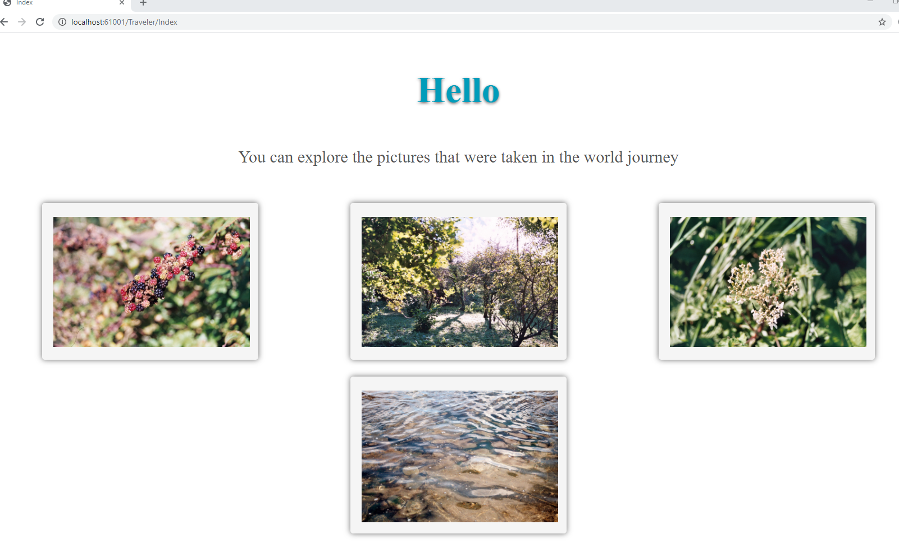
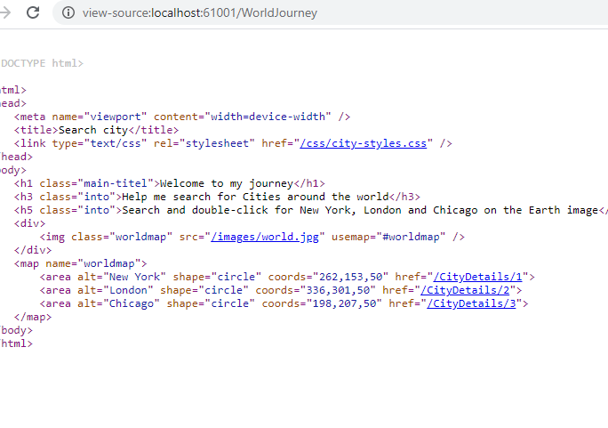

## Módulo 4: Module 4: Developing Controllers

### Lab: Developing Controllers


#### Exercise 1: Adding Controllers and Actions to an MVC Application

Abrimos la soclución del WorldJourney.sln.  Repositorio 01_WorldJourney_begin y la ejecutamos.


http://localhost:61001


examinamos la aplicación.


Vemos el Middleware que preapara la injection de pendencias de Idata, Data  
Prepara Mvc  
Permite accesos al wwwroot  
y sigue la routa MVC por defecto (Controllle + Acction + ?parametro)  

```` c#
public class Startup
    {
        public void ConfigureServices(IServiceCollection services)
        {
            services.AddMvc();
            services.AddSingleton<IData, Data>();
        }

        public void Configure(IApplicationBuilder app)
        {
            app.UseStaticFiles();
            app.UseMvcWithDefaultRoute();
        }
    }
}
````

Examinamos Models
```c#
public class City
    {
        public int ID { get; set; }
        public string CityName { get; set; }
        public string ImageName { get; set; }
        public string ImageMimeType { get; set; }
    }

	
public class Data : IData
{
	public List<City> CityList { get; set; }

	public List<City> CityInitializeData()
	{
		CityList = new List<City>()
		{
			new City(){ID = 1,CityName = "New York",ImageName = "new-york.jpg",ImageMimeType = "image/jpeg"},
			new City(){ID = 2,CityName = "London",ImageName = "london.jpg",ImageMimeType = "image/jpeg"},
			new City(){ID = 3,CityName = "Chicago",ImageName = "chicago.jpg", ImageMimeType = "image/jpeg"}
		};
		return CityList;
	}

	public City GetCityById(int? id)
	{
		if (id == null)
		{
			return null;
		}
		else
		{
			return CityList.SingleOrDefault(a => a.ID == id);
		}
	}
}

public interface IData
{
	List<City> CityList { get; set; } 
	List<City> CityInitializeData();  //Inicializa con NY, London, Chicago
	City GetCityById(int? id); // devuelve la ciudad con id = id
}
````


Y despues tiene dos vistas en City   
(Index con un a photdelmundo y tres href al  City detalles id (que no esta implementado)  
(details con una imagen que se carga con src="@Url.Action("GetImage", "City", new { CityId = Model.ID })"  
y un Goback y .Models.City como mdoel


Tambien hay una vista Trarveler con una coleccion de divs con imagenes


Bien pues al lio creamos un controlador Home que en su acction Index tiene una redireccion a Index del controlador City
y nos piden crear el controlador City tal y como muestro.

```` c#

City controller ---

using System;
using System.IO;
using System.Linq;
using Microsoft.AspNetCore.Hosting;
using Microsoft.AspNetCore.Mvc;
using Microsoft.AspNetCore.Mvc.Filters;


namespace WorldJourney.Controllers
{
    public class CityController : Controller
    {
        private IData _data;                             // Injection de Dependencia de City
        private IHostingEnvironment _environment;

        public CityController(IData data, IHostingEnvironment environment)
        {
            _data = data;
            _environment = environment;
            _data.CityInitializeData();
        }

        public IActionResult Index()					// ve a la vista detalles y le paso el ViewData
        {
            ViewData["Page"] = "Search city";
            return View();
        }

        public IActionResult Details(int? id)			// le paso el id de la city
        {
            ViewData["Page"] = "Selected city";
            City city = _data.GetCityById(id);			// obtengo la City selecconada
            if (city == null)
            {
                return NotFound();
            }

            ViewBag.Title = city.CityName;				// voy a la vista con la city
            return View(city);
        }

        public IActionResult GetImage(int? cityId)      // GetImage con el id de la city
        {
            ViewData["Message"] = "display Image";
            City requestedCity = _data.GetCityById(cityId);  // cargp la city seleccionada
            if (requestedCity != null)
            {
                string webRootpath = _environment.WebRootPath;         //uhy a es para saber el path de wwwroot
                string folderPath = "\\images\\";
                string fullPath = webRootpath + folderPath + requestedCity.ImageName; lo concateno para sacar la imagen

                FileStream fileOnDisk = new FileStream(fullPath, FileMode.Open);
                byte[] fileBytes;
                using (BinaryReader br = new BinaryReader(fileOnDisk))
                {
                    fileBytes = br.ReadBytes((int)fileOnDisk.Length);
                }
                return File(fileBytes, requestedCity.ImageMimeType);   // y devuelvo el Fichero   (recuerda como se carga la imgane en la vista detalles 
            }														  // con con src="@Url.Action("GetImage", "City", new { CityId = Model.ID })"  
            else
            {
                return NotFound();
            }
        }

    }
}

````


  
  


#### Exercise 2: Configuring Routes by Using the Routing Table


Agregamos un nuevo Controldador llamado Travaler y ejecutamos la apliacion http://localhost:61001/Traveler/Index

````c#
 public class TravelerController : Controller
    {
        public IActionResult Index(string name)
        {
            ViewBag.VisiterName = name;
            return View();
        }
    }
```` 




Bien pues se trata de añadir rutas en el Middeware 

````c#
 public void Configure(IApplicationBuilder app)
        {
            app.UseStaticFiles();
            //app.UseMvcWithDefaultRoute();
            app.UseMvc(routes =>
            {
                routes.MapRoute(
                     name: "TravelerRoute",
                     template: "{controller}/{action}/{name}",
                     constraints: new { name = "[A-Za-z ]+" },
                     defaults: new { controller = "Traveler", action = "Index", name = "Katie Bruce" });

                routes.MapRoute(
                    name: "defaultRoute",
                    template: "{controller}/{action}/{id?}",
                    defaults: new { controller = "Home", action = "Index" },
                    constraints: new { id = "[0-9]+" });
            });
        }
````

Como vemos ahora por defecto nos va a Traveller y le pasa al  ViewBag.VisiterName el { name }

Si quieres ir a las citys puedes poner http://localhost:61001/Home ó http://localhost:61001/City   


#### Exercise 3: Configuring Routes by Using Attributes


modificamos CityController con los siguientes atrubutos

```c#
[Route("WorldJourney")]
public IActionResult Index()
{
...
}
[Route("CityDetails/{id?}")]
public IActionResult Details(int? id)
{
...
}
```` 

http://localhost:61001/WorldJourney


ver codigo



y si pincho en el href


Ojo ahora http://localhost:61001/HOME/Details/1 falla!!


#### Exercise 4: Adding an Action Filter

Para añadir filtros de Accion  crearemos una carpeta Filters y una nueva clase LogActionFilterAttribute 
```c#
using System.IO;
using Microsoft.AspNetCore.Hosting;
using Microsoft.AspNetCore.Mvc;
using Microsoft.AspNetCore.Mvc.Filters;

namespace WorldJourney.Filters
{
    public class LogActionFilterAttribute : ActionFilterAttribute
    {
        private IHostingEnvironment _environment;
        private string _contentRootPath;
        private string _logPath;
        private string _fileName;
        private string _fullPath;

        public LogActionFilterAttribute(IHostingEnvironment environment)
        {
            _environment = environment;
            _contentRootPath = _environment.ContentRootPath;
            _logPath = _contentRootPath + "\\LogFile\\";
            _fileName = $"log {DateTime.Now.ToString("MM-dd-yyyy-H-mm")}.txt";
            _fullPath = _logPath + _fileName;
        }

        public override void OnActionExecuting(ActionExecutingContext filterContext)
        {
            Directory.CreateDirectory(_logPath);
            string actionName = filterContext.ActionDescriptor.RouteValues["action"];
            string controllerName = filterContext.ActionDescriptor.RouteValues["controller"];
            using (FileStream fs = new FileStream(_fullPath, FileMode.Create))
            {
                using (StreamWriter sw = new StreamWriter(fs))
                {
                    sw.WriteLine($"The action {actionName} in {controllerName} controller started, event fired: OnActionExecuting");
                }
            }
        }

        public override void OnResultExecuted(ResultExecutedContext filterContext)
        {
            string actionName = filterContext.ActionDescriptor.RouteValues["action"];
            string controllerName = filterContext.ActionDescriptor.RouteValues["controller"];
            ViewResult result = (ViewResult)filterContext.Result;
            using (FileStream fs = new FileStream(_fullPath, FileMode.Append))
            {
                using (StreamWriter sw = new StreamWriter(fs))
                {
                    sw.WriteLine($"The action {actionName} in {controllerName} controller has the following viewData : {result.ViewData.Values.FirstOrDefault()}, event fired: OnResultExecuted");
                }
            }
        }
    }

}
```


modificamos el Middleware

````

using WorldJourney.Filters;
.....
        public void ConfigureServices(IServiceCollection services)
        {
            services.AddMvc();
            services.AddSingleton<IData, Data>();
            services.AddScoped<LogActionFilterAttribute>();
        }

````

y decoramos City. Index
con 
````
[Route("WorldJourney")]
[ServiceFilter(typeof(LogActionFilterAttribute))]
public IActionResult Index()
        
````

y ejecutamos http://localhost:61001/WorldJourney


