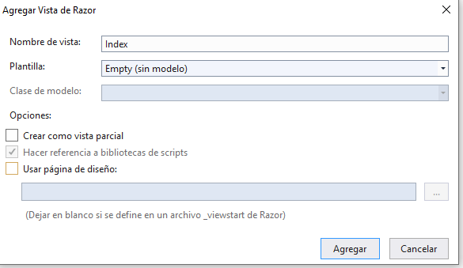
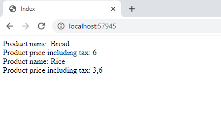

## Developing Views

### Lesson 1: Creating Views with Razor Syntax

#### Demonstration: How to Use the Razor Syntax

Partimos del proyecto 01_RazorSyntaxExample_begin del repositorio demos 05. (Web Core 2.1)  

El Middleware tiene  

````c#
app.UseMvc(routes =>
            {
                routes.MapRoute(
                    name: "Product",
                    template: "{controller}/{action}/{id?}",
                    defaults: new { controller = "Product", action = "Index" });
            });
````
Solo tiene un Controlador ProductController con una Accion Index() que retorna View()  

La vista no está implementada.  


Nos piden añadir a  ProductController.Index()  al ViewBag.ProductPrices un Dictionary<string, int>();

````c#
public class ProductController : Controller
    {
        public IActionResult Index()
        {
            ViewBag.ProductPrices = new Dictionary<string, int>();
            ViewBag.ProductPrices.Add("Bread", 5);
            ViewBag.ProductPrices.Add("Rice", 3);

            return View();
        }
    }
````
y ahora implementamos la vista con las siguientes propiedades

  

Vemos que nos crea el archivo Views/Product/Index.cshtml  

Lo modificamos para que en el body pintar los productos del diccionario que se lo hemos pasado en el ViewBag.ProductPrices  

````cshtml

@{
    Layout = null;
}

<!DOCTYPE html>

<html>
<head>
    <meta name="viewport" content="width=device-width" />
    <title>Index</title>
</head>
<body>
    @foreach (KeyValuePair<string, int> productPrices in ViewBag.ProductPrices)
    {
    <div>
        Product name: @productPrices.Key
        Product price including tax: @(productPrices.Value * 1.2)
    </div>
    }
</body>
</html>
````

Salvamos y ejecutamos.


 


