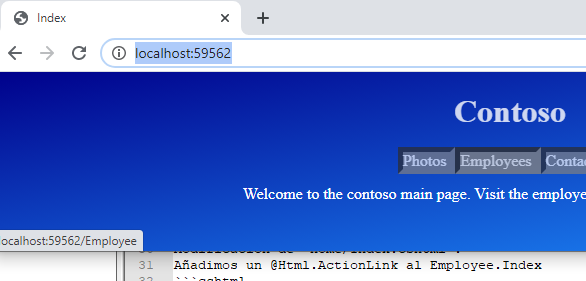
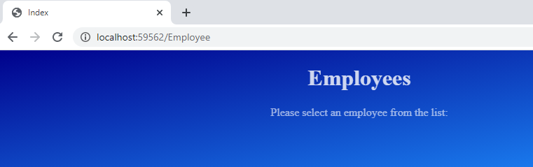
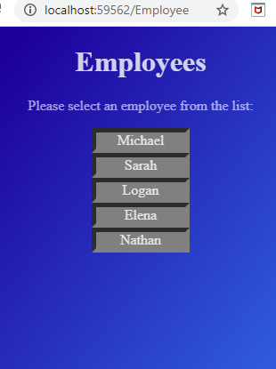
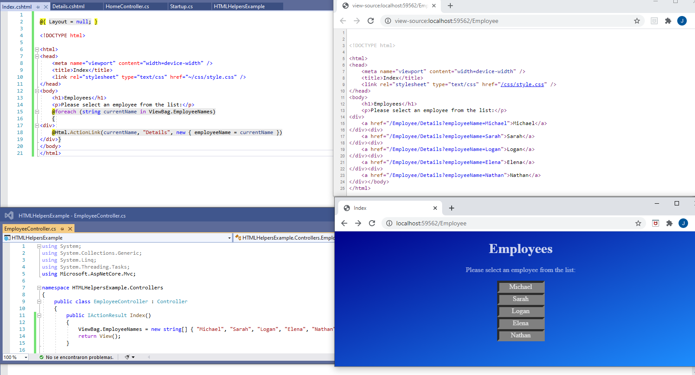
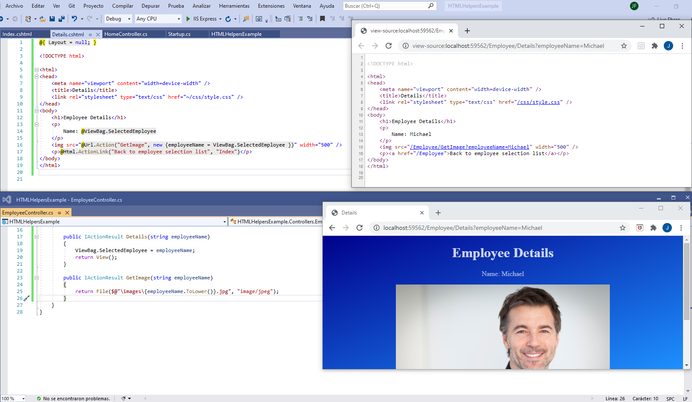

## Developing Views

### Lesson 2: Using HTML Helpers and Tag Helpers

#### Demonstration: How to Use HTML Helpers


Al lio: Abrimos HTMLHelpersExample.sln  Web core 2.1

El middleware tiene

app.UseStaticFiles();    
app.UseMvcWithDefaultRoute();     

tiene dos controladores:  
1. Home con una Accion Index que abre una vista  

2. Employee con tres acciones:  
. Index() --> view  
. Details(string employeeName) --> view  
. GetImage(string employeeName) -- Content("");    


Home/Index.cshtml (codigo html con un nav y un footer)  
Employee/Index.cshtml  codigo html    
Employee/Details.cshtml  un   Name: @ViewBag.SelectedEmployee  


Modificación de  Home/Index.cshtml :
Añadimos un @Html.ActionLink al Employee.Index
```cshtml
<nav>
	<span>
		Photos
	</span>
	<span>
		@Html.ActionLink("Employees", "Index", "Employee")
	</span>
	<span>
		Contact Us
	</span>
</nav>
````
Observa el enlace a localhost/Employee  desde el Html.ActionLink



  

Bueno vamos a darle un poco de lógica al Employee/Index

Creamos un string[] con los empleados names y lo metemos en el ViewBag para mandarselo a la vista.

```c#
public IActionResult Index()
        {
            ViewBag.EmployeeNames = new string[] { "Michael", "Sarah", "Logan", "Elena", "Nathan" };
            return View();
        }
````
Modifamos su vistema recorrecorreindo el ViewBag.EmployeeNames con un foreach y pintando los respectivos @Html.ActionLink
a Employee.Details a los que les pasaremos el name seleccionado

```c#    <p>Please select an employee from the list:</p>
    @foreach (string currentName in ViewBag.EmployeeNames)
    {
    <div>
        @Html.ActionLink(currentName, "Details", new { employeeName = currentName })
    </div>
    }
````

  

Los enlaces funcionan http://localhost:59562/Employee/Details?employeeName=Michael

Pero vamos a añadir logica la vista Details


```c# 
 <p>
        Name: @ViewBag.SelectedEmployee

         <! --Url.Action a Getimage(string name)-->
       <p>@Html.ActionLink("Back to employee selection list", "Index")</p> >!-- enlace a Index del controlador --> 
    </p>
```

getimage devuelve  el File que se encuentra en wwwroot/imagenes
```
public IActionResult GetImage(string employeeName)
{
	return File($@"\images\{employeeName.ToLower()}.jpg", "image/jpeg");
}
```	


  


  

