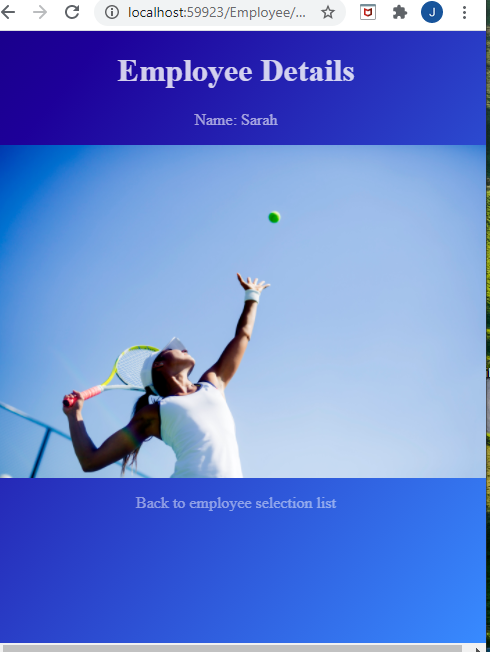

## Module 5: Developing Views

### Lesson 2: Using HTML Helpers and Tag Helpers

#### Demonstration: How to Use Tag Helpers

Abrimos 03_TagHelpersExample_begin Web Core 2.1 

Es la versión del anterior , así que no lo voy a describir  


Recordemos que los TagHelpers es una alternativa a HtmlHelpers 
```c#
<a asp-action="action" asp-controller="home" asp-route-id="1">Press me</a>
```
@addTagHelper se añade a la vista o a _ViewImports.cshtml 


Pues modificamos las vistas 


````cshtml
---- Employee.Details 
@addTagHelper *, Microsoft.AspNetCore.Mvc.TagHelpers
@{ Layout = null; }

<!DOCTYPE html>

<html>
<head>
    <meta name="viewport" content="width=device-width" />
    <title>Details</title>
    <link rel="stylesheet" type="text/css" href="~/css/style.css" />
</head>
<body>
    <h1>Employee Details</h1>
    <p>
        Name: @ViewBag.SelectedEmployee
    </p>
    

    <p><a asp-action="Index">Back to employee selection list</a></p>
    <!--<p>@@Html.ActionLink("Back to employee selection list", "Index")</p>-->
</body>
</html>

---- Employee.Index 
@addTagHelper *, Microsoft.AspNetCore.Mvc.TagHelpers

@{ Layout = null; }

<!DOCTYPE html>

<html>
<head>
    <meta name="viewport" content="width=device-width" />
    <title>Index</title>
    <link rel="stylesheet" type="text/css" href="~/css/style.css" />
</head>
<body>
    <h1>Employees</h1>
    <p>Please select an employee from the list:</p>
    @foreach (string currentName in ViewBag.EmployeeNames)
    {
        <div>
            @Html.ActionLink(currentName, "Details", new { employeeName = currentName })
            <!-- @@Html.ActionLink(currentName, "Details", new { employeeName = currentName }) -->
        </div>
    }
    </body>
    </html>
--- home.Index
@addTagHelper *, Microsoft.AspNetCore.Mvc.TagHelpers


        @{ Layout = null; }

        <!DOCTYPE html>

        <html>
        <head>
            <meta name="viewport" content="width=device-width" />
            <title>Index</title>
            <
            <link rel="stylesheet" type="text/css" href="~/css/style.css" />
        </head>
        <body>
            <h1>Contoso</h1>
            <nav>
                <span>
                    Photos
                </span>
                <span>
                    <a asp-controller="Employee" asp-action="Index">Employees</a>
                    <!-- hemos sustituido la @@Html.ActionLink("Employees", "Index", "Employee")-->
                </span>
                <span>
                    Contact Us
                </span>
            </nav>
            <footer>
                Welcome to the contoso main page. Visit the employees page to see our employees.
            </footer>
        </body>
    </html>
````
y la funcionalidad es la misma


Por último verificanos que añadiendo la directiva @addTagHelper *, Microsoft.AspNetCore.Mvc.TagHelpers a _ViewImports.cshtml y quitandola de las vistas sigue funcionado   





