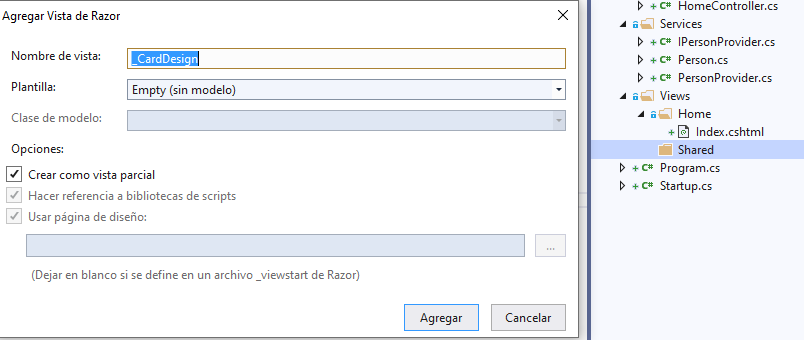
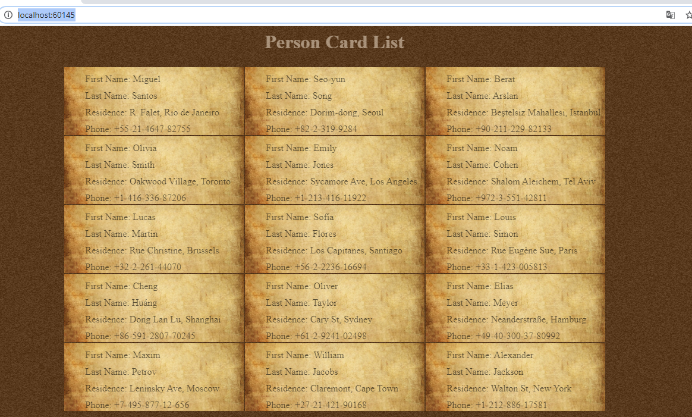

## Module 5: Developing Views

### Lesson 3: Reusing Code in Views

#### Demonstration: How to Create and Use Partial Views


Para esta Demo abrimos la solucion PartialViewsExample.sln

Que tiene acceso a ficheros estaticos y utiliza enrutamiento Mvc por defecto.

utiliza injection de depencias con PartialViewsExample.Service  
services.AddSingleton<IPersonProvider, PersonProvider>();

Tiene un Home Controller que esta utilzando la ijection de depencias  y una Action Index que abre una vista y le pasa en el ViewBag 
dos valores Rows=5 y Columns=3
````
public class HomeController : Controller
    {
        IPersonProvider _personProvider;

        public HomeController(IPersonProvider personProvider)
        {
            _personProvider = personProvider;
        }

        public IActionResult Index()
        {
            ViewBag.Rows = 5;
            ViewBag.Columns = 3;
			ViewBag.People = _personProvider.PersonList; /*Añadido en la vista */
            return View();
        }
    }
````
y la vista Home.Index.cshtml que dibuja un table de Rows*Columns 


Para terminar la clase Person la Interfaz IPersonProvider y la PersonProvider
````c#
public class Person
{
	public string FirstName { get; private set; }
	public string LastName { get; private set; }
	public string Address { get; private set; }
	public string PhoneNumber { get; private set; }

	public Person(string firstName, string lastName, string address, string phoneNumber)
	{
			FirstName = firstName;  /*Añadido en la demo */
			LastName = lastName;
			Address = address;
			PhoneNumber = phoneNumber;
	}
}
-------------------------------------------------
 public interface IPersonProvider
    {
        List<Person> PersonList { get; }
    }
---------------------------------------------------
public class PersonProvider : IPersonProvider
{
public List<Person> PersonList { get; private set; }

public PersonProvider()
{
	PersonList = PersonInitializer(); /*Añadido en la demo */
}

private List<Person> PersonInitializer()
{
	List<Person> personList = new List<Person>();
	personList.Add(new Person("Miguel", "Santos", "R. Falet, Rio de Janeiro", "+55-21-4647-82755"));
	personList.Add(new Person("Seo-yun", "Song", "Dorim-dong, Seoul", "+82-2-319-9284"));
	personList.Add(new Person("Berat", "Arslan", "Beştelsiz Mahallesi, Istanbul", " +90-211-229-82133"));
	personList.Add(new Person("Olivia", "Smith", "Oakwood Village, Toronto", " +1-416-336-87206"));
	personList.Add(new Person("Emily", "Jones", "Sycamore Ave, Los Angeles", "+1-213-416-11922"));
	personList.Add(new Person("Noam", "Cohen", "Shalom Aleichem, Tel Aviv", "+972-3-551-42811"));
	personList.Add(new Person("Lucas", "Martin", "Rue Christine, Brussels", "+32-2-261-44070"));
	personList.Add(new Person("Sofía", "Flores", "Los Capitanes, Santiago", "+56-2-2236-16694"));
	personList.Add(new Person("Louis", "Simon", "Rue Eugène Sue, Paris", "+33-1-423-005813"));
	personList.Add(new Person("Cheng", "Huáng", "Dong Lan Lu, Shanghai", "+86-591-2807-70245"));
	personList.Add(new Person("Oliver", "Taylor", "Cary St, Sydney", "+61-2-9241-02498"));
	personList.Add(new Person("Elias", "Meyer", "Neanderstraße, Hamburg", "+49-40-300-37-80992"));
	personList.Add(new Person("Maxim", "Petrov", "Leninsky Ave, Moscow", "+7-495-877-12-656"));
	personList.Add(new Person("William", "Jacobs", "Claremont, Cape Town", "+27-21-421-90168"));
	personList.Add(new Person("Alexander", "Jackson", "Walton St, New York", "+1-212-886-17581"));

	return personList;
}
````

Al lio:
Modificaremos el constructor de Person y PersonProvider dandole contenido lo he metido en el codigo anterior.
y en la Action Index añadidmos ViewBag.People = _personProvider.PersonList;

De momento nada tiene que ver con la vista parcial, lo únio que hemos hecho es pasar a la vista la lista de personal en el ViewBag

Bien lo que queremos hacer es que las celdas de la tabla se rellenen en una vista parcial (para ello me creo una cista parcial llamada _CardDesign.cshtml
 


```c#
@model int @*le pasamos el id de la lista *@
<td>
    <div>First Name: @ViewBag.People[Model].FirstName</div>
    <div>Last Name: @ViewBag.People[Model].LastName</div>
    <div>Residence: @ViewBag.People[Model].Address</div>
    <div>Phone: @ViewBag.People[Model].PhoneNumber</div>
</td>
````

y ya lo único que queda es el Index.cshtml llamar a la parcial pasandole el int indice (el Viewbag se comparte) 


````cshtml
<table>
	@for (int rowIndex = 0; rowIndex < ViewBag.Rows; rowIndex++)
	{
	<tr>
		@for (int columnIndex = 0; columnIndex < ViewBag.Columns; columnIndex++)
		{
			int cardIndex = columnIndex + (rowIndex * ViewBag.Columns);
			@await Html.PartialAsync("_CardDesign", cardIndex);
		}
	</tr>
	}
</table>
````




