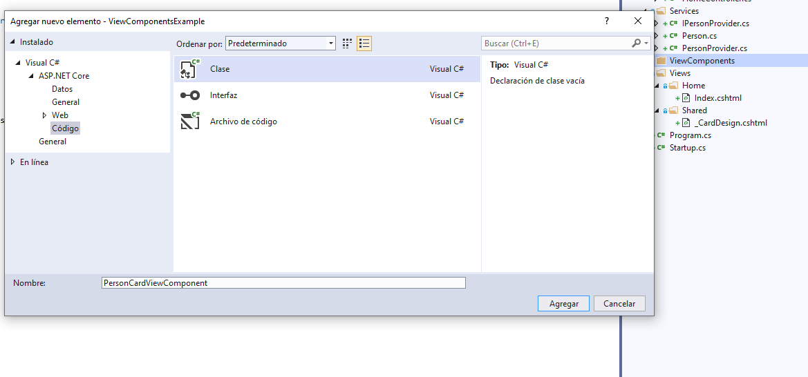
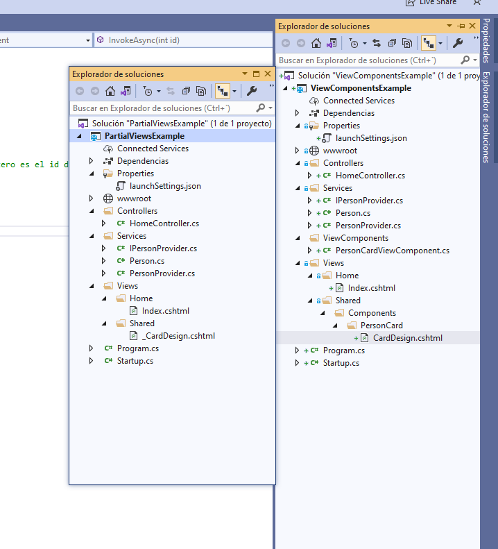
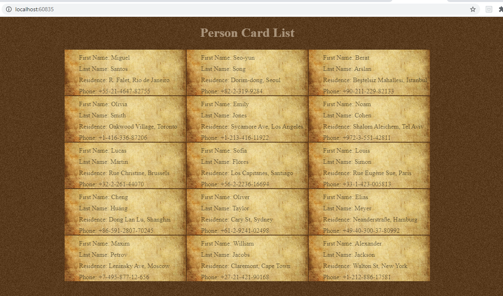

## Module 5: Developing Views

### Lesson 3: Reusing Code in Views

#### Demonstration: How to Create and Use View Components

Para esta demo partimos de la demo anterior (pagina parcial)

Se trata de utilizar ViewComponents por lo que nos vamos a crear uno



Vamos a utilizar la vista parcial anterior pero para tener un orden la ublcamos en la siguiente carpeta y la cambiamos de nombre




Modificamos el index.cshtml

````

@{
    Layout = null;
}

<!DOCTYPE html>

<html>
<head>
    <meta name="viewport" content="width=device-width" />
    <title>Index</title>
    <link href="css\style.css" rel="stylesheet" />
</head>
<body>
    <h1>Person Card List</h1>
    <table>
        @for (int rowIndex = 0; rowIndex < ViewBag.Rows; rowIndex++)
        {
        <tr>
            @for (int columnIndex = 0; columnIndex < ViewBag.Columns; columnIndex++)
            {
                int cardIndex = columnIndex + (rowIndex * ViewBag.Columns);
				<!-- Llamada a pagina parcial -->
                <!--@@await Html.PartialAsync("_CardDesign", cardIndex);-->
				<!-- Llamada a Component -->
                @await Component.InvokeAsync("PersonCard", cardIndex);

            }
        </tr>
        }
    </table>
</body>
</html>
````

y comprobamos que todo funciona



Bueno pues parece que es una chorrada pero no,

ahora a repasar de nuevo este último tema ;)
