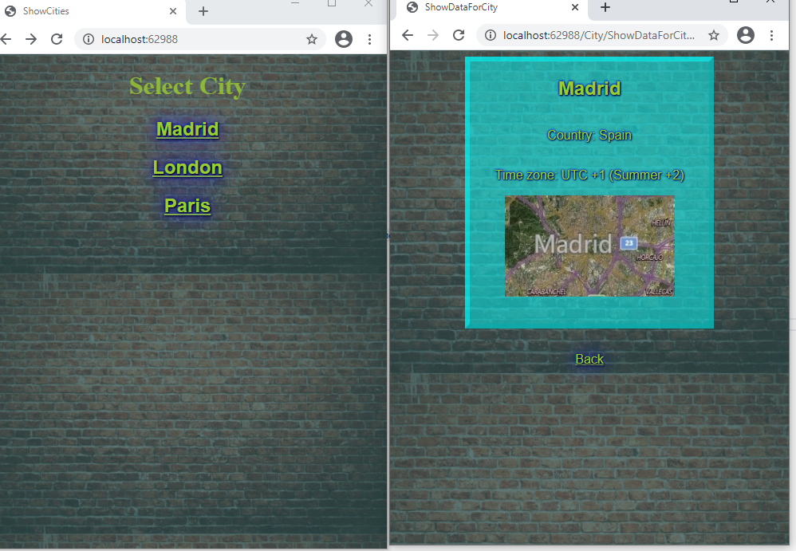

## Module 5: Developing Views

### Lab: Developing Views

#### Exercise 1: Adding Views to an MVC Application


Se trata de dieñar un Maestro Detalle de Cities


Partimos de la solucion Web Core 2.1 MVC 01_CitiesWebsite_begin


````

-----Middleware
.....
 services.AddSingleton<ICityProvider, CityProvider>();
 services.AddSingleton<ICityFormatter, CityFormatter>();
 
 app.UseMvc(routes =>
{
	routes.MapRoute(
	name: "Default",
	template: "{controller}/{action}",
	defaults: new { controller = "City", action = "ShowCities" });
});
 
----Models
public class City
{
	public string Country { get; }
	public string Name { get; }
	public string TimeZone { get; }
	public CityPopulation Population { get; }

	public City(string country, string cityName, string timeZone, CityPopulation population) {}
}
public class CityPopulation
{
	public int Year { get; }
	public int City { get; }
	public int Urban { get; }
	public int Metro { get; }

	public CityPopulation(int year, int city, int urban, int metro) {}
}

----Controllers
public class CityController : Controller
{
	public CityController() {}
	public IActionResult ShowCities()
	{
		return View();
	}

	public IActionResult ShowDataForCity()
	{
		return View();
	}

	public IActionResult GetImage(string cityName)
	{
		return Content(cityName);
	}
}
----Services

public interface ICityProvider : IEnumerable<KeyValuePair<string, City>>
{
	City this[string name] { get; }
}
public class CityProvider : ICityProvider
{
	Dictionary<string, City> _cities;

	public CityProvider() {}

	public City this[string name]
	{
		get
		{
			return _cities[name];
		}
	}

	private Dictionary<string, City> CityInitializer()
	{
		Dictionary<string, City> _cityList = new Dictionary<string, City>();
		_cityList.Add("Madrid", new City("Spain", "Madrid", "UTC +1 (Summer +2)", new CityPopulation(2015, 3141991, 6240000, 6529700)));
		_cityList.Add("London", new City("England", "London", "UTC +0 (Summer +1)", new CityPopulation(2016, 8787892, 9787426, 14040163)));
		_cityList.Add("Paris", new City("France", "Paris", "UTC +1 (Summer +2)", new CityPopulation(2015, 2206488, 10601122, 12405426)));
		return _cityList;
	}

	public IEnumerator<KeyValuePair<string, City>> GetEnumerator()
	{
		return _cities.GetEnumerator();
	}

	IEnumerator IEnumerable.GetEnumerator()
	{
		return _cities.GetEnumerator();
	}
}


public interface ICityProvider : IEnumerable<KeyValuePair<string, City>>
{
	City this[string name] { get; }
}

public class CityFormatter : ICityFormatter
{
	public string GetFormattedPopulation(int population)
	{
		return string.Format("{0:n0}", population);
	}
}
````

Lo primero implementar los constructores (no entiendo muy bien porque no vienen implementados):  
CitiesWebsite.Models.City  
CitiesWebsite.Models.CityPopulation  
CitiesWebsite.Services.CityProvider  

Lo siguiente el controlador implementar la injeccion de depencias en el controlador (mira el modulo anterior): 
```c#
using System;
using System.Collections.Generic;
using System.Linq;
using System.Threading.Tasks;
using Microsoft.AspNetCore.Mvc; // se lo insertamos porque sino poco MVC
using CitiesWebsite.Services;  // injection de dependencias

namespace CitiesWebsite.Controllers
{
    public class CityController : Controller
    {
        private ICityProvider _cities; // injection de dependencias
        public CityController(ICityProvider cities)
        {
            _cities = cities;  // injection de dependencias
        }

        public IActionResult ShowCities()
        {
            ViewBag.Cities = _cities;  // como ya lo tenemos por injeccion, se la pasamos a la vista
            return View();
        }

        public IActionResult ShowDataForCity()
        {
            return View();
        }

        public IActionResult GetImage(string cityName)
        {
            return Content(cityName);
        }
    }
}
````

Creamos la vista ShowCities  


le añadimos style y en un foreach que recora el viewBag.Cities y que presenta el item.key (es un Dictionary<string, City>)


```
@{
    Layout = null;
}
<!DOCTYPE html>

<html>
<head>
    <meta name="viewport" content="width=device-width" />
    <title>ShowCities</title>
    <link rel="stylesheet" type="text/css" href="~/css/style.css" />
</head>
<body>
    <h1>Select City</h1>
    @foreach (var item in ViewBag.Cities)
    {
        <p>@item.Key</p>
    }
</body>
</html>
````


Tiene pinta que vamos a insertar Html.Helpers  pues mejor tag helpers

creamos el _ViewImports.cshtml   
@addTagHelper *, Microsoft.AspNetCore.Mvc.TagHelpers   

 creamos la vista ShowDataForCity.cshtml con el siqguiente código

```c#
<div>
    <h2>@ViewBag.City.Name</h2>
    <p>Country: @ViewBag.City.Country</p>
    <p>Time zone: @ViewBag.City.TimeZone</p>
    <span></span>
</div>
<a asp-action="ShowCities">Back</a>

```
Y modificamos la ShowCities.cshtml

```c#
    @foreach (var item in ViewBag.Cities)
    {
        <h2>

            <a asp-action="ShowDataForCity" asp-route-cityname="@item.Key">@item.Key</a>
        </h2>
       
    }

````




#### Exercise 2: Adding a Partial View


El siguiente paso es hacer una vista parcial en Views/Shared


con el siguiente código
````
@inject CitiesWebsite.Services.ICityFormatter cityFormatter

@{
    CitiesWebsite.Models.CityPopulation population = ViewBag.City.Population;
}

<h3>City Population (@population.Year)</h3>
<p>City: @cityFormatter.GetFormattedPopulation(@population.City)</p>
<p>Urban: @cityFormatter.GetFormattedPopulation(@population.Urban)</p>
<p>Metro: @cityFormatter.GetFormattedPopulation(@population.Metro)</p>
````

`

y para llamarla 
añadimos @await Html.PartialAsync("_CityPopulation")
despues de la Url.Action en ShowDataForCity.cshtml


#### Exercise 3: Adding a View Component

And finally View Component  


Creamos el ViewComponent (class)

   
 
 
 ````
 using System;
using System.Collections.Generic;
using System.Linq;
using System.Threading.Tasks;
using Microsoft.AspNetCore.Mvc;
using CitiesWebsite.Services;
using CitiesWebsite.Models;

namespace CitiesWebsite.ViewComponents
{
    public class CityViewComponent : ViewComponent
    {
        private ICityProvider _cities;

        public CityViewComponent(ICityProvider cities)
        {
            _cities = cities;
        }

        public async Task<IViewComponentResult> InvokeAsync(string cityName)
        {
            ViewBag.CurrentCity = await GetCity(cityName);
            return View("SelectCity");
        }

        private Task<City> GetCity(string cityName)
        {
            return Task.FromResult<City>(_cities[cityName]);
        }
    }
}
````
 
 `
 y para usarlo cambiamos modificamos showCities.cshtm
 
 ````
    <h1>Select City</h1>
    @foreach (var item in ViewBag.Cities)
    {
<h2>

   <!-- <a asp-action="ShowDataForCity" asp-route-cityname="@@item.Key">@@item.Key</a> -->

    @await Component.InvokeAsync("City", item.Key)
</h2>
       
    }
``

Creamos la una nueva vista PARCIAL en Shared/Components/City

   
 
 con el siguiente codigo
 
 ```html
 <div>
    <h2>
        <a asp-action="ShowDataForCity" asp-route-cityname=@ViewBag.CurrentCity.Name>@ViewBag.CurrentCity.Name (Capital of @ViewBag.CurrentCity.Country)</a>
    </h2>
    
</div>
```` 


   
 
 
 
 Por último si ves que el enlace no funciona asegurate quue _ViemImports está en su sitio
 
    
 