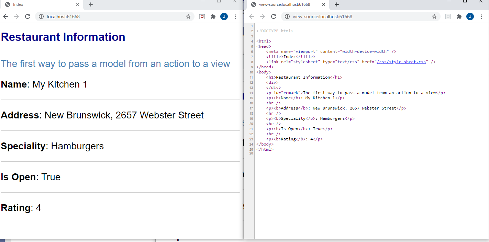
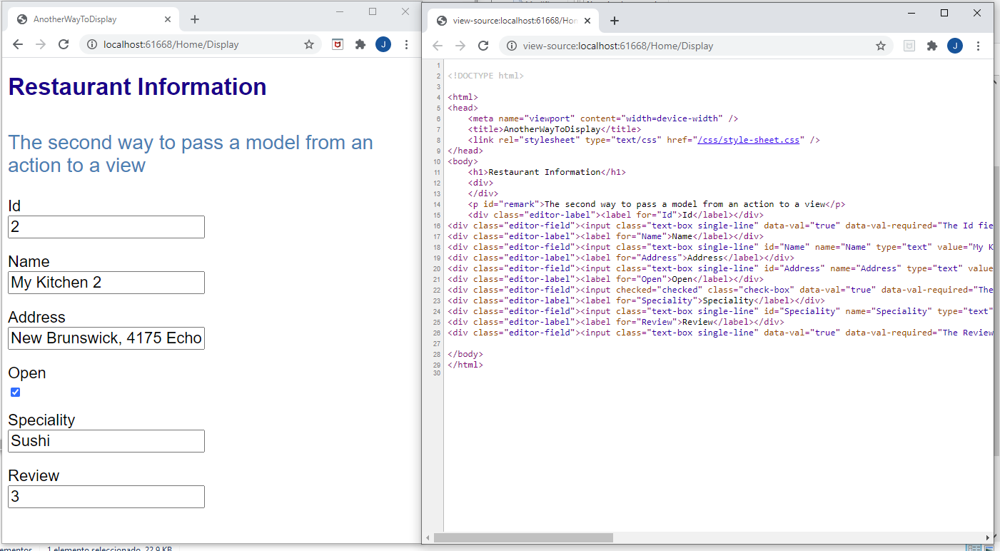

## Demo Module 6: Developing Models

### Lesson 1: Creating MVC Models

#### Demonstration: How to Bind Views to Model Classes

Abrimos 01_BindViewsExample_begin
```c#
-- MidleWare
	app.UseStaticFiles();
    app.UseMvcWithDefaultRoute();
	
--HomeControler 
public IActionResult Index()
{
	return View();
}

[Route("Home/Display")]
public IActionResult AnotherWayToDisplay()
{
	return View();
}

(y sus repectivas vistas vacias)
````

http://localhost:61668/

La demo e sencilla

Crear Models/Restaurants.cs

Desde el controlador hacer using BindViewsExample.Models y pasarle una instancia de un restaurante a cada vista
````
public class HomeController : Controller
{
	public IActionResult Index()
	{
		Restaurant restaurant = new Restaurant() { Id = 1, Name = "My Kitchen 1", Address = "New Brunswick, 2657 Webster Street", Speciality = "Hamburgers", Open = true, Review = 4 };
		return View(restaurant);
	}

	[Route("Home/Display")]
	public IActionResult AnotherWayToDisplay()
	{
		Restaurant restaurant = new Restaurant() { Id = 2, Name = "My Kitchen 2", Address = "New Brunswick, 4175 Echo Lane Street", Speciality = "Sushi", Open = true, Review = 3 };
		return View(restaurant);
	}
}
````
utilizar en las vistas 
__@model BindViewsExample.Models.Restaurant__   


En la primera vista presentar lo datos mediante __@Model.propiedad__  
@Model.Name  

En la segunda con un   __@Html.EditorForModel()__ 

__@Model.propiedad__   
  
__@Html.EditorForModel()__   
  
