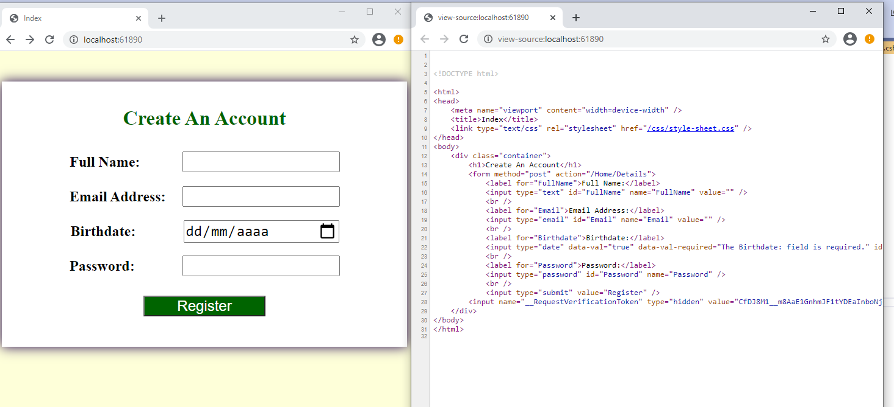
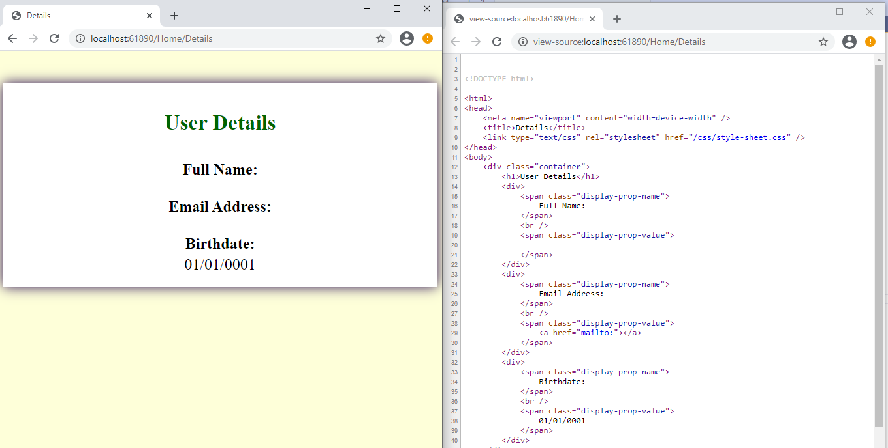

## DEMO Module 6: Developing Models

### Lesson 2: Working with Forms

#### Demonstration: How to Use Display and Edit Data Annotations

Abrimos la solucion 02_DataAnnotationsExample_begin
````
---Middleware
	app.UseStaticFiles();
	app.UseMvcWithDefaultRoute();

--Models.User	
---public class User
    {
        public int UserId { get; set; }
        public string FullName { get; set; }
        public string Email { get; set; }
        public DateTime Birthdate { get; set; }
        public string Password { get; set; }
    }
---Views.ViewImports.cshtml
	@addTagHelper *, Microsoft.AspNetCore.Mvc.TagHelpers
	
--HomeController	
	 public class HomeController : Controller
    {
        public IActionResult Index()
        {
            return View();
        }

        public IActionResult Details(User user)
        {
            return View(user);
        }
    }
---
	
	Las vistas creadas pero vacias 
````


Decoramos las propiedades del Modelo con  System.ComponentModel.DataAnnotations
````c#
using System;
using System.Collections.Generic;
using System.Linq;
using System.Threading.Tasks;
using System.ComponentModel.DataAnnotations;

namespace DataAnnotationsExample.Models
{
    public class User
    {
        public int UserId { get; set; }
        [Display(Name = "Full Name:")]
        public string FullName { get; set; }
        [Display(Name = "Email Address:")]
        [DataType(DataType.EmailAddress)]
        public string Email { get; set; }
        [Display(Name = "Birthdate:")]
        [DataType(DataType.Date)]
        public DateTime Birthdate { get; set; }
        [Display(Name = "Password:")]
        [DataType(DataType.Password)]
        public string Password { get; set; }
    }
}
````

ìndex  
````
......
<form asp-action="Details" method="post">
	<label asp-for="FullName"></label>
	<input asp-for="FullName" />
	<br />
	<label asp-for="Email"></label>
	<input asp-for="Email" />
	<br />
	<label asp-for="Birthdate"></label>
	<input asp-for="Birthdate" />
	<br />
	<label asp-for="Password"></label>
	<input asp-for="Password" />
	<br />
	<input type="submit" value="Register" />
</form>
````




Details
````
.....
<span class="display-prop-name">
	@Html.DisplayNameFor(model => model.FullName)
</span>
````
