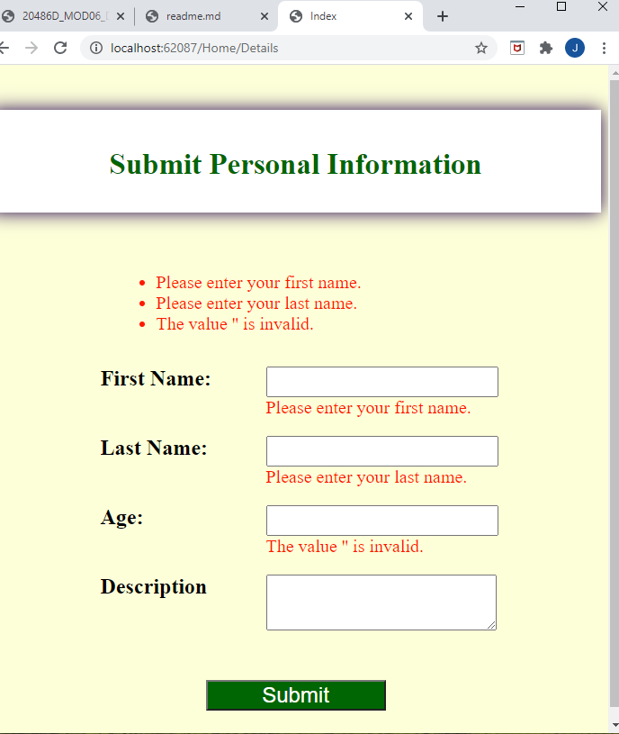
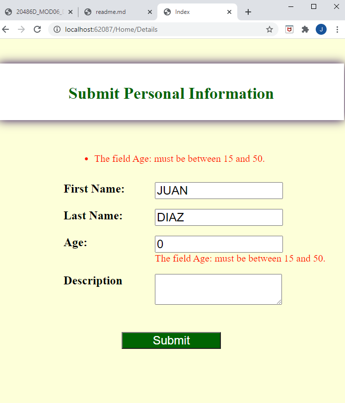
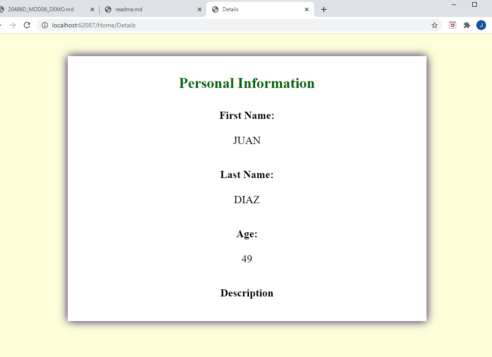

## DEMO Module 6: Developing Models

### Lesson 3: Validating MVC Applications

#### Demonstration: How to Use Display and Edit Data Annotations

Partimos de un entorno similar a los anteriores en la solucion del repositorio 03_DataAnnotationsValidationExample_begin

lo primero vamos a decorar la clase Models.Person

````
using System;
using System.Collections.Generic;
using System.Linq;
using System.Threading.Tasks;
using System.ComponentModel.DataAnnotations;

namespace DataAnnotationsExample.Models
{
    public class Person
    {
		public int PersonId { get; set; }
		[DataType(DataType.Text)]
		[Display(Name = "First Name:")]
		[Required(ErrorMessage = "Please enter your first name.")]
		public string FirstName { get; set; }
		[DataType(DataType.Text)]
		[Display(Name = "Last Name:")]
		[Required(ErrorMessage = "Please enter your last name.")]		
		public string LastName { get; set; }
		[Range(15, 50)]
		[Display(Name = "Age:")]
		public int Age { get; set; }
		public string Description { get; set; }
    }
}

````

Modificamos el controlador

````
using System;
using System.Collections.Generic;
using System.Linq;
using System.Threading.Tasks;
using Microsoft.AspNetCore.Mvc;
using DataAnnotationsExample.Models;

namespace DataAnnotationsExample.Controllers
{
    public class HomeController : Controller
    {
		public IActionResult Index()
        {
            return View(new Person());  // Ojo añadir el modelo a la vista o el formulario petara 
        }

        public IActionResult Details(Person person)
        {
            if (!ModelState.IsValid)
            {
                return View("Index", person);
            }

            return View(person);
        }
    }
}
````


y la vista index
````
@model DataAnnotationsExample.Models.Person
@{ Layout = null; }

<!DOCTYPE html>

<html>
<head>
    <meta name="viewport" content="width=device-width" />
    <title>Index</title>
    <link type="text/css" rel="stylesheet" href="~/css/style-sheet.css" />
</head>
<body>
    <div class="container">
        <h1>Submit Personal Information</h1>
    </div>
    <form asp-action="Details">
        <div asp-validation-summary="All"></div>
        <div class="form-field">
            <label asp-for="FirstName"></label>
            <span class="input-span">
                <input asp-for="FirstName" />
                <span asp-validation-for="FirstName"></span>
            </span>
        </div>
        <div class="form-field">
            <label asp-for="LastName"></label>
            <span class="input-span">
                <input asp-for="LastName" />
                <span asp-validation-for="LastName"></span>
            </span>
        </div>
        <div class="form-field">
            <label asp-for="Age"></label>
            <span class="input-span">
                <input asp-for="Age" />
                <span asp-validation-for="Age"></span>
            </span>
        </div>
        <div class="form-field">
            <label asp-for="Description"></label>
            <span class="input-span">
                <textarea asp-for="Description"></textarea>
                <span asp-validation-for="Description"></span>
            </span>
        </div>
        <div>
            <input type="submit" value="Submit" />
        </div>
    </form>
</body>
</html>
````

Con ello Index es un fomrulario que cuando hace submit va a Home.Details  
si el modelo no es válido regresa  
y si lo es va a detalles.  


  

  

  

