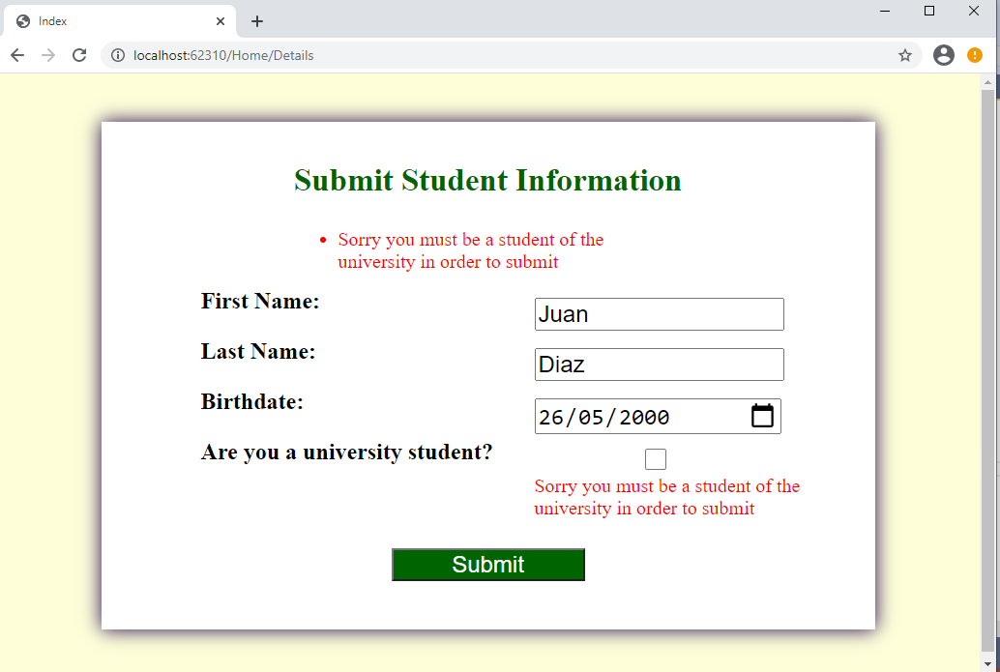
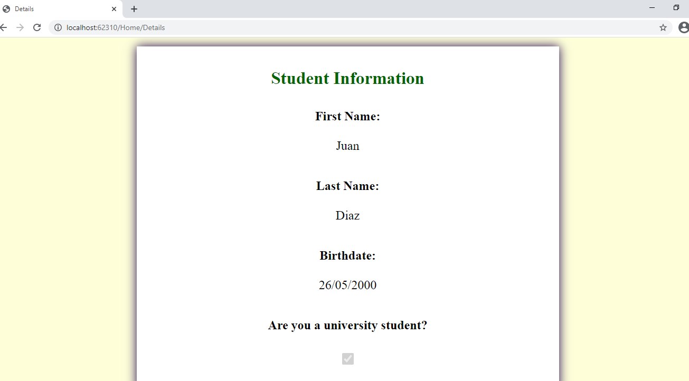

## Demo Module 6: Developing Models

### Lesson 3: Validating MVC Applications

#### Demonstration: How to Add Custom Validations

En este laboratorio partimos de la solucion del repositorio 04_DataAnnotationsCustomValidationExample_begin

similar a la anterior (en vez de Models.Person tenemos Models.Student)

````
namespace DataAnnotationsExample.Models
{
    public class Student
    {
        public int StudentId { get; set; }

        [Display(Name = "First Name:")]
        [Required(ErrorMessage = "Please enter your first name.")]
        public string FirstName { get; set; }

        [Display(Name = "Last Name:")]
        [Required(ErrorMessage = "Please enter your last name.")]
        public string LastName { get; set; }

        [Display(Name = "Birthdate:")]
        [DataType(DataType.Date)]
        public DateTime Birthdate { get; set; }
        public bool UniversityStudent { get; set; }
    }
````

Nos creamos Validators/InUniversityValidationAttribute.cs


````
using System;
using System.Collections.Generic;
using System.Linq;
using System.Threading.Tasks;
using DataAnnotationsExample.Models;
using System.ComponentModel.DataAnnotations;

namespace DataAnnotationsExample._Validators
{
    public class InUniversityValidationAttribute : ValidationAttribute
    {
        protected override ValidationResult IsValid(object value, ValidationContext validationContext)
        {
            Student student = (Student)validationContext.ObjectInstance;
            if (!student.UniversityStudent)
            {
                return new ValidationResult("Sorry you must be a student of the university in order to submit");
            }
            return ValidationResult.Success;
        }
    }
}
````


Añadimos el using al Model y decoramos con validacion la propiedad UniversityStudent
````
using System;
using System.Collections.Generic;
using System.Linq;
using System.Threading.Tasks;
using System.ComponentModel.DataAnnotations;
using DataAnnotationsExample.Validators;

namespace DataAnnotationsExample.Models
{
    public class Student
    {
        public int StudentId { get; set; }

        [Display(Name = "First Name:")]
        [Required(ErrorMessage = "Please enter your first name.")]
        public string FirstName { get; set; }

        [Display(Name = "Last Name:")]
        [Required(ErrorMessage = "Please enter your last name.")]
        public string LastName { get; set; }

        [Display(Name = "Birthdate:")]
        [DataType(DataType.Date)]
        public DateTime Birthdate { get; set; }
        [Display(Name = "Are you a university student?")]
        [InUniversityValidation]
        public bool UniversityStudent { get; set; }
    }
}
````

Y ejecutamos vemos que si el estudante no es universitario el modelo no es válido


nota:para que no de error de Nulreference verifica que le pasamos el modelo desde el controlador  
````
public IActionResult Index()
        {
            return View(new Student());
        }

````  


