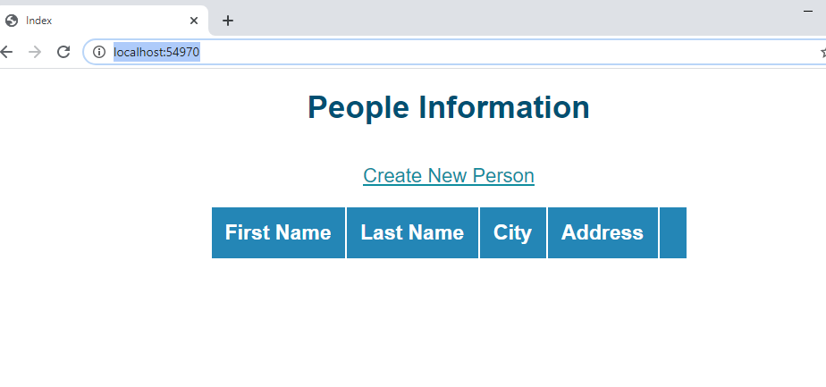
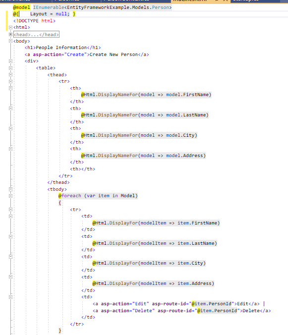
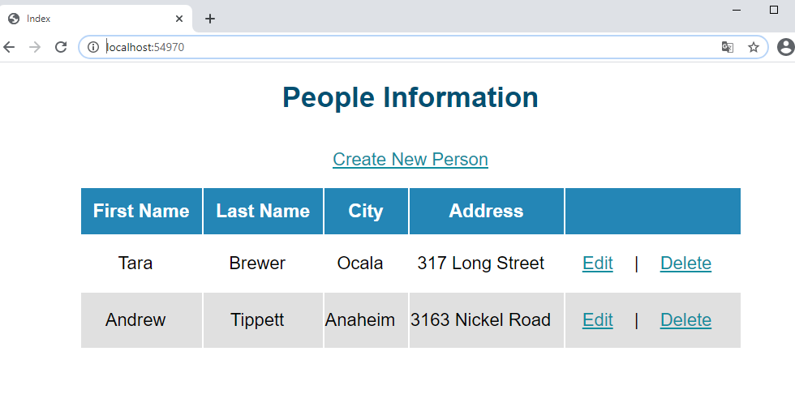
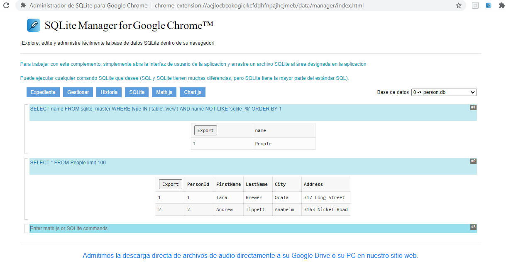
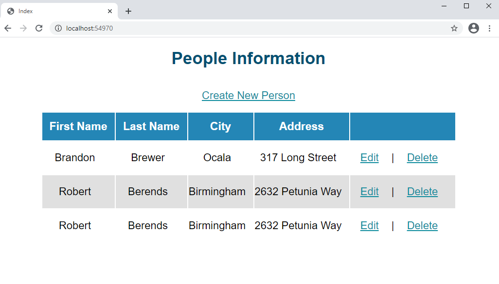

## Module 7: Using Entity Framework Core in ASP.NET Core

### Lesson 2: Working with Entity Framework Core

#### Demonstration: How to Use Entity Framework Core


Vamos a hacer un CRUD con MVC EF CORE y SQL Lite

Abrimos el repositorio de 01_EntityFrameworkExample_begin.
Y como siempre lo revisamos:

Midelware con app.UseStaticFiles(); app.UseMvc por defecto "{controller=Person}/{action=Index}/{id?}"  

Models.Person ( PersonId, FirstName, LastName, City, Adress )  

una clase vacia en Data.PersonContext

un Controlador PersonController con un Index reurn view()

y esta vista Index






nota: Para evitar error  
System.NullReferenceException: 'Object reference not set to an instance of an object.'  
Microsoft.AspNetCore.Mvc.Razor.RazorPage<TModel>.Model.get devolvió null.

le paso en el controlador
````
return View(new List<Person>());
````
otra opcion es modificar la vista
````
@if (Model != null) {
		@foreach (var item in Model)
		{...}
}
````			


Bueno pues vamos alla.

Lo primero es añadir Nuget Microsoft.EntityFrameworkCore.Sqlite v 2.10.


Despues implementar la clase Data.PersonContext
````
using System;
using System.Collections.Generic;
using System.Linq;
using System.Threading.Tasks;

using EntityFrameworkExample.Models;
using Microsoft.EntityFrameworkCore;

namespace EntityFrameworkExample.Data
{
    public class PersonContext : DbContext
    {
        public PersonContext(DbContextOptions<PersonContext> options) : base(options)
        {
        }
        public DbSet<Person> People { get; set; }

        protected override void OnModelCreating(ModelBuilder modelBuilder)  //Cuando llamamos a este metdo añadira los dos registros a la base de datos
        {
            modelBuilder.Entity<Person>().HasData(
              new Person
              {
                  PersonId = 1,
                  FirstName = "Tara",
                  LastName = "Brewer",
                  City = "Ocala",
                  Address = "317 Long Street"
              },
              new Person
              {
                  PersonId = 2,
                  FirstName = "Andrew",
                  LastName = "Tippett",
                  City = "Anaheim",
                  Address = "3163 Nickel Road"
              });
        }
    }
}
````

Modificamos el Midelware  
````
using System;
using System.Collections.Generic;
using System.Linq;
using System.Threading.Tasks;
using Microsoft.AspNetCore.Builder;
using Microsoft.AspNetCore.Hosting;
using Microsoft.AspNetCore.Http;
using Microsoft.Extensions.DependencyInjection;
using Microsoft.EntityFrameworkCore; // Añadimos estos dos using 
using EntityFrameworkExample.Data;


namespace EntityFrameworkExample
{
    public class Startup
    {
        public void ConfigureServices(IServiceCollection services)
        {
            services.AddMvc();
            services.AddDbContext<PersonContext>(options =>
                     options.UseSqlite("Data Source=person.db"));  //Aqui es donde le vamos a decir que el PersonContext está asociado a SqlLite (person.db)
        }

        public void Configure(IApplicationBuilder app,   PersonContext personContext)  // le pasamos el PersonContext
        {
            personContext.Database.EnsureDeleted(); // Cada vez que ejecutemos borramos la base 
            personContext.Database.EnsureCreated(); // y la creamos segun el contexto

            app.UseStaticFiles();
            app.UseMvc(routes =>
            {
                routes.MapRoute(
                    name: "defaultRoute",
                    template: "{controller=Person}/{action=Index}/{id?}");
            });
        }
    }
}
```` 

Bien pues ya tenemos el PersonContext y el Midelware, pues a hacer el CRUD en el Controller


Vamos a injectarle por depencia el Contexto y pasarselo a la vista  como en teoria cada vez creamos la base deberemos tener datos


````
`using System;
using System.Collections.Generic;
using System.Linq;
using System.Threading.Tasks;
using EntityFrameworkExample.Data;
using EntityFrameworkExample.Models;
using Microsoft.AspNetCore.Mvc;
using EntityFrameworkExample.Data; // añadimos los dos using 
using EntityFrameworkExample.Models;

namespace EntityFrameworkExample.Controllers
{
    public class PersonController : Controller
    {
        private readonly PersonContext _context;     // injeccion de depencia de PersonContext ya podemos usarlo

        public PersonController(PersonContext context)
        {
            _context = context;
        }


        public IActionResult Index()
        {

            /* var p = new List<Person>();
             return View(p);*/
            return View(_context.People.ToList());     // le pasamos el conexto la tabla People!
        }
    }
}
````

Do you remeber David Copperfield?




y con la extension de Chrome
https://chrome.google.com/webstore/detail/sqlite-manager-for-google/aejlocbcokogiclkcfddhfnpajhejmeb?hl=es




Venga vamos a por el CRUD 

```
public IActionResult Edit(int id)
{
	var person = _context.People.SingleOrDefault(m => m.PersonId == id);
	person.FirstName = "Brandon";
	_context.Update(person);
	_context.SaveChanges();
	return RedirectToAction(nameof(Index));
}
````
Recordemos que es ejecutada desde la vista
y en este ejemplo solo modifica el FirstName a Brandon (de cualquiera de los dos)
````
<a asp-action="Edit" asp-route-id="@item.PersonId">Edit</a> 
````

```
public IActionResult Delete(int id)
{
	var person = _context.People.SingleOrDefault(m => m.PersonId == id);
	_context.People.Remove(person);
	_context.SaveChanges();
	return RedirectToAction(nameof(Index));
}
````
Recordemos que es ejecutada desde la vista
````
<a asp-action="Delete" asp-route-id="@item.PersonId">Delete</a>
````


y el create

````
public IActionResult Create()
{
	_context.Add(new Person() { FirstName = "Robert", LastName = "Berends", City = "Birmingham", Address = "2632 Petunia Way" });
	_context.SaveChanges();
	return RedirectToAction(nameof(Index));
}
`````
````
 <a asp-action="Create">Create New Person</a>
````




