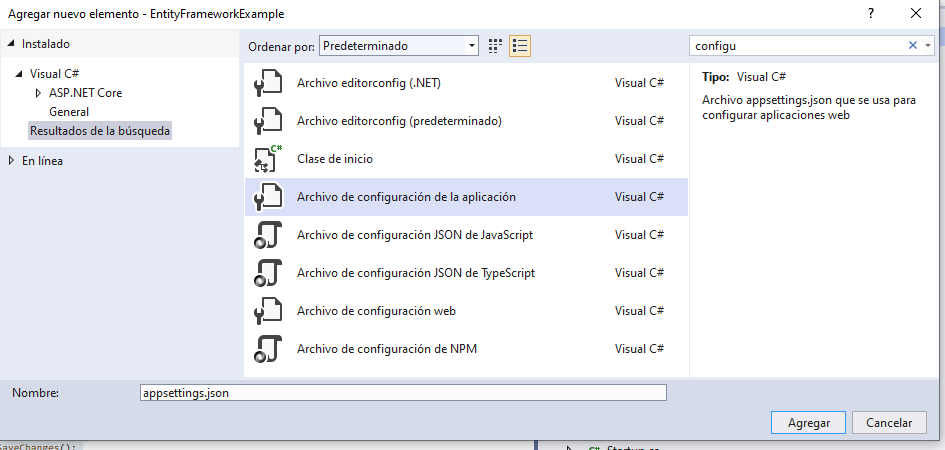
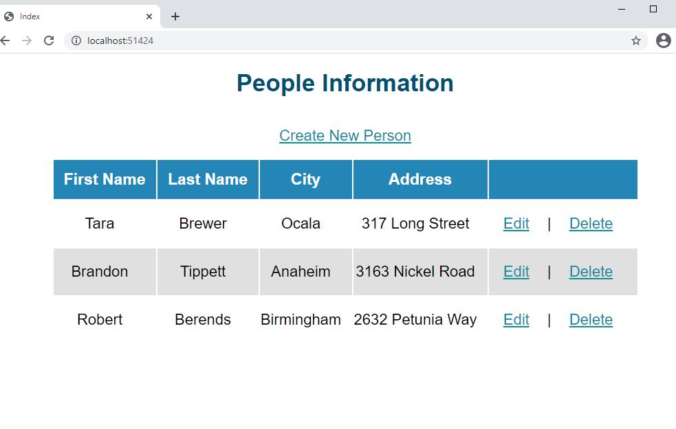

## Module 7: Using Entity Framework Core in ASP.NET Core

### Lesson 3: Using Entity Framework Core to Connect to Microsoft SQL Server

#### Demonstration: How to Apply the Repository Pattern

Empezamos con el proyecto del repositorio 02_RepositoryExample_begin


Es la misma estructura del proyecto anterior
solo que con el [Data/PersonContext.cs](EntityFrameworkExample/Data/PersonContext.cs) ya implementado (recurde OnModelCreating())....Insertaba dos Person y un  DbSet<Person> People { get; set; }


y si he creado una interfaz IRepository y una clase MyRepository en una carpeta Repositories

la vista Person.Index.cshtml la modifico añadiendole 
```
@if (Model != null){
	@foreach (var item in Model)
	{ <tr>......</tr>
	}
}
```
mejor que pasandole una instancia vacia del modelo.

Al lio.

Implementamos la Interfaz IRepository.cs 
````
using System;
using System.Collections.Generic;
using System.Linq;
using System.Threading.Tasks;
using EntityFrameworkExample.Models; // Añadimos el using
namespace EntityFrameworkExample.Repositories
{
    public interface IRepository
    {
        IEnumerable<Person> GetPeople();
        void CreatePerson();
        void UpdatePerson(int id);
        void DeletePerson(int id);
    }
}
````  
Bueno ya nos da una pista de que tendra MyRepository (porque seguro que la implemeta)

````
using System;
using System.Collections.Generic;
using System.Linq;
using System.Threading.Tasks;
using EntityFrameworkExample.Data;
using EntityFrameworkExample.Models;

namespace EntityFrameworkExample.Repositories
{
    public class MyRepository : IRepository
    {
        private PersonContext _context;             // lo primero injectamos PersonContext

        public MyRepository(PersonContext context)
        {
            _context = context;
        }

        public IEnumerable<Person> GetPeople()   // y despues un CRUD 
        {
            return _context.People.ToList();
        }

        public void CreatePerson()
        {
            _context.Add(new Person() { FirstName = "Robert ", LastName = "Berends", City = "Birmingham", Address = "2632 Petunia Way" });
            _context.SaveChanges();
        }

        public void UpdatePerson(int id)
        {
            var person = _context.People.SingleOrDefault(m => m.PersonId == id);
            person.FirstName = "Brandon";
            _context.Update(person);
            _context.SaveChanges();
        }


        public void DeletePerson(int id)
        {
            var person = _context.People.SingleOrDefault(m => m.PersonId == id);
            _context.People.Remove(person);
            _context.SaveChanges();
        }
    }
}

````

Ahora creamos un archivo de configuracion appsettings.json para meter DefaultConnection



Le ponemos la nuestra (recuerda que teniamos en el contexto un OnModelCreating() por lo que seguramente la crearemos en el MiddleWare
(porque no existe y si existe y te vale cambiala porque la vamos a cambiar)

````
{
  "ConnectionStrings": {
    "DefaultConnection": "Server=(localdb)\\MSSQLLocalDB;Database=PersonDB;Trusted_Connection=True;MultipleActiveResultSets=true"
  }
}
````


Bien lo dicho  al MiddleWare

````
using System;
using System.Collections.Generic;
using System.Linq;
using System.Threading.Tasks;
using Microsoft.AspNetCore.Builder;
using Microsoft.AspNetCore.Hosting;
using Microsoft.AspNetCore.Http;
using Microsoft.Extensions.Configuration;
using Microsoft.Extensions.DependencyInjection;
using EntityFrameworkExample.Data; // añadimos estos 3 using 
using Microsoft.EntityFrameworkCore;
using EntityFrameworkExample.Repositories;

namespace EntityFrameworkExample
{
    public class Startup
    {
        private IConfiguration _configuration;

        public Startup(IConfiguration configuration)
        {
            _configuration = configuration;
        }

        public void ConfigureServices(IServiceCollection services)
        {
            services.AddMvc();
            services.AddDbContext<PersonContext>(options =>
            options.UseSqlServer(_configuration.GetConnectionString("DefaultConnection"))); // aqui le decimos la base de datos del Personcontext

            services.AddScoped<IRepository, MyRepository>(); // La injeccion de depencia utilizada 
        }

        public void Configure(IApplicationBuilder app, PersonContext personContext) // le pasamos el  PersonContext
        {
            app.UseStaticFiles();

            personContext.Database.EnsureDeleted();  // eliminamos y creamos la base de datos
            personContext.Database.EnsureCreated();

            app.UseMvc(routes =>
            {
                routes.MapRoute(
                    name: "defaultRoute",
                    template: "{controller=Person}/{action=Index}/{id?}");
            });
        }
    }
}
````

y finalmente.... le añadimos al controlador la injeccion de depencia, bueno y no solo eso las acions tiraran de ella.

````
using System;
using System.Collections.Generic;
using System.Linq;
using System.Threading.Tasks;
using Microsoft.AspNetCore.Mvc;
using EntityFrameworkExample.Repositories;  //los repsoitorios

namespace EntityFrameworkExample.Controllers
{
    public class PersonController : Controller
    {
        private IRepository _repository;             //      injeccion de depencia

        public PersonController(IRepository repository)
        {
            _repository = repository;
        }         

        public IActionResult Index()
        {
            var list = _repository.GetPeople();
            return View(list);
        }
        public IActionResult Create()
        {
            _repository.CreatePerson();
            return RedirectToAction(nameof(Index));
        }
        public IActionResult Edit(int id)
        {
            _repository.UpdatePerson(id);
            return RedirectToAction(nameof(Index));
        }
        public IActionResult Delete(int id)
        {
            _repository.DeletePerson(id);
            return RedirectToAction(nameof(Index));
        }
    }
}
````

Esta vez ya no soprende tanto porque nos lo esperabamos ;)




