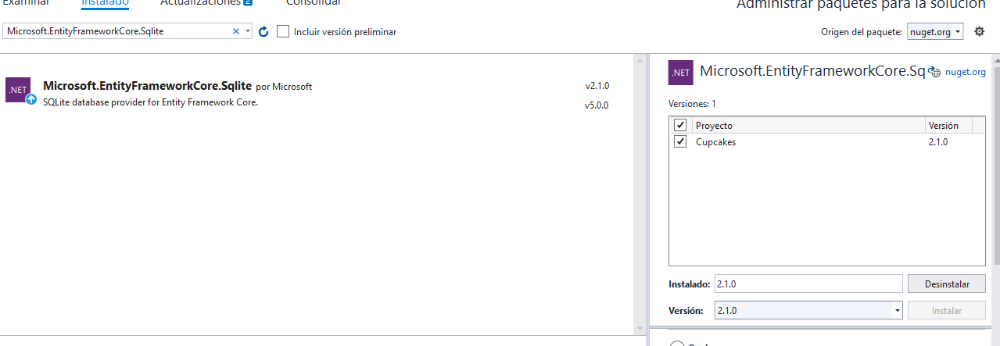
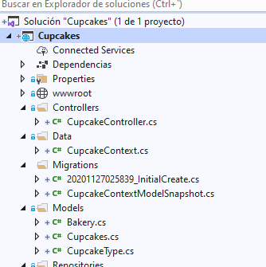

## Laboratorio  Module 7: Using Entity Framework Core in ASP.NET Core

### Lab: Using Entity Framework Core in ASP.NET Core


En este laboraorio partimos de la solucion del repositorio 01_Cupcakes_begin


[MiddleWare](original/Cupcakes/Startup.cs) con  app.UseStaticFiles() y una ruta {controller}/{action}/{id?} por defecto Cupcake/Index  
En [Models](original/Cupcakes/Models/CupcakeType.cs) sólo tenemos una enumeracion  
un [CupcakeController](original/Cupcakes/Controllers/CupcakeController.cs) con un Index y un GetImage  
y todas las [vistas](original/Cupcakes/Views/Cupcake) creadas   


No lo intentamos ejecutar porque peta por todos lados  

#### Exercise 1: Adding Entity Framework Core

la primera tarea será añadir a Models las clases Cupcakes  y Bakery  
añadiendolas los atributos de System.ComponentModel.DataAnnotations y System.ComponentModel.DataAnnotations.Schema  por el atributo NotMapped
--Cupcakes  __OJO QUE LA CLASE LA TIENE PLURAL (LA CORRIJO A SINGULAR)__
````
using System;
using System.Collections.Generic;
using System.Linq;
using System.Threading.Tasks;
using Microsoft.AspNetCore.Http;                    // tema de la Imagen 
using System.ComponentModel.DataAnnotations;       // Atributos DataAnnotations
using System.ComponentModel.DataAnnotations.Schema; // Atributos DataAnnotations.Schema

namespace Cupcakes.Models
{
    public class Cupcake // CUPCAKE
    {
        [Key]
        public int CupcakeId { get; set; }

        [Required(ErrorMessage = "Please select a cupcake type")]
        [Display(Name = "Cupcake Type:")]
        public CupcakeType? CupcakeType { get; set; }

        [Required(ErrorMessage = "Please enter a cupcake description")]
        [Display(Name = "Description:")]
        public string Description { get; set; }

        [Display(Name = "Gluten Free:")]
        public bool GlutenFree { get; set; }

        [Range(1, 15)]
        [Required(ErrorMessage = "Please enter a cupcake price")]
        [DataType(DataType.Currency)]
        [Display(Name = "Price:")]
        public double? Price { get; set; }

        [NotMapped]                                        // No pasar a la base de datos!!!
        [Display(Name = "Cupcake Picture:")]
        public IFormFile PhotoAvatar { get; set; }

        public string ImageName { get; set; }

        public byte[] PhotoFile { get; set; }

        public string ImageMimeType { get; set; }

        [Required(ErrorMessage = "Please select a bakery")]
        public int? BakeryId { get; set; }

        public virtual Bakery Bakery { get; set; }    // va a ser relacion 1:??? hasta que no implemente la otra clase no lo sé
    }
}

````
--Bakery  
````
using System;
using System.Collections.Generic;
using System.Linq;
using System.Threading.Tasks;
using System.ComponentModel.DataAnnotations;

namespace Cupcakes.Models
{
    public class Bakery
    {
        [Key]
        public int BakeryId { get; set; }

        [StringLength(50, MinimumLength = 4)]
        public string BakeryName { get; set; }

        [Range(1, 40)]
        public int Quantity { get; set; }

        [StringLength(50, MinimumLength = 4)]
        public string Address { get; set; }

        public virtual ICollection<Cupcake> Cupcakes { get; set; }  // relacion 1:N (ahora sí)
    }
}
`````

la tarea 2 es crear el DBContext   

  

````
using System;
using System.Collections.Generic;
using System.Linq;
using System.Threading.Tasks;
using Cupcakes.Models;                   // añadimos los usings
using Microsoft.EntityFrameworkCore;

namespace Cupcakes.Data
{
    public class CupcakeContext : DbContext   //heredamos de DBContext
    {
        public CupcakeContext(DbContextOptions<CupcakeContext> options) : base(options)    // el connstructor con el base constructor
        {
        }

        public DbSet<Cupcake> Cupcakes { get; set; }   // un DBset para cada tabla
        public DbSet<Bakery> Bakeries { get; set; }
    }
}
````

`
La siguiente area habla de Set up Entity Framework Core to use SQLite

pues nada añadir con Nuget Microsoft.EntityFrameworkCore.Sqlite la version 2.1.0 !!!



y a usarla, para ello nos vamos al MiddleWare (Startup.cs)

````
using System;
using System.Collections.Generic;
using System.Linq;
using System.Threading.Tasks;
using Microsoft.AspNetCore.Builder;
using Microsoft.AspNetCore.Hosting;
using Microsoft.AspNetCore.Http;
using Microsoft.Extensions.DependencyInjection;

using Microsoft.Extensions.Configuration;  // añadimos estos using 
using Cupcakes.Data;
using Microsoft.EntityFrameworkCore;

namespace Cupcakes
{
    public class Startup
    {

        private IConfiguration _configuration;                   //injection de dependencia de IConfiguration

        public Startup(IConfiguration configuration)
        {
            _configuration = configuration;
        }

        public void ConfigureServices(IServiceCollection services)
        {
            services.AddMvc();
            services.AddDbContext<CupcakeContext>(options =>
                          options.UseSqlite("Data Source=cupcake.db"));  // le indicamos que el contexto va a usar Sqlit)e 
        }

        public void Configure(IApplicationBuilder app, CupcakeContext cupcakeContext)  // Le añadimos el contexto al Configure
        {
            app.UseStaticFiles();

            cupcakeContext.Database.EnsureDeleted();                  // y ya sabemos que con esto en cada ejecución tenemos una base de datos original!
            cupcakeContext.Database.EnsureCreated();

            app.UseMvc(routes =>
            {
                routes.MapRoute(
                    name: "CupcakeRoute",
                    template: "{controller}/{action}/{id?}",
                    defaults: new { controller = "Cupcake", action = "Index" },
                    constraints: new { id = "[0-9]+" });
            });
        }
    }
}
````

Sigamos ...
Task 4: Use OnModelCreating to populate the database (esto será en .... Data/CupcakeContext)

`Le añadimos datos a cada tabla
````
using System;
using System.Collections.Generic;
using System.Linq;
using System.Threading.Tasks;
using Cupcakes.Models;                   // añadimos los usings
using Microsoft.EntityFrameworkCore;

namespace Cupcakes.Data
{
    public class CupcakeContext : DbContext   //heredamos de DBContext
    {
        public CupcakeContext(DbContextOptions<CupcakeContext> options) : base(options)    // el connstructor con el base constructor
        {
        }

        public DbSet<Cupcake> Cupcakes { get; set; }   // un DBset para cada tabla
        public DbSet<Bakery> Bakeries { get; set; }

        protected override void OnModelCreating(ModelBuilder modelBuilder)
        {
            modelBuilder.Entity<Bakery>().HasData(
                new Bakery {BakeryId = 1,BakeryName = "Gluteus Free",Address = "635 Brighton Circle Road",Quantity = 8 },
                new Bakery{BakeryId = 2,BakeryName = "Cupcakes Break",Address = "4323 Jerome Avenue",Quantity = 22},
                new Bakery{BakeryId = 3,BakeryName = "Cupcakes Ahead",Address = "2553 Pin Oak Drive",Quantity = 18},
                new Bakery { BakeryId = 4, BakeryName = "Sugar", Address = "1608 Charles Street", Quantity = 30 });

            modelBuilder.Entity<Cupcake>().HasData(
                new Cupcake{CupcakeId = 1,CupcakeType = CupcakeType.Birthday,Description = "Vanilla cupcake with coconut cream",GlutenFree = true,
                            Price = 2.5,BakeryId = 1,ImageMimeType = "image/jpeg",ImageName = "birthday-cupcake.jpg"},
                new Cupcake{CupcakeId = 2,CupcakeType = CupcakeType.Chocolate,Description = "Chocolate cupcake with caramel filling and chocolate butter cream",GlutenFree = false,
                            Price = 3.2,BakeryId = 2,ImageMimeType = "image/jpeg",ImageName = "chocolate-cupcake.jpg"},
                new Cupcake{CupcakeId = 3,CupcakeType = CupcakeType.Strawberry,Description = "Chocolate cupcake with straberry cream filling",GlutenFree = false,   
                            Price = 4,BakeryId = 3,ImageMimeType = "image/jpeg",ImageName = "pink-cupcake.jpg"},
                new Cupcake{CupcakeId = 4,CupcakeType = CupcakeType.Turquoise,Description = "Vanilla cupcake with butter cream",GlutenFree = true,
                            Price = 1.5,BakeryId = 4,ImageMimeType = "image/jpeg",ImageName = "turquoise-cupcake.jpg"});
        }
    }
}
````


Con esto ya podíamos añadir datos a la base de datos cada vez que ejecutemos.... pero en vez de ejecutar vamos a seguir con el laboraorio

#### Exercise 2: Use Entity Framework Core to Retrieve and Store Data

Como en la Demo vamos a crear Repositorios.. 
Repositories/ICupcakeRepository y Repositories/CupcakeRepository 

--- Repositories/ICupcakeRepository
```
using System;
using System.Collections.Generic;
using System.Linq;
using System.Threading.Tasks;
using Cupcakes.Models;    // el modelo porque sino mal

namespace Cupcakes.Repositories
{
    public interface ICupcakeRepository
    {
        IEnumerable<Cupcake> GetCupcakes();                       //un CRUD
        Cupcake GetCupcakeById(int id);
        void CreateCupcake(Cupcake cupcake);
        void DeleteCupcake(int id);
        void SaveChanges();                                         // un SaveChanges
        IQueryable<Bakery> PopulateBakeriesDropDownList();          // llenar un DropDownList
    }
}
````  
--- Repositories/CupcakeRepository la implementará
````

using System;
using System.Collections.Generic;
using System.Linq;
using System.Threading.Tasks;

using System.IO;               // esto es por la imagen 
using Cupcakes.Data;           // esto por  el contexto
using Cupcakes.Models;         // esto por los datos
using Microsoft.EntityFrameworkCore;  // esto es el EF

namespace Cupcakes.Repositories
{
    public class CupcakeRepository : ICupcakeRepository  
    {
        private CupcakeContext _context;              //   injeccion de dependia del contexto

        public CupcakeRepository(CupcakeContext context)
        {
            _context = context;
        }

        public IEnumerable<Cupcake> GetCupcakes()
        {
            return _context.Cupcakes.ToList();
        }

        public Cupcake GetCupcakeById(int id)
        {
            return _context.Cupcakes.Include(b => b.Bakery)
                 .SingleOrDefault(c => c.CupcakeId == id);
        }

        public void CreateCupcake(Cupcake cupcake)
        {
            if (cupcake.PhotoAvatar != null && cupcake.PhotoAvatar.Length > 0)  
            {
                cupcake.ImageMimeType = cupcake.PhotoAvatar.ContentType;
                cupcake.ImageName = Path.GetFileName(cupcake.PhotoAvatar.FileName);
                using (var memoryStream = new MemoryStream())
                {
                    cupcake.PhotoAvatar.CopyTo(memoryStream);
                    cupcake.PhotoFile = memoryStream.ToArray();
                }
                _context.Add(cupcake);
                _context.SaveChanges();
            }
        }

        public void DeleteCupcake(int id)
        {
            var cupcake = _context.Cupcakes.SingleOrDefault(c => c.CupcakeId == id);
            _context.Cupcakes.Remove(cupcake);
            _context.SaveChanges();
        }

        public void SaveChanges()
        {
            _context.SaveChanges();
        }

        public IQueryable<Bakery> PopulateBakeriesDropDownList()  // va a llenar un DropDownList con las Bakeries 
        {
            var bakeriesQuery = from b in _context.Bakeries
                                orderby b.BakeryName
                                select b;
            return bakeriesQuery;
        }
    }
}
``````````````````

En la linea 15 tenemos una injeccion de depencia pues habrá que meterla en el [MiddleWare](CupcakessqlLite/Startup.cs)  

``````
using Cupcakes.Repositories;  // <<<<<<<<<<<<<<<<<<<<<<<<<<<<<<<<<<<<<< injeccion de depencia de los Repositorios
.......
public void ConfigureServices(IServiceCollection services)
        {
            services.AddMvc();
            services.AddDbContext<CupcakeContext>(options =>
                          options.UseSqlite("Data Source=cupcake.db"));  // le indicamos que el contexto va a usar Sqlite 
            services.AddTransient<ICupcakeRepository, CupcakeRepository>();  // <<<<<<<<<<<<< injeccion de depencia de los Repositorios
        }
``````


El Repositorio no lo utilzamos en el [CupcakeController](CupcakessqlLite/Controllers/CupcakeController.cs)  , pues alla vamos

``` 
...............
using Microsoft.AspNetCore.Mvc;

using Microsoft.AspNetCore.Hosting;         // lo añadimos por los Repositorios
using Cupcakes.Models;
using Cupcakes.Repositories;
using Microsoft.AspNetCore.Mvc.Rendering;
using Microsoft.EntityFrameworkCore;


namespace Cupcakes.Controllers
{
    public class CupcakeController : Controller
    {

        private ICupcakeRepository _repository;   // lo añadimos por los Repositorios
        private IHostingEnvironment _environment;

        public CupcakeController(ICupcakeRepository repository, IHostingEnvironment environment)
        {
            _repository = repository;
            _environment = environment;
        }
		.......................
````

y le añadimos las diferenctes acciones del CRUD

Index y Details  
````
		public IActionResult Index()
        {
            //return View();
            return View(_repository.GetCupcakes()); // como ya tenmos el repositorio...
        }
        public IActionResult Details(int id)
        {
            var cupcake = _repository.GetCupcakeById(id);
            if (cupcake == null)
            {
                return NotFound();
            }
            return View(cupcake);
        }
````
el PopulateBakeriesDropDownList  
````
        private void PopulateBakeriesDropDownList(int? selectedBakery = null)
        {
            var bakeries = _repository.PopulateBakeriesDropDownList();
            ViewBag.BakeryID = new SelectList(bakeries.AsNoTracking(), "BakeryId", "BakeryName", selectedBakery);
        }
````
Create (get y Post)  
````
        [HttpGet]
        public IActionResult Create()
        {
            PopulateBakeriesDropDownList();
            return View(new Cupcake());  // en mi caso le tengo que meter un new Cupcake() por que sino me peta
        }
        [HttpPost, ActionName("Create")]
        public IActionResult CreatePost(Cupcake cupcake)
        {
            if (ModelState.IsValid)
            {
                _repository.CreateCupcake(cupcake);
                return RedirectToAction(nameof(Index));
            }
            PopulateBakeriesDropDownList(cupcake.BakeryId);
            return View(cupcake);
        }
````
Edit (get y Post)  OJO Al utilizar TryUpdateModelAsync y pasarle cdada campo debemos verificar si cambia al hacer cualquier migraciones
````
        [HttpGet]
        public IActionResult Edit(int id)
        {
            Cupcake cupcake = _repository.GetCupcakeById(id);
            if (cupcake == null)
            {
                return NotFound();
            }
            PopulateBakeriesDropDownList(cupcake.BakeryId);
            return View(cupcake);
        }

        [HttpPost, ActionName("Edit")]
        public async Task<IActionResult> EditPost(int id)
        {
            var cupcakeToUpdate = _repository.GetCupcakeById(id);
            bool isUpdated = await TryUpdateModelAsync<Cupcake>(
                                     cupcakeToUpdate,
                                     "",
                                     c => c.BakeryId,
                                     c => c.CupcakeType,
                                     c => c.Description,
                                     c => c.GlutenFree, 
                                     c => c.Price); /// si añado un nuevo campo ó quito un campo en el modelo debemos ver si se actualiza automaticamente
            if (isUpdated == true)
            {
                _repository.SaveChanges();
                return RedirectToAction(nameof(Index));
            }
            PopulateBakeriesDropDownList(cupcakeToUpdate.BakeryId);
            return View(cupcakeToUpdate);
        }
````
Delete (get y Post)  
````		
        [HttpGet]
        public IActionResult Delete(int id)
        {
            var cupcake = _repository.GetCupcakeById(id);
            if (cupcake == null)
            {
                return NotFound();
            }
            return View(cupcake);
        }
        [HttpPost, ActionName("Delete")]
        public IActionResult DeleteConfirmed(int id)
        {
            _repository.DeleteCupcake(id);
            return RedirectToAction(nameof(Index));
        }

````


ya aqui podemos ejecutar....


#### Exercise 3: Use Entity Framework Core to Connect to Microsoft SQL Server

Bueno para terminar la conectaremos a una SQLSERVER y usaremos Migraciones...


Para no perder lo hecho hago una copia y la llamo CupcakessqlLite y asi los anteriores enlaces del markdown siguen teniendo el código con la versión SQlite


1. agregamos el archivo de connfiguracion [appsettings.json](Cupcakes/appsettings.json)    con la DefaultConnectionString 
````
{
  "ConnectionStrings": {
    "DefaultConnection": "Server=(localdb)\\MSSQLLocalDB;Database=BakeriesDb;Trusted_Connection=True;MultipleActiveResultSets=true"
  }
}
``````````


2. Modifcamos el [MiddleWare](Cupcakes/Startup.cs)   
````
public void ConfigureServices(IServiceCollection services)
{
	services.AddMvc();

	/* services.AddDbContext<CupcakeContext>(options =>
				 options.UseSqlite("Data Source=cupcake.db")); */

	/*string connectionString = "Server=(localdb)\\MSSQLLocalDB;Database=BakeriesDb;Trusted_Connection=True;MultipleActiveResultSets=true";
	  services.AddDbContext<CupcakeContext>(options =>
				 options.UseSqlServer(connectionString));	*/

	services.AddDbContext<CupcakeContext>(options =>
				  options.UseSqlServer(_configuration.GetConnectionString("DefaultConnection")));

	services.AddTransient<ICupcakeRepository, CupcakeRepository>();   // <<<<<<<<<<<<<<<<<<<<<<<<<<<<<<<<<<<<<< injeccion de depencia de los Repositorios
}
````		  
			  
y quitamos las el CupcakeContext cupcakeContext del Configure ya que vamos por migraciones
````
 public void Configure(IApplicationBuilder app)  // Le añadimos el contexto al Configure
        {
            app.UseStaticFiles();

            app.UseMvc(routes =>
            {
                routes.MapRoute(
                    name: "CupcakeRoute",
                    template: "{controller}/{action}/{id?}",
                    defaults: new { controller = "Cupcake", action = "Index" },
                    constraints: new { id = "[0-9]+" });
            });
        }
````

3. Agregamos las Migraciones desde NuGet Package Manager  Package Manager Console


en la consola ejecutamos   estos dos comandos  
Add-Migration InitialCreate  
Update-Database   


Bien si vemos ahora tenemos un historial de migraciones





Para terminar vamos a actualizar el modelo y ver como migra 

Añadimos a Cupcake.cs.
````
        [Display(Name = "Caloric Value:")]
        public int CaloricValue { get; set; }
````
en  OnModelCreating  deCupcakeContext.cs. le pasamos valores por ejemplo 
````
CaloricValue = 355
````

le metemos en las vistas el nuevo campo 
Details
````
<div>
	<p class="display-label">
		@Html.DisplayNameFor(model => model.CaloricValue)
	</p>
	<p class="display-field">
		@Html.DisplayFor(model => model.CaloricValue)
	</p>
</div>
````
Edit
````
  <div class="form-field">
      <label asp-for="CaloricValue"></label>
      <input asp-for="CaloricValue" />
      <span asp-validation-for="CaloricValue"></span>
  </div>
````
Create
````
 <div class="form-field">
      <label asp-for="CaloricValue"></label>
      <input asp-for="CaloricValue" />
      <span asp-validation-for="CaloricValue"></span>
  </div>
````

Ejecutamos en la Consola Nuget
````
Add-Migration AddCupcakeCaloricValue
Update-Database
````
Ojo porque no viene en el Lak
si no camabiamos esto en el controlador no actualizará el campo nuevo

````
      [HttpPost, ActionName("Edit")]
        public async Task<IActionResult> EditPost(int id)
        {
            var cupcakeToUpdate = _repository.GetCupcakeById(id);
            bool isUpdated = await TryUpdateModelAsync<Cupcake>(
                                     cupcakeToUpdate,
                                     "",
                                     c => c.BakeryId,
                                     c => c.CupcakeType,
                                     c => c.Description,
                                     c => c.GlutenFree,
                                     c => c.Price,
                                     c => c.CaloricValue); // debemos añadir a mano el nuevo campo 
            if (isUpdated == true)
            {
                _repository.SaveChanges();
                return RedirectToAction(nameof(Index));
            }
            PopulateBakeriesDropDownList(cupcakeToUpdate.BakeryId);
            return View(cupcakeToUpdate);
        }
````


Y observamos los cambios


