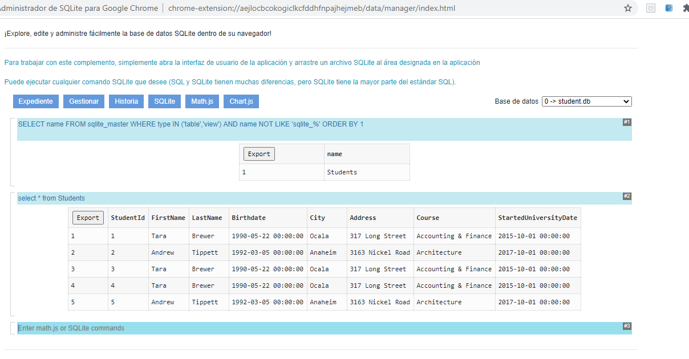
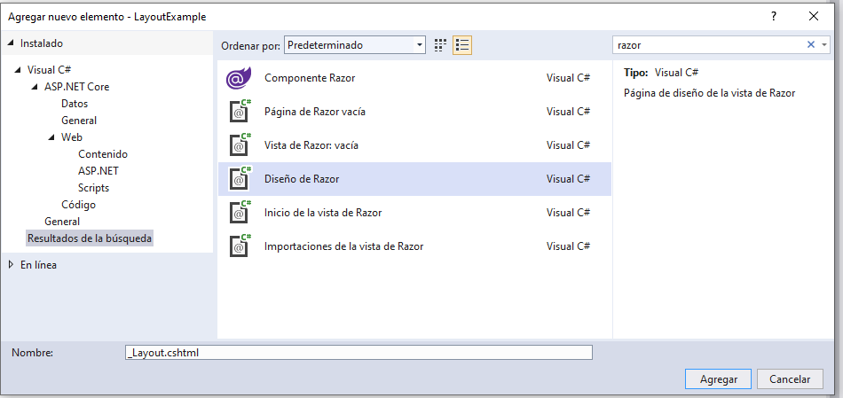
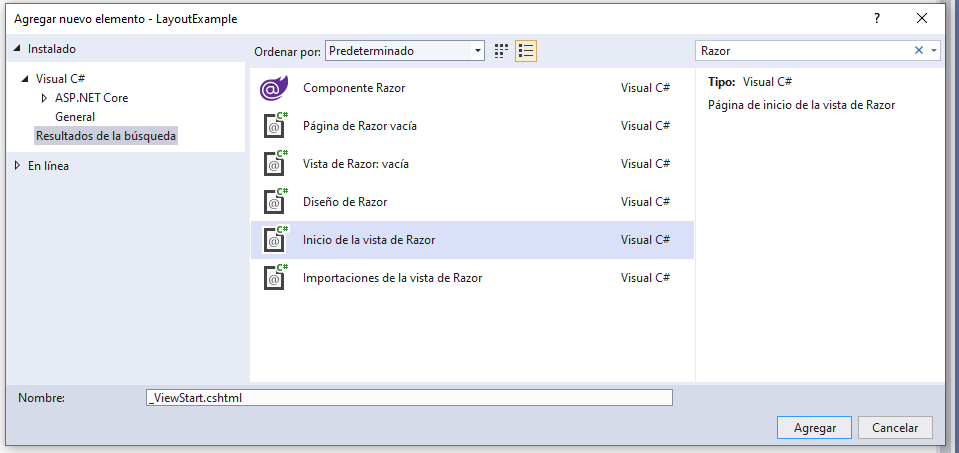
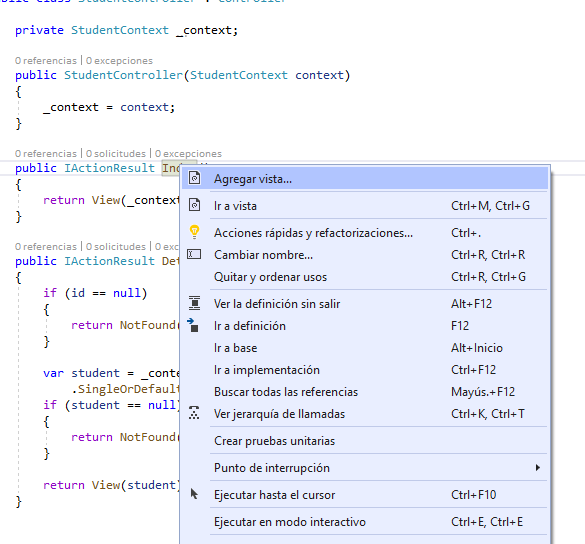
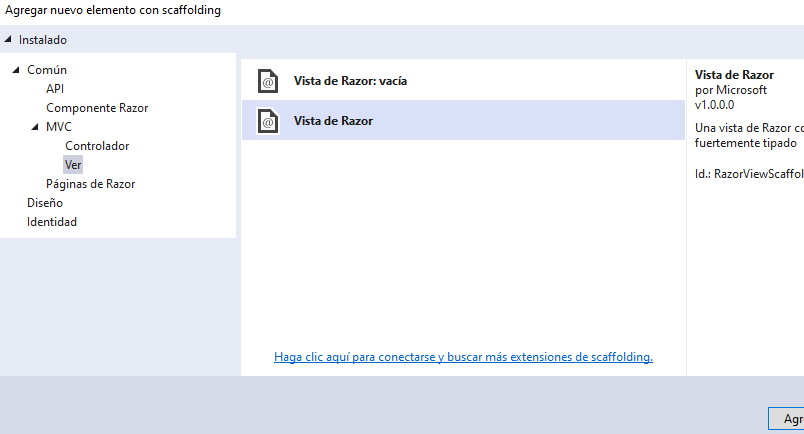
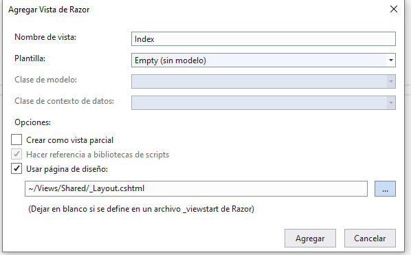
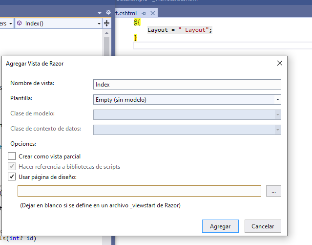
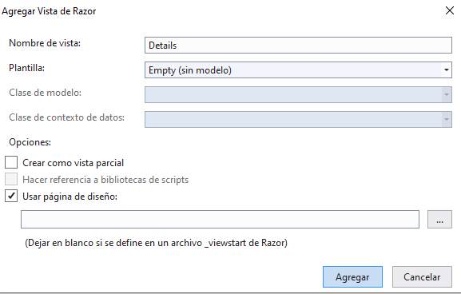
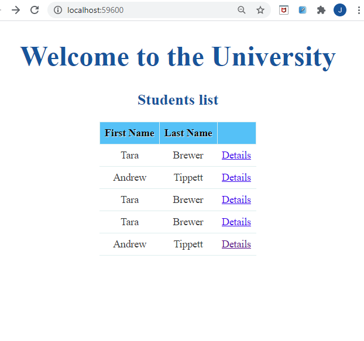
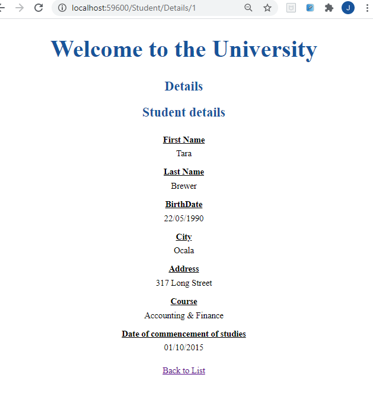

## DEMO Module 8: Using Layouts, CSS and JavaScript in ASP.NET Core MVC

### Lesson 1: Using Layouts

#### Demonstration: How to Create a Layout and Link it to a View

Partimos de la solución del repositorio 01_LayoutExample_begin

El [Middleware](LayoutExample0/Startup.cs) utiliza MVC {controller}/{action}/{id?} por defecto Student/Index  
Acceso a ficheros estaticos y una base de datos sqlLite student.db  a traves de StudentContext studentContext  
(que se crea de nuevo cada vez que se accede a la página)

El [Model/Student.cs](LayoutExample0/Models/Student.cs) un modelo de Student

El [Data/StudentContext](LayoutExample0/Data/StudentContext.cs) un DbSet<Student> y se encarga de rellenar los datos en OnModelCreating() 

El [Controller/StudentController](LayoutExample0/Controllers/StudentController.cs) con injeccion de depencia a StudentContext y dos metodos Index y Details(int ?id)

(vuelve a ver los 4 enlaces como repaso de acceso a datos para ver como accede a los datos de la tabla Student desde el context y a los detalles)


y no existe más vista más que [_ViewImports.cshtm](LayoutExample0/Views/_ViewImports.cshtml) con el @using LayoutExample.Models y 
@addTagHelper *, Microsoft.AspNetCore.Mvc.TagHelper  


y como curiosidad  la db tiene los siguientes datos / estructura




Al lio:

Nos piden agregar una (Razor Layout) nombre: Views/Shared/_Layout.cshtml  (pego la imagen por eso de que lo tengo en Spanish)



Nos piden agregar una (Razor View Start) nombre: Views/Shared/_ViewStart.cshtml



Modificamos el código [_Layout](LayoutExample/Views/Shared/_Layout.cshtml) layout (realmente es una html)
````html
<!DOCTYPE html>

<html>
<head>
    <meta name="viewport" content="width=device-width" />
    <title>@ViewBag.Title</title>
    <link type="text/css" rel="stylesheet" href="~/css/style-layout-example.css" />  <!-- Añadimos el style -->
</head>
<body>
    <h1>Welcome to the University</h1> <!-- Añadimos este h1 -->
    <div>  <!-- en   @@RenderBody()  es donde se pintaran las vistas que utilicen el layout-->
         @RenderBody() 
    </div>
	 <!-- puedo tener varias    @@RenderSection() -->
    @RenderSection("footer", false)
</body>
</html>
````

y ahora vamos a StudentController.cs apara crear la vista Index 




Marcamos Usar página de diseño y  
Podemos decirle cual es la página de diseño
  

o dejarla en blanco puesto en _ViewStart.cshtmlya le decimos cual es la layot por defecto  



Reemplazos el código de [Student/Index.cshtml](LayoutExample/Views/Student/Index.cshtml) por

````
@model IEnumerable<Student>

<h2>Students list</h2>
<div>
    <table class="table">
        <thead>
            <tr>
                <th>
                    @Html.DisplayNameFor(model => model.FirstName)
                </th>
                <th>
                    @Html.DisplayNameFor(model => model.LastName)
                </th>
                <th></th>
            </tr>
        </thead>
        <tbody>
            @foreach (var item in Model)
            {
                <tr>
                    <td>
                        @Html.DisplayFor(modelItem => item.FirstName)
                    </td>
                    <td>
                        @Html.DisplayFor(modelItem => item.LastName)
                    </td>
                    <td>
                        <a asp-action="Details" asp-route-id="@item.StudentId">Details</a>
                    </td>
                </tr>
            }
        </tbody>
    </table>
</div>
````

hacemos lo mismo con la Accion Index del controlador..



Modificamos el código de [Student/Details.cshtml](LayoutExample/Views/Student/Details.cshtml) por


```
@model Student
<h2>Details</h2>

<h2>Student details</h2>

<div>
    <dl>
        <dt>
            @Html.DisplayNameFor(model => model.FirstName)
        </dt>
        <dd>
            @Html.DisplayFor(model => model.FirstName)
        </dd>
        <dt>
            @Html.DisplayNameFor(model => model.LastName)
        </dt>
        <dd>
            @Html.DisplayFor(model => model.LastName)
        </dd>
        <dt>
            @Html.DisplayNameFor(model => model.Birthdate)
        </dt>
        <dd>
            @Html.DisplayFor(model => model.Birthdate)
        </dd>
        <dt>
            @Html.DisplayNameFor(model => model.City)
        </dt>
        <dd>
            @Html.DisplayFor(model => model.City)
        </dd>
        <dt>
            @Html.DisplayNameFor(model => model.Address)
        </dt>
        <dd>
            @Html.DisplayFor(model => model.Address)
        </dd>
        <dt>
            @Html.DisplayNameFor(model => model.Course)
        </dt>
        <dd>
            @Html.DisplayFor(model => model.Course)
        </dd>
        <dt>
            @Html.DisplayNameFor(model => model.StartedUniversityDate)
        </dt>
        <dd>
            @Html.DisplayFor(model => model.StartedUniversityDate)
        </dd>
    </dl>
</div>
@section footer {
    <div>
        <a asp-action="Index">Back to List</a>
    </div>
}
````


y ejcutamos






