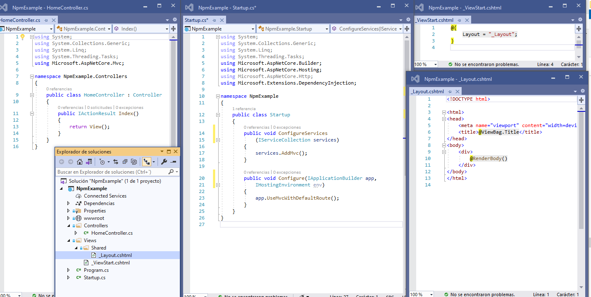
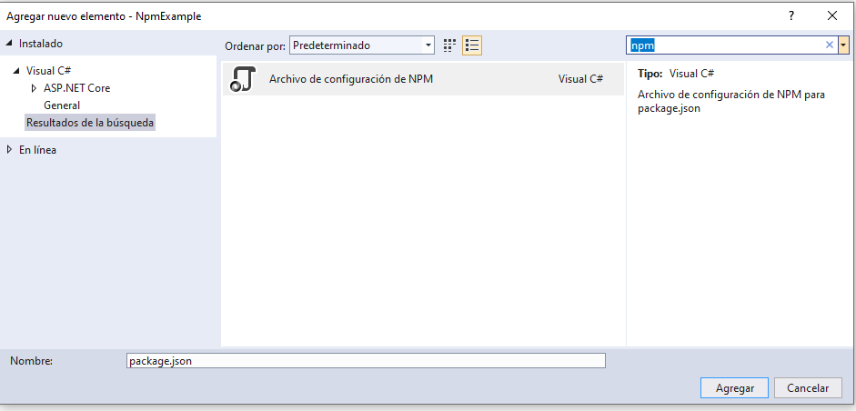
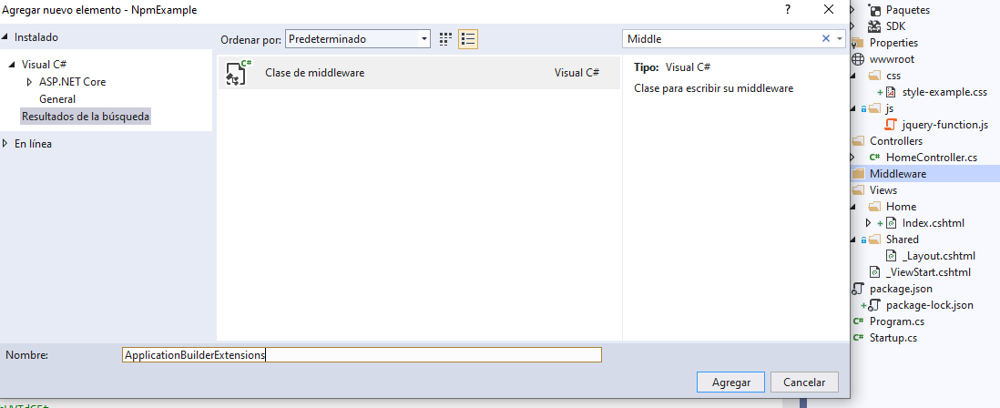
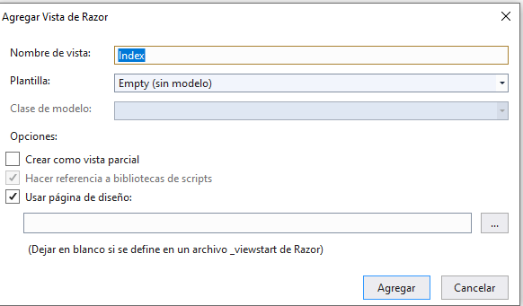
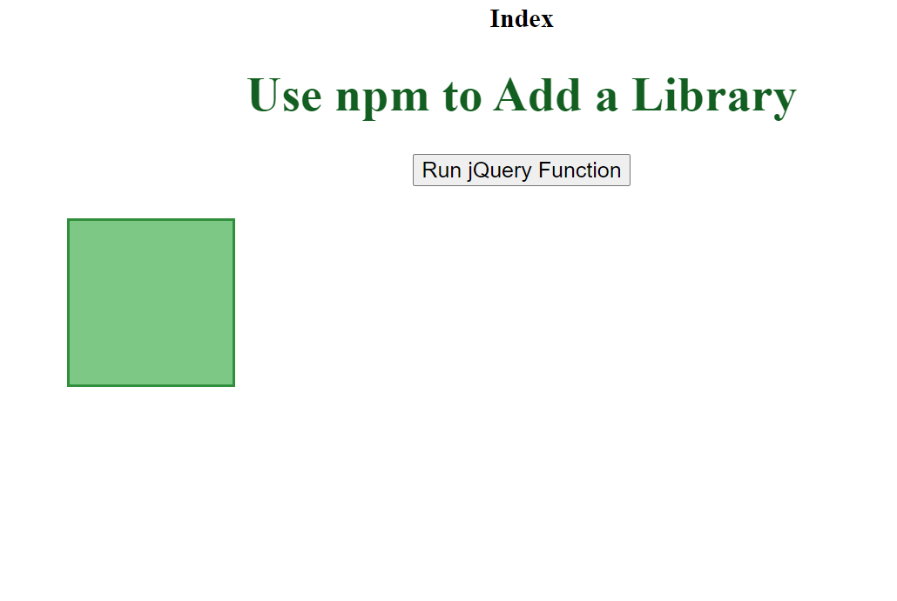
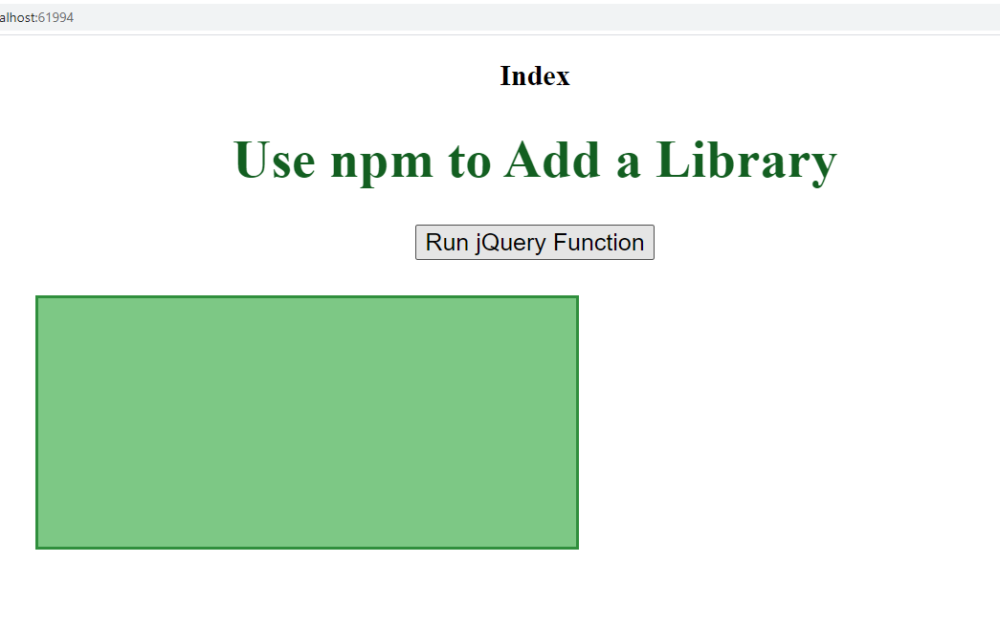
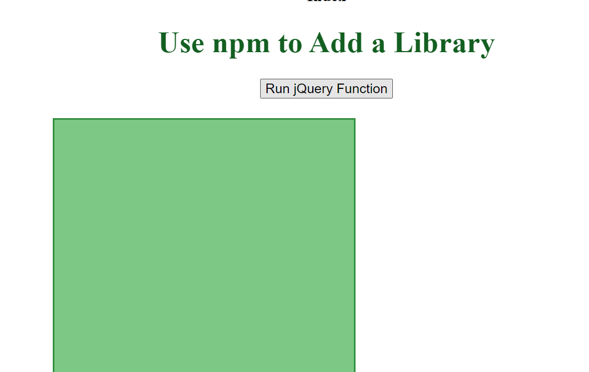

## DEMO Module 8: Using Layouts, CSS and JavaScript in ASP.NET Core MVC

### Lesson 2: Using CSS and JavaScript

#### Demonstration: How to Use npm to Add a Library

Partimos de de la solución del repositorio 02_NpmExample_begin que no tiene nada...



Bueno tambien hay un código js en el [wwwroot/js/jquery-function.js](NpmExample/wwwroot/js/jquery-function.js)

que lo que hace es cuando se haga click en un elemento button una animacion 
```
var value = 300;
$(function () {
    $('button').click(function () {
        $('.box')
            .animate({ width: '+=' + value + 'px'})
            .animate({ height: '+=' + value + 'px' })
            .animate({ marginLeft: ($(window).width() - ($('.box').width() + value)) / 2 + 'px' })
            .animate({ borderWidth: '10px'})
            .animate({ opacity: 0.5 });
    });
});
````


Agrefamos un npm Configuration File  package.json 




Con el siguiente Código

````
{
  "version": "1.0.0",
  "name": "asp.net",
  "private": true,
  "devDependencies": {},
  "dependencies": {"jquery": "3.3.1" }
}
````

Yo he pulsado sobre el package.json botón derecho Restaurar paquetes...


Sigo, Añadir Middleware llamado Middleware/ApplicationBuilderExtensions.cs




```
using System;
using System.Collections.Generic;
using System.Linq;
using System.Threading.Tasks;
using System.IO;
using Microsoft.AspNetCore.Builder;
using Microsoft.Extensions.FileProviders;

namespace NpmExample.Middleware
{
    public static class ApplicationBuilderExtensions
    {
        public static IApplicationBuilder UseNodeModules(this IApplicationBuilder applicationBuilder, string root)
        {
            var path = Path.Combine(root, "node_modules");
            var fileProvider = new PhysicalFileProvider(path);

            var options = new StaticFileOptions();
            options.RequestPath = "/node_modules";
            options.FileProvider = fileProvider;

            applicationBuilder.UseStaticFiles(options);
            return applicationBuilder;
        }
    }
}
````

y modificamos nuestro [startup.cs](NpmExample/Startup.cs)
````
using NpmExample.Middleware;  //   Añadido por Middleware 

............

public void Configure(IApplicationBuilder app, IHostingEnvironment env)
	{
		app.UseMvcWithDefaultRoute();

		app.UseStaticFiles();

		app.UseNodeModules(env.ContentRootPath);
	}
````


Bueno una vez instalada  las depencias modificamos el 	 [Layout.cshtml](NpmExample/Views/Shared/_Layout.cshtml)
````
  <script src="~/node_modules/jquery/dist/jquery.min.js"></script>
  <script src="~/js/jquery-function.js"></script>
   
   <link href="~/css/style-example.css" rel="stylesheet" />  <!-- ya que estamos se lo añadimos también que será el punto 43 -->
   
````

Añadimos una vista esde el controlador Action Index




````

@{
    ViewData["Title"] = "Index";
}

<h2>Index</h2>


<div>
    <h1>Use npm to Add a Library</h1>
    <button id="btn-jquery-func">Run jQuery Function</button>
    <div class="box"></div>
</div>

````
Si quieres vuelve a ver [wwwroot/js/jquery-function.js](NpmExample/wwwroot/js/jquery-function.js)


Añdaimos una hoja de estilos en wwwroot/css lamadada  [style-example.css](NpmExample/wwwroot/css/style-example.css)

````
body {
    text-align: center;
}

h1 {
    color: #1B5E20;
    font-family: "Libre Baskerville", serif;
    font-size: 45px;
    font-weight: bolder;
    text-align: center;
}

#btn-jquery-func {
    font-size: 20px;
}

.box {
    width: 150px;
    height: 150px;
    background: #81C784;
    margin-top: 30px;
    margin-left: 150px;
    margin-right: auto;
    border-style: solid;
    border-color: #388E3C;
    font-size: x-large;
    font-weight: bold;
}
````
(Acuerdate que añadimos antes al layout el style)


y ejecutamos










