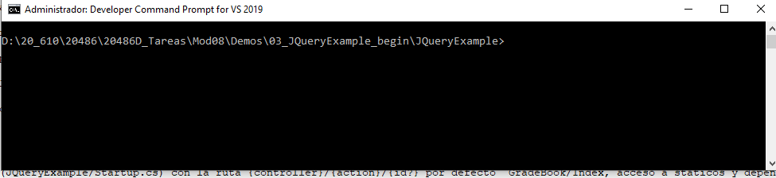
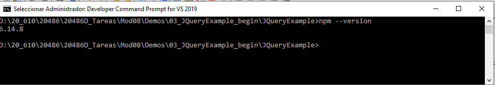
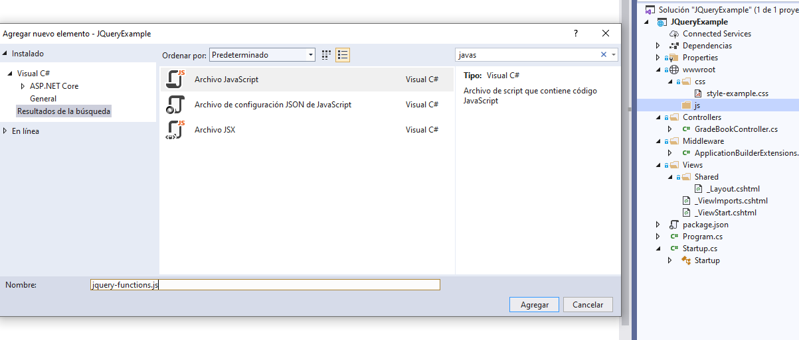
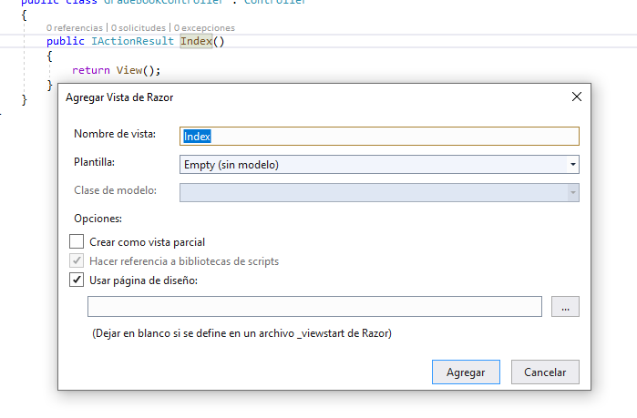

## DEMO Module 8: Using Layouts, CSS and JavaScript in ASP.NET Core MVC

### Lesson 3: Using jQuery

#### Demonstration: How to Modify HTML Elements by using jQuery

Para empezar utilizaremos la solucion del repositorio 03_JQueryExample_begin

que tiene una hoja de estilo  en wwwroot/css
  
un controlador  GradeBookController con una Action Index que retorna una vista (pero que no esta implementada)  

un [Middleware/ApplicationBuilderExtensions.cs](JQueryExample/Middleware/ApplicationBuilderExtensions.cs) del mismo tipo que la práctica anterior 

una _Layout.cshtml simple y el _ViewStart.cshtml que hace referencia a ella

el _ViewImports con la directiva @addTagHelper *, Microsoft.AspNetCore.Mvc.TagHelpers

el [package.json](JQueryExample/package.json)  con la depencia a jquery


y el [Startup.cs](JQueryExample/Startup.cs) con la ruta {controller}/{action}/{id?} por defecto  GradeBook/Index, acceso a staticos y dependencias


A la demo....


Lo primero es instalar npm (npm es el sistema de gestión de paquetes por defecto para Node.js)

(es posible que ya lo tengas instalado)

En cualquier caso abrir el cmd o el PS como administrador y hacer un cd a la ruta donde esta el proyecto.

en mi caso D:\20_610\20486\20486D_Tareas\Mod08\Demos\03_JQueryExample_begin\JQueryExample



Si ejecutas npm --version te mostrará la version  que tienes instalado

y ejecutar npm install  te lo instala (yo tengo la 6.14.8)




Bueno pues cerramos y vamos a la solución


Vale en esta ocasión vamos a crear una archivo js  [jquery-functions.js](JQueryExample/wwwroot/js/jquery-functions.js) con una jquery en wwwroot/js/

  

con este codigo ...  
````js
var passingGrade = 55;
   $(function() {
       $("#jqueryButton").click(function (event) {
            var firstGrade = parseInt($("#studentGrade1").text());
            var secondGrade = parseInt($("#studentGrade2").text());
            var thirdGrade = parseInt($("#studentGrade3").text());

            if (firstGrade > passingGrade) {
                $("#studentGrade1").addClass("goodGrade");
            } 
            else {
                $("#studentGrade1").addClass("badGrade");
            }

            if (secondGrade > passingGrade) {
                $("#studentGrade2").addClass("goodGrade");
            } 
            else {
                $("#studentGrade2").addClass("badGrade");
            }

            if (thirdGrade > passingGrade) {
                $("#studentGrade3").addClass("goodGrade");
            } 
            else {
                $("#studentGrade3").addClass("badGrade");
            }
       });
   });

````

le añadimos a _Layout(JQueryExample/Views/Shared/_Layout-.cs) 
````
 <script src="~/js/jquery-functions.js"></script>
````


Creamos la vista desde el controlador  



con este codigo [Index.cshtml](JQueryExample/Views/GradeBook/Index.cshtml) 

````

@{
    ViewData["Title"] = "Index";
}

<h1>Students GradeBook</h1>
<h2>Course Name: Mathematics and Computer Science</h2>

<div>
    <table>
        <thead>
            <tr>
                <th>
                    Student Name
                </th>
                <th>
                    Mid-Term
                </th>
                <th>
                    Performance
                </th>
                <th>
                    Final Grade
                </th>
            </tr>
        </thead>
        <tbody>
            <tr>
                <td>Thomas M. Hacker</td>
                <td>93</td>
                <td>95%</td>
                <td id="studentGrade1">90</td>
            </tr>
            <tr>
                <td>Patrick J. Lazo</td>
                <td>53</td>
                <td>51%</td>
                <td id="studentGrade2">50</td>
            </tr>
            <tr>
                <td>Helen D. Miller</td>
                <td>91</td>
                <td>95%</td>
                <td id="studentGrade3">85</td>
            </tr>
        </tbody>
    </table>
</div>
<button id="jqueryButton">Apply JQuery</button>

````


