## Module 8: Using Layouts, CSS and JavaScript in ASP.NET Core MVC

### Lab: Using Layouts, CSS and JavaScript in ASP.NET Core MVC


Preparación


Para la práctica utilizaremos el proyecyo del repositorio 01_ZooSite_begin

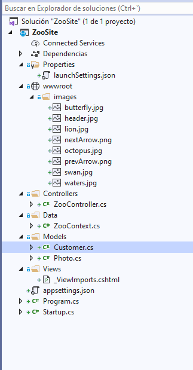

el Middleware [StartUp.cs](ZooSite0/Startup.cs)  

el DbCcontext [ZooContext.cs](ZooSite0/Data/ZooContext.cs)

el Modelo [Customer](ZooSite0/Models/Customer.cs) y  [Photo](ZooSite0/Models/Photo.cs)

y el Controlador [ZooController](ZooSite0/Controllers/ZooController.cs)

la aplicaión falla pues no existe la vista

el Middelware creará la bd en SqlExpress [appsettings.json](ZooSite0/appsettings.json) 

---

#### Exercise 1: Applying a Layout and Link Views to it


Creamos la [View/Shared/Layout](01_ZooSite_begin/ZooSite/Views/Shared/_Layout.cshtml)   añadiendo una lista de @Url.Action y dos imagenes Previous y Next con el evento onclick  
(posterioremente añadiremos una sección. )
````
<!DOCTYPE html>

<html>
<head>
    <meta name="viewport" content="width=device-width" />
    <title>@ViewBag.Title</title>

</head>
<body>

    <ul class="nav">
        <li><a href="@Url.Action("Index", "Zoo")">Attractions</a></li>
        <li><a href="@Url.Action("VisitorDetails", "Zoo")">Visitor Info</a></li>
        <li><a href="@Url.Action("BuyTickets", "Zoo")">Tickets</a></li>
    </ul>

    <div class="header-container">
        <h1 class="content">Welcome to Zoo Center</h1>
        <div class="slider-buttons">
            
            
        </div>
    </div>

    <div>
        @RenderBody()
    </div>

    @RenderSection("Scripts", false)
</body>
</html>
``````
Creamos una vista [View/Zoo/Index.cshtml](01_ZooSite_begin/ZooSite/Views/Zoo/Index.cshtml)  desde el ZooController (con _Layout)


```` 
@model IEnumerable<ZooSite.Models.Photo>

@{
    ViewData["Title"] = "Index";
  
}

<h1 class="main-title">Zoo Attractions</h1>
<div class="container">
</div>
@foreach (var item in Model)
{
    <div class="photo-index-card">
        @if (item.PhotoFileName != null)
        {
            <div class="image-wrapper">
                
            </div>
        }
        <h3 class="display-picture-title">
            @Html.DisplayFor(modelItem => item.Title)
        </h3>
        <div>
            <span class="display">
                @Html.DisplayFor(model => item.Description)
            </span>
        </div>
    </div>
}
``````

Nos creamos la 
[View/_ViewStart.cshtml](01_ZooSite_begin/ZooSite/Views/_ViewStart.cshtml)
Como contiene 
````
@{
    Layout = "_Layout";
}
````

Podemos suprmir del Zoo/Index.cshtml :
````
  Layout = "~/Views/Shared/_Layout.cshtml"; 
````


El siguiente paso es agregar una serie de vistas ya existentes a View/Zoo

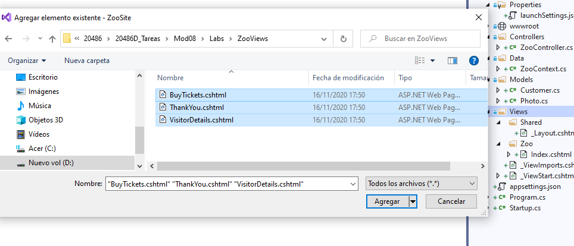


y para finalizar el ejercicio añaidmos una seccion a la _Layout
````
@RenderSection("Scripts", false)
````

Ejecutamos la aplicación

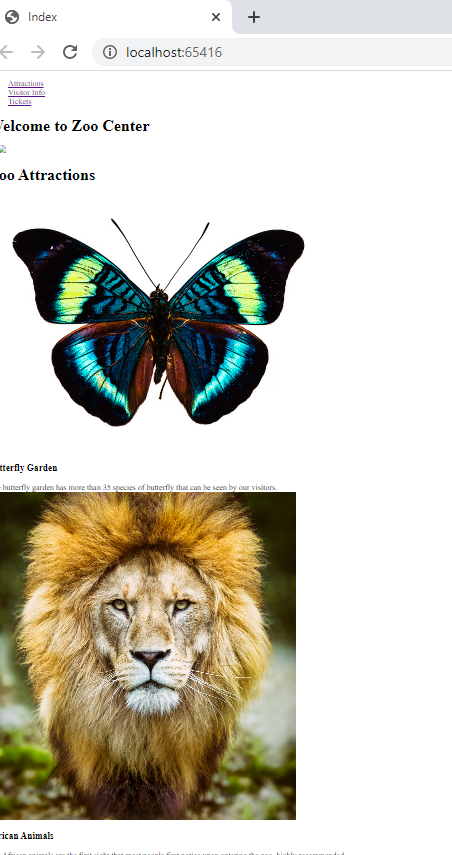


#### Exercise 2: Using CSS


Añadimos a wwwroot/css el fichero existente [zoo-style.cssl](01_ZooSite_begin/ZooSite/wwwroot/css/zoo-style.css)   desde el repositorio 
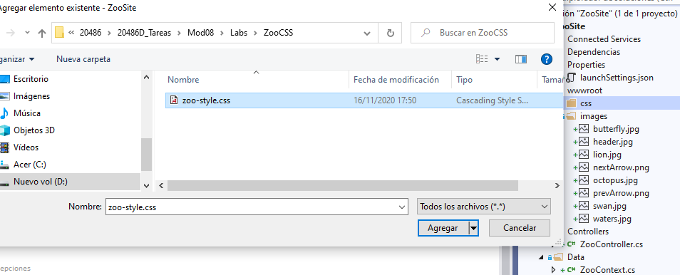

Añadimos   app.UseStaticFiles(); al [Startup.cs](01_ZooSite_begin/ZooSite/Startup.cs)  para poder acceder al wwwroot

Y en _Layout añadimos el style
````
<link type="text/css" rel="stylesheet" href="~/css/zoo-style.css"/>
````


Ahora vamos añadir un poco de gracia al menu por eso en el style añadimos el código siguiente 
````
.nav {
       list-style-type: none;
       margin: 0;
       padding: 0;
       overflow: hidden;
       background-color: #85754e;
       position: fixed;
       top: 0;
       left: 0;
       width: 100%;
    }

    .nav li {
       float: left;
    }

.nav li a {
       display: block;
       color: white;
       text-align: center;
       padding: 14px 16px;
       text-decoration: none;
    }

    .nav li a:hover:not(.active) {
       background-color: #016b6b;
    }

    
````  
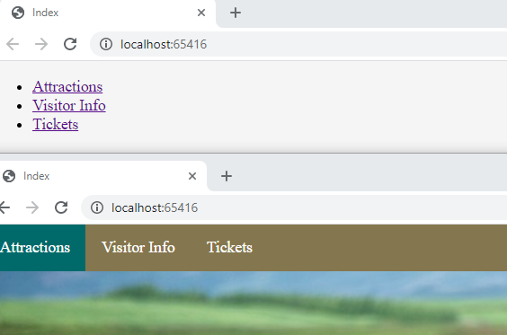


También aplicamos estilo a la seccion de fotos

```` 
   .photo-index-card {
       background-color: #ffffff;
       padding: 0;
       margin: 10px 5px 15px 18px;
       padding-bottom: 25px;
       width: 355px;
       border: 1px solid #d6d4d4;
       border-radius: 10px;
       overflow: hidden;
    }
```` 

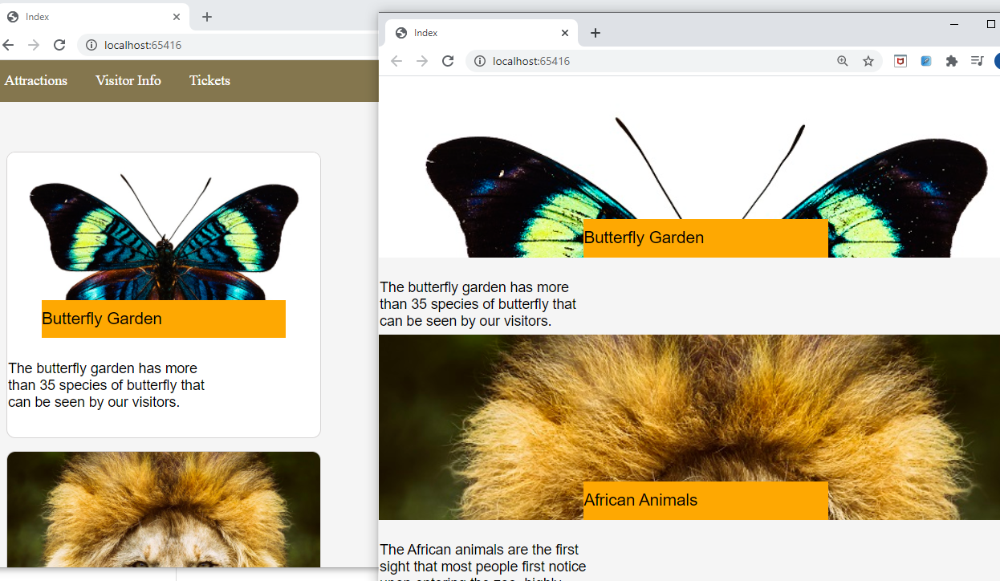  


y al formulario  en  [BuyTickets.cshtml](01_ZooSite_begin/ZooSite/Views/Zoo/BuyTickets.cshtml)  


`````` 

.info .form-field {
       text-align:left;
       clear: both;
    }

    .info .form-field div {
       width: 172px;
       text-align: right;
       float: right;
    }

    .info label {
       width: 118px;
       display: inline-block;
       margin-bottom: 10px;
    }

    .info input{
       border-radius: 2px;
       line-height: 20px;
       border: 1px solid #ccc6c6;
       background-color: #f9f6f6;
       width: 100%;
    }
``````
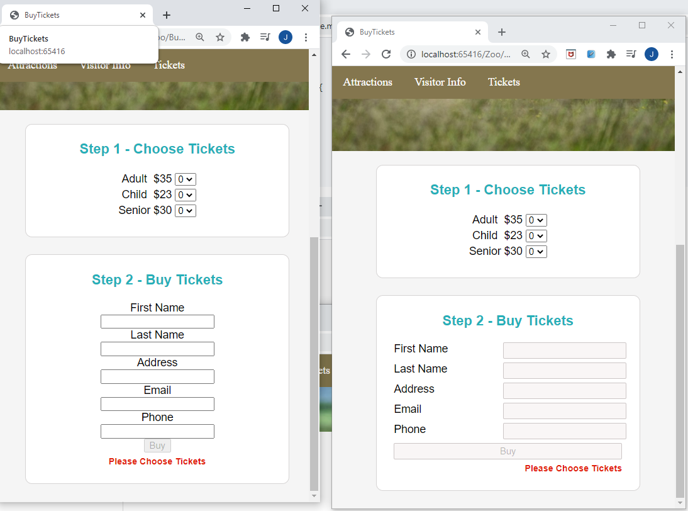

Y finalmente a los botones del formulario

``````
 input.submit-btn {
       width: 100px;
       margin-top: 12px;
       height: 29px;
       background-color: orange;
       font-weight: bold;
       box-shadow: inset 0px 0px 4px #b77006;
       border: 1px solid #a59797;
    }

    input.submit-btn[disabled] {
       opacity: 0.8;
       background-color: whitesmoke;
       box-shadow: none;
    }
``````


#### Exercise 3: Using JavaScript

Vamos a añadir in puquito Js para pode rcomprar tickets


Acuerdate que teniamos en BuyTickets.cshtml. 
````
@section Scripts {
    }
````	
Pues la modificamos con 
````
 @section Scripts {
 <script src="~/js/form-functions.js"></script>
    }
````

Si añadimos al fichero [form-functions.js](01_ZooSite_begin/ZooSite/wwwroot/js/form-functions.js)

````
function calculateSum() {
       var rows = document.querySelectorAll("#totalAmount tr .sum");
       var sum = 0;

       for (var i = 0; i < rows.length; i++) {
           sum = sum + parseFloat(parseFloat(rows[i].innerHTML.substring(1, rows[i].innerHTML.length)).toFixed(2));
       }
	
       document.getElementById("sum").innerHTML = "Total: $" + sum;
    }
````

Bueno es una pena que todavía no funcione....
pero bueno ya sabemos añadir un javascript a una section...


#### Exercise 4: Using jQuery


Vamos a solucionarlo.. para ello vamos a añadir dependencias con npm

lo primero añadir el package.json y lo modificamos añadiendo la dependicia jquery

````
{
  "version": "1.0.0",
  "name": "asp.net",
  "private": true,
  "devDependencies": {
  }
  ,
    "dependencies": {
        "jquery": "3.3.1"
    }
}
``````

fijate como añade la dependencia de momento no instalado!!

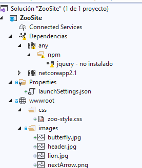


bueno ya se instalara...


Añadimos un Middelware [Middelware/Middelware.cs)](01_ZooSite_begin/ZooSite/Middelware/Middelware.cs)

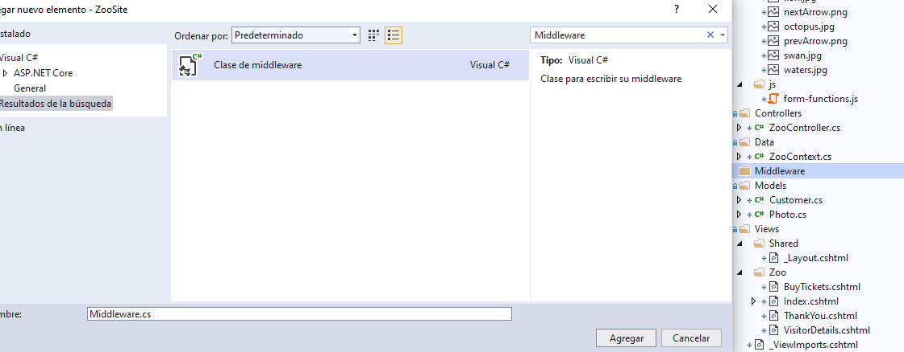

````
using Microsoft.AspNetCore.Builder;
using Microsoft.AspNetCore.Http;
using System;
using System.Collections.Generic;
using System.Linq;
using System.Threading.Tasks;

using System.IO;
using Microsoft.Extensions.FileProviders;


namespace ZooSite.Middleware
{
    // You may need to install the Microsoft.AspNetCore.Http.Abstractions package into your project
    public static class Middleware
    {

        public static IApplicationBuilder UseNodeModules(this IApplicationBuilder applicationBuilder, string root)
        {
            var path = Path.Combine(root, "node_modules");
            var fileProvider = new PhysicalFileProvider(path);

            var options = new StaticFileOptions();
            options.RequestPath = "/node_modules";
            options.FileProvider = fileProvider;

            applicationBuilder.UseStaticFiles(options);
            return applicationBuilder;
        }
    }
}
````


Modificamos el starups para añadirle este Middelware 

 
````````
using ZooSite.Middleware;
.....

 public void Configure(IApplicationBuilder app, IHostingEnvironment env, ZooContext zooContext)
        {
            zooContext.Database.EnsureDeleted();
            zooContext.Database.EnsureCreated();

            app.UseStaticFiles();

            app.UseNodeModules(env.ContentRootPath);

            app.UseMvc(routes =>
            {
                routes.MapRoute(
                    name: "ZooRoute",
                    template: "{controller}/{action}/{id?}",
                    defaults: new { controller = "Zoo", action = "Index" },
                    constraints: new { id = "[0-9]+" });
            });
        }
 
````````

Añadimos el script al Layout
``````
<script src="~/node_modules/jquery/dist/jquery.min.js"></script>
``````

`
Modificamos la function.js añadiendole los handlers

[form-functions.js](01_ZooSite_begin/ZooSite/wwwroot/js/form-functions.js)
````

$(function () {
    $('.pricing select').change(function (event) {
        var target = $(event.target);
        var value = parseInt(target.val());
        var container = target.parent();
        var price = container.prev();
        var label = price.prev();

        $("#" + label.text()).remove();

        if (value) {
            $("#summery").addClass("display-div").removeClass("hidden-div");

            var correctCost = (price.text().substring(1, price.text().length));
            var calc = parseInt(value * correctCost);

            var msg = label.text() + " ticket - " + value.toString() + "x" + price.text() + " = <span class='sum'>" + '$' + calc + '</span>';
            var row = $("<tr id='" + label.text() + "'>");
            row.append($("<td>").html(msg));
            $("#totalAmount").append(row);
        }
        if ($("#totalAmount tr").length === 0) {
            $("#summery").addClass("hidden-div").removeClass("display-div");
            $("#formButtons input").attr('disabled', 'disabled');
            $("#comment").show();
        }
        else {
            $("#formButtons input").removeAttr('disabled');
            $("#comment").hide();
        }

        calculateSum();
    });

    function calculateSum() {
        var rows = document.querySelectorAll("#totalAmount tr .sum");
        var sum = 0;

        for (var i = 0; i < rows.length; i++) {
            sum = sum + parseFloat(parseFloat(rows[i].innerHTML.substring(1, rows[i].innerHTML.length)).toFixed(2));
        }

        document.getElementById("sum").innerHTML = "Total: $" + sum;
    }
});
````

Añadimos el fichero [menubar-functions.js](01_ZooSite_begin/ZooSite/wwwroot/js/menubar-functions.js)
````
var current = 0;

function nextImage() {
    current++;
    if (current === images.length) {
        current = 0;
    }
    $('.header-container').css('background-image', 'url(' + images[current] + ')');
}

function prevImage() {
    current--;
    if (current < 0) {
        current = images.length-1;
    }
    $('.header-container').css('background-image', 'url(' + images[current] + ')');
}

````


y el ficherp [slider-functions.js](01_ZooSite_begin/ZooSite/wwwroot/js/slider-functions.js)  
````
$(function() {
    var path = window.location.pathname;

    $(".nav li a").each(function (index, value) {
        var href = $(value).attr('href');
        if (path === href) {
            $(this).closest('li').addClass('active');
        }
    });
});
````


Detalles finales

añadimos los scrips de menubar y slider a laytout
```` 
<script src="~/js/menubar-functions.js"></script>
<script src="~/js/slider-functions.js"></script>
````

y modificamos el package.json con
```` 

"dependencies": {
      "jquery": "3.3.1",
      "jquery-validation": "1.17.0",
      "jquery-validation-unobtrusive": "3.2.10"
    }
````

y añadiremos estos script jquery a BuyTickets.cshtml
```` 
	<script src="~/node_modules/jquery-validation/dist/jquery.validate.min.js"></script>
    <script src="~/node_modules/jquery-validation-unobtrusive/dist/jquery.validate.unobtrusive.min.js"></script>
```` 


nos situamos sobre pacage.json y restauramos paquetes   
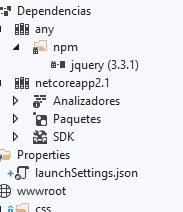  
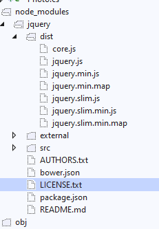  

Compilamos y probamos   


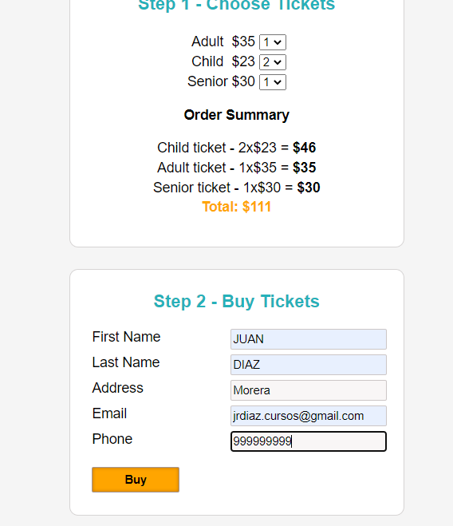

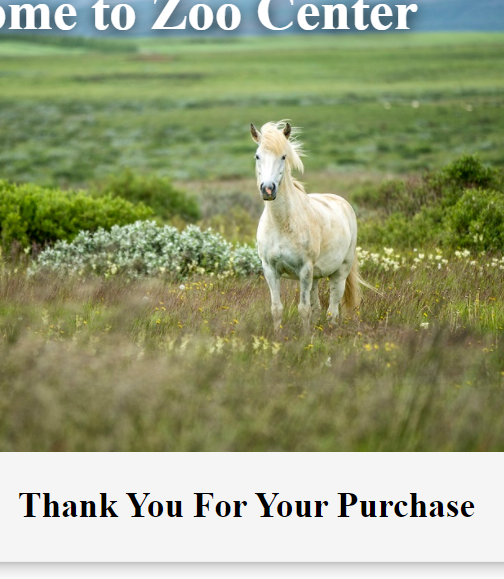

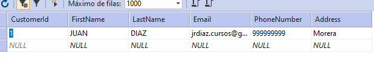