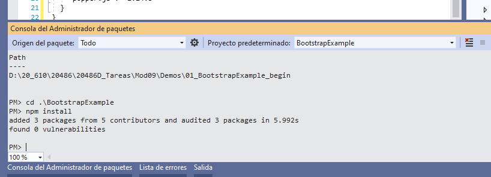
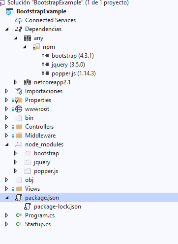
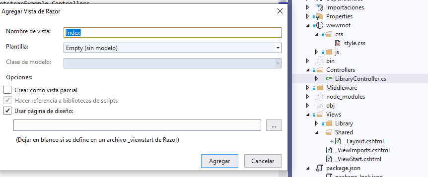
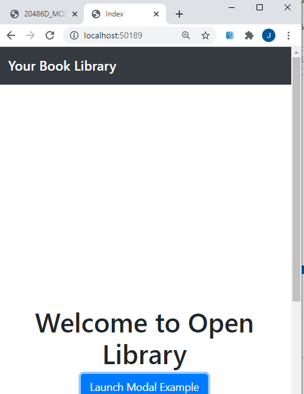
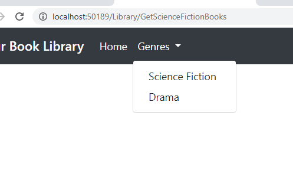
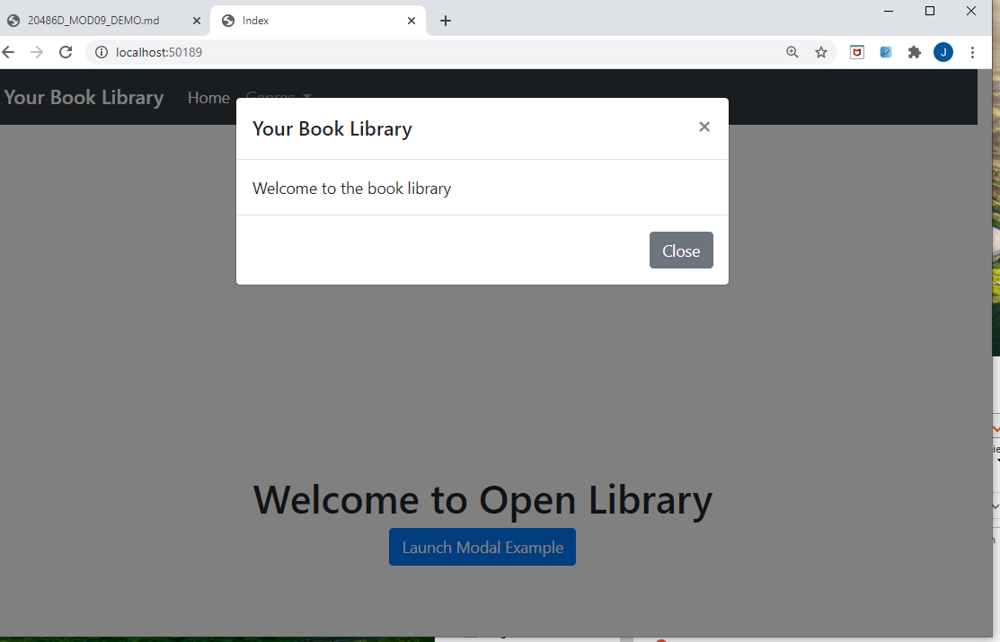
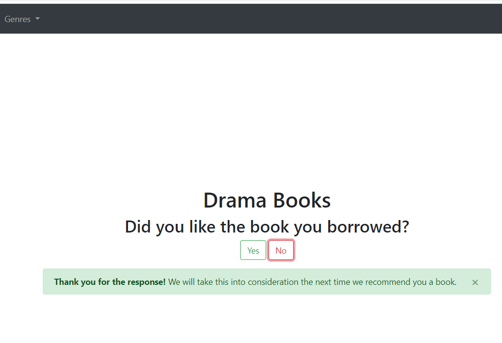

## Demos Module 9: Client-Side Development

### Lesson 1: Applying Styles

#### Demonstration: How to Work with Bootstrap

Partimimos del proyecto del repositorio 01_BootstrapExample_begin

Tiene el siguiente package.json por lo que ejecutamos npm install para instalar las dependencias 

```
{
  "version": "1.0.0",
  "name": "asp.net",
  "private": true,
  "devDependencies": {},
  "dependencies": {
    "bootstrap": "4.3.1",
    "jquery": "3.5.0",
    "popper.js": "1.14.3"
  }
}
````







El Siguiente paso es crear Views/Shared/_Layout.cshtml

Añadimos los links a bootstrap (descargado a node_modules) y a style.css (en wwwroot)
```
    <link href="~/css/style.css" rel="stylesheet" />
    <link href="~/node_modules/bootstrap/dist/css/bootstrap.css" rel="stylesheet" />
````
y le añadimos una barra de navegacion bootstrap
````
<div>
        <nav class="navbar navbar-expand-lg navbar-dark bg-dark">
            <span class="navbar-brand mb-0 h1">Your Book Library</span>
            <div class="collapse navbar-collapse" id="navbarNavDropdown">
                <ul class="navbar-nav">
                    <li class="nav-item active">
                        <a class="nav-link" href="@Url.Action("Index", "Library")">Home <span class="sr-only">(current)</span></a>
                    </li>
                    <li class="nav-item dropdown">
                        <a href="#" class="nav-link dropdown-toggle" id="navbarDropdownMenuLink" data-toggle="dropdown" aria-haspopup="true" aria-expanded="false">
                            Genres
                        </a>
                        <div class="dropdown-menu" aria-labelledby="navbarDropdownMenuLink">
                            <a class="dropdown-item" href="@Url.Action("GetScienceFictionBooks", "Library")">Science Fiction</a>
                            <a class="dropdown-item" href="@Url.Action("GetDramaBooks", "Library")">Drama</a>
                        </div>
                    </li>

                </ul>
            </div>
        </nav>
    </div>
````

y los scripts de bootsptrap necesiarios
```
 <script src="~/node_modules/jquery/dist/jquery.js"></script>
   <script src="~/node_modules/popper.js/dist/umd/popper.js"></script>
   <script src="~/node_modules/bootstrap/dist/js/bootstrap.js"></script>
   <script src="~/js/alert-function.js"></script>
````

y para terminar con esta _Layout añadimos la clase view*container al div del RenderBody
```
<div class="view-container">
       @RenderBody()
</div>
```
 

aqui puedes ver como queda [_layout.cshtml](BootstrapExample/Views/Shared/_Layout.cshtml)


Ahora creamos la vista Index desde el controlador LibraryController (marcando que use layout) como tenemos refrencia a ella en _ViewStart no necesitamos especificar cual



Con el siguiente Código
```
@{
    ViewData["Title"] = "Index";
}

<div class="text-center">
    <h1>Welcome to Open Library </h1>
    <button type="button" class="btn btn-primary" data-toggle="modal" data-target="#exampleModal">
        Launch Modal Example
    </button>
</div>

<div class="modal fade" id="exampleModal" tabindex="-1" role="dialog" aria-labelledby="exampleModalLabel" aria-hidden="true">
    <div class="modal-dialog" role="document">
        <div class="modal-content">
            <div class="modal-header">
                <h5 class="modal-title" id="exampleModalLabel">Your Book Library</h5>
                <button type="button" class="close" data-dismiss="modal" aria-label="Close">
                    <span aria-hidden="true">&times;</span>
                </button>
            </div>
            <div class="modal-body">
                Welcome to the book library
            </div>
            <div class="modal-footer">
                <button type="button" class="btn btn-secondary" data-dismiss="modal">Close</button>
            </div>
        </div>
    </div>
</div>
````

Creamos una vista en Shared llamada _Alert.cshtml

con el siguiente código
````
<section>
    <h2 class="m-2">Did you like the book you borrowed? </h2>
    <button type="button" class="btn btn-outline-success">Yes</button>
    <button type="button" class="btn btn-outline-danger">No</button>
    <div id="alert" class="alert alert-success alert-dismissible fade show m-3" role="alert">
        <strong>Thank you for the response!</strong>
        We will take this into consideration the next time we recommend you a book.
        <button type="button" class="close" aria-label="Close">
            <span aria-hidden="true">&times;</span>
        </button>
     </div>
</section>
````


`y finalmente ejecutamos

Observa el nav de bootstrap que se carga desde [_Layout](BootstrapExample/Views/Shared/_Layout.cshtml)





El modal de bootstrap  desde [Index](BootstrapExample/Views/Library/Index.cshtml) mediante data-toggle="modal" data-target="#exampleModal">




y el div de mensajes que lo pinta mediante un   @await Html.PartialAsync("_Alert") en   [GetDramaBooks](BootstrapExample/Views/Library/GetDramaBooks.cshtml)
que llama a  [Alert.cshtml ](BootstrapExample/Views/Shared/_Alert.cshtml)


 



