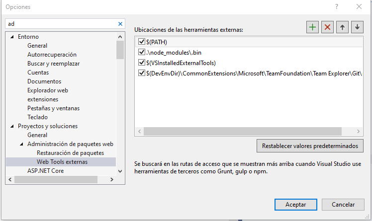
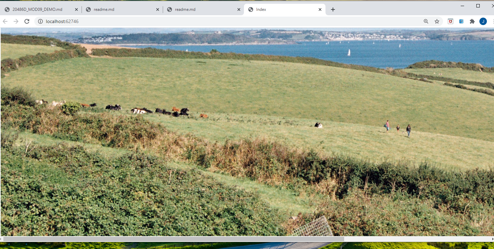
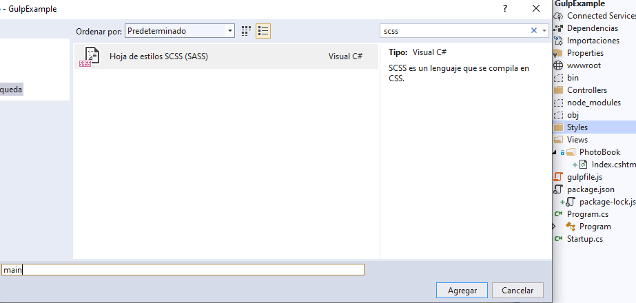
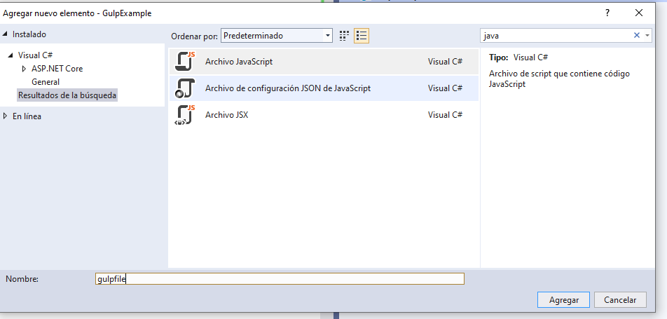
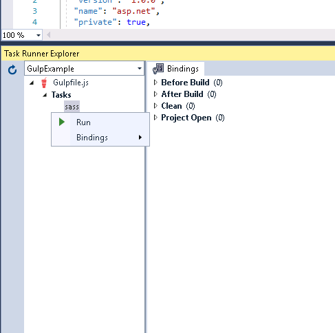
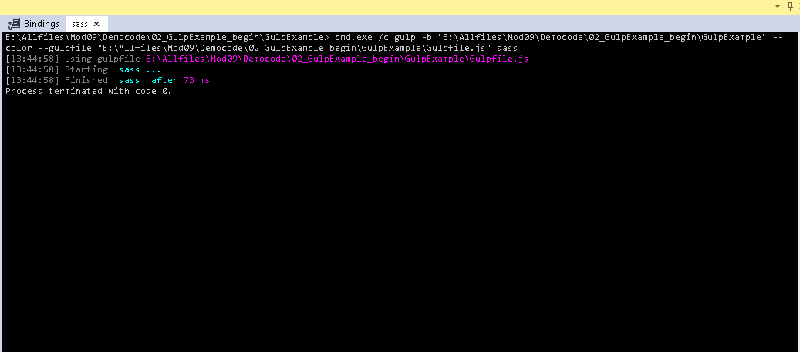
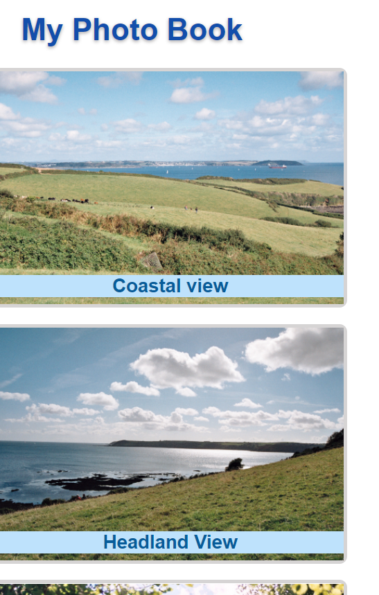

## Module 9: Client-Side Development

### Lesson 2: Using Task Runners

#### Demonstration: How to Use gulp to Compile Sass to CSS

Lo primero ejecutamos npm install para instalar las dependencias del

package.json
````
{
  "version": "1.0.0",
  "name": "asp.net",
  "private": true,
  "devDependencies": {
    "gulp": "4.0.0",
    "gulp-sass": "4.0.1",
    "lodash": "4.17.5",
    "hoek": "4.2.1"
  }
}
````


verficamos la lista de ubicaciones de herramientas externas  (Administración de Paquetes Web) en TOOLS



Una vez preparaado ejecutamos y comprobamos que esta sin fomato




Bien pues creamos una nueva hoja de estilos SASS llamada main.scss en Styles



con el siguiente código

````
$highlights: #124eab;
$main-color: #1395f4;

@mixin normalized-text() {
    font-family: Arial;
}

h1 {
    color: $highlights;
    @include normalized-text();
    font-size: 40px;
    text-shadow: 0px 2px 5px #aba8a8;
    font-weight: bolder;
    text-align: left;
    margin-left: 55px;
}
div {
    color: darken($main-color, 20%);
    margin: 21px 5px 15px 18px;
    padding-bottom: 95px;
    width: 455px;
    border: 5px solid #d6d4d4;
    border-radius: 10px;
    height: 210px;

    img {
        width: 100%;
    }

    h3 {
        @include normalized-text();
        font-size: 25px;
        position: relative;
        margin-top: -43px;
        background-color: lighten($main-color, 35%);
        text-align: center;
    }
}
````


Añadimos un fichero js llamado gulpfile.js a nivel de proyecto



```` 
var gulp = require('gulp');
var sass = require('gulp-sass');

gulp.task("sass", function () {
    return gulp.src('Styles/main.scss')
        .pipe(sass())
        .pipe(gulp.dest('wwwroot/css'));
});
````

Seleccionando gulpfile.js abrimos el Task runner Explorer




y lo ejecutamos

  


con ello creamos el fichero wwwroot/css/main.css ya solo queda lincarlo en index.cshtml

````
<link type="text/css" href="~/css/main.css" rel="stylesheet" />
````


  
