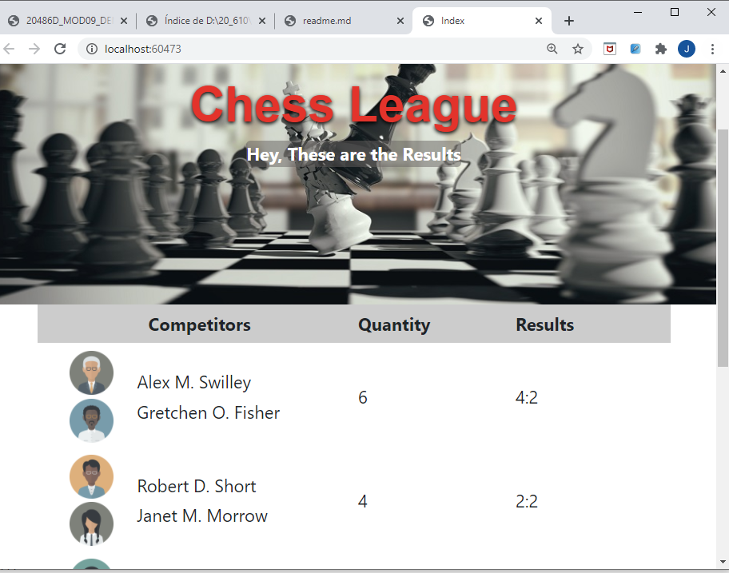

## Module 9: Client-Side Development  
### Lesson 2: Using Task Runners  
#### Demonstration: How to Use the Bootstrap Grid System    

Abrimos el proyecto gridExample del repositorio 03_GridExample_begin

y ejecutamos npm install para instalar las dependencias


````
{
  "version": "1.0.0",
  "name": "asp.net",
  "private": true,
  "dependencies": {
    "bootstrap": "4.3.1",
    "jquery": "^3.5.1",
    "popper.js": "1.14.3"
  }
}

``````

Con ello ya tenemos   "bootstrap,  jquery y popper.js  


Creamos la vista Index desde el controlador 


modificamos la vista añadiendole el modelo ,

los links a bootstrap y a la hoja style.css, los scripts de bottstrap m popper y jquery 
y contenido al body añadiendo divs con clases del grid de bootstrap

```
@model IEnumerable<GridExample.Models.Game>


@{
    Layout = null;
}

<!DOCTYPE html>

<html>
<head>
    <meta name="viewport" content="width=device-width" />
    <title>Index</title>
	<link href="~/node_modules/bootstrap/dist/css/bootstrap.css" rel="stylesheet" />
    <link href="~/css/style.css" rel="stylesheet" />
</head>
<body>
    <div class="title">
        <h1>Chess League</h1>
        <p>Hey, These are the Results</p>
    </div>
    <div class="container">
        <div class="row grid-header align-items-center">
            <div class="col-2">
            </div>
            <div class="col-4">
                Competitors
            </div>
            <div class="col-3">
                Quantity
            </div>
            <div class="col-3">
                Results
            </div>
        </div>
        <div class="row align-items-center">
            @foreach (var item in Model)
            {
                <div class="col-2">
                    <div class="row justify-content-center">
                        
                    </div>
                    <div class="row justify-content-center">
                        
                    </div>
                </div>
                <div class="col-4">
                    <div class="row">
                        @Html.DisplayFor(model => item.FirstCompetitorName)
                    </div>
                    <div class="row">
                        @Html.DisplayFor(model => item.SecondCompetitorName)
                    </div>
                </div>
                <div class="col-3">
                    @Html.DisplayFor(model => item.GamesQuantity)
                </div>
                <div class="col-3">
                    @Html.DisplayFor(model => item.FinalScore)
                </div>
            }
        </div>
    </div>
    <script src="~/node_modules/jquery/dist/jquery.js"></script>
    <script src="~/node_modules/popper.js/dist/umd/popper.js"></script>
    <script src="~/node_modules/bootstrap/dist/js/bootstrap.js"></script>
</body>
</html>
````




