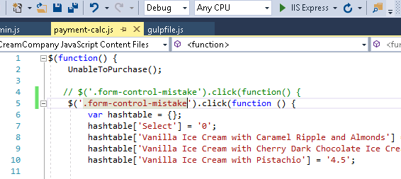

## Module 9: Client-Side Development

### Lab: Client-Side Development


Objectives  
After completing this lab, you will be able to:  

. Install gulp by using npm.  
. Write tasks by using gulp.  
. Style the application by using Sass and Bootstrap.  


#### Exercise 1: Using gulp to Run Tasks

##### Task 1: Use npm to install gulp


##### Task 2: Write a task to copy a JavaScript file


gulpfile.js:

````

var gulp = require('gulp');

var paths = {
    webroot: "./wwwroot/",
    nodeModules: "./node_modules/"
};

paths.jqueryjs = paths.nodeModules + "jquery/dist/jquery.js";
paths.destinationjsFolder = paths.webroot + "scripts/";

gulp.task("copy-js-file", function () {
    return gulp.src(paths.jqueryjs)
        .pipe(gulp.dest(paths.destinationjsFolder));
});
````


##### Task 3: Run the task


##### Task 4: Write a task to minify a JavaScript file  
##### Task 5: Write a task to bundle and minify all JavaScript files in a folder  
##### Task 6: Add a watcher task  

gulpfile.js:

````
var gulp = require('gulp');
var concat = require('gulp-concat');
var uglify = require('gulp-uglify');
var sass = require('gulp-sass');
var cssmin = require('gulp-cssmin');

var paths = {
    webroot: "./wwwroot/",
    nodeModules: "./node_modules/"
};

paths.jqueryjs = paths.nodeModules + "jquery/dist/jquery.js";
paths.popperjs = paths.nodeModules + "popper.js/dist/umd/popper.js";
paths.bootstrapjs = paths.nodeModules + "bootstrap/dist/js/bootstrap.js";
paths.vendorjs = [paths.jqueryjs, paths.popperjs, paths.bootstrapjs];
paths.destinationjsFolder = paths.webroot + "scripts/";
paths.vendorjsFileName = "vendor.min.js";
paths.jsFiles = "./Scripts/*.js";
paths.jsFileName = "script.min.js";
paths.sassFiles = "./Styles/*.scss";
paths.compiledCssFileName = "main.min.css";
paths.destinationCssFolder = paths.webroot + "css/";
paths.bootstrapCss = paths.nodeModules + "bootstrap/dist/css/bootstrap.css";
paths.vendorCssFileName = "vendor.min.css";

gulp.task("copy-js-file", function () {
    return gulp.src(paths.jqueryjs)
        .pipe(gulp.dest(paths.destinationjsFolder));
});

gulp.task("min-vendor:js", function () {
    return gulp.src(paths.vendorjs)
        .pipe(concat(paths.vendorjsFileName))
        .pipe(uglify())
        .pipe(gulp.dest(paths.destinationjsFolder));
});

gulp.task("min:js", function () {
    return gulp.src(paths.jsFiles)
        .pipe(concat(paths.jsFileName))
        .pipe(uglify())
        .pipe(gulp.dest(paths.destinationjsFolder));
});

gulp.task("min:scss", function () {
    return gulp.src(paths.sassFiles)
        .pipe(sass().on('error', sass.logError))
        .pipe(concat(paths.compiledCssFileName))
        .pipe(cssmin())
        .pipe(gulp.dest(paths.destinationCssFolder));
});

gulp.task("min-vendor:css", function () {
    return gulp.src(paths.bootstrapCss)
        .pipe(concat(paths.vendorCssFileName))
        .pipe(cssmin())
        .pipe(gulp.dest(paths.destinationCssFolder));
});

gulp.task("js-watcher", function () {
    gulp.watch('./Scripts/*.js', gulp.series("min:js"));
});

gulp.task("sass-watcher", function () {
    gulp.watch('./Styles/*.scss', gulp.series("min:scss"));
});
```` 

##### Task 7: Run the tasks


Observa como estan vinculados





#### Exercise 2: Styling by Using Sass


Creamos el main.sass


````
$highlights: #124eab;

@mixin normalized-text() {
    font-family: "Playfair Display", Arial, Tahoma, sans-serif;
    text-align: center;
}

@mixin normalized-image() {
    width: 100%;
    height: auto;
}

div {
    h1 {
        @include normalized-text();
        font-size: 45px;
        line-height: 50px;
        font-weight: 400;
        letter-spacing: 1px;
        color: #736454;
        margin: 60px;
    }
}

.main-title {
    background-image: url("/images/banner-1.jpg");
    width: 100%;
    background-size: cover;
    background-position: center center;
    min-height: 400px;
    display: flex;
    flex-direction: column;
    justify-content: center;
    align-items: center;

    h1 {
        @include normalized-text();
        color: $highlights;
        font-size: 50px;
        text-shadow: 0px 2px 5px #aba8a8;
        font-weight: bolder;
        text-align: center;
    }

    button {
        @include normalized-text();
        transition: none;
        color: lighten(#ffffff,90%);
        text-align: inherit;
        line-height: 13px;
        border: 1px solid #d3c0c0;
        margin: 0px;
        padding: 12px 24px;
        letter-spacing: 0px;
        font-weight: 400;
        font-size: 16px;
        font-weight: bold;
        background-color: #736454;
    }
}


.img-container {
    display: flex;
    flex-wrap: wrap;
    justify-content: space-around;
    align-items: flex-end;

    .item {
        color: white;
        width: 200px;
        display: flex;
        flex-direction: column;
        justify-content: space-between;

        h3 {
            @include normalized-text();
            color: #736454;
            font-size: 20px;
        }

        div {
            img {
                @include normalized-image();
            }
        }

        div {
            p {
                @include normalized-text();
                color: #736454;
                font-size: 20px;
                margin: 70px;
            }
        }
    }
}

.container {
    .checkout {
        border: 1px solid #ccc;
        box-shadow: 0 0 5px #ccc;
        padding: 20px;
        width: 800px;
        margin: 0 auto;
        border-radius: 4px;
        background-color: #f9f9f9;

        .row justify-content-center intro-row {
            font-weight: bold;
        }
    }
}

.justify-content-center {
    justify-content: center !important;
    align-items: center;
}

nav {
    width: 450px;
}

img {
    height: 35px;
    width: 35px;
}

.navbar-nav > li {
    float: left;
    position: relative;
}

.row {
    margin: 10px;
}

.imageDisplay {
    @include normalized-image();
}
````

##### Task 2: Add gulp tasks to handle Sass files


Modificamos el gulp.js añadiendo las lineas del sass

````
..........................
	var sass = require('gulp-sass');
	var cssmin = require('gulp-cssmin');

..........................

	paths.sassFiles = "./Styles/*.scss";
    paths.compiledCssFileName = "main.min.css";
    paths.destinationCssFolder = paths.webroot + "css/";
	
..........................	
	 gulp.task("min:scss", function() {
		return gulp.src(paths.sassFiles)
		.pipe(sass().on('error', sass.logError))
		.pipe(concat(paths.compiledCssFileName))
		.pipe(cssmin())
		.pipe(gulp.dest(paths.destinationCssFolder));
    });
	
	..........................
	
    gulp.task("sass-watcher", function() {
        gulp.watch('./Styles/*.scss', gulp.series("min:scss"));
    });
	
````

Guardamos y ejecutamos las tareas min:scss y sass-watcher


#### Exercise 3: Using Bootstrap

Incluimos en gulp.js las lineas de bootsptrap de tal manera que nos queda el siguiente listado


````

	var gulp = require('gulp');
var concat = require('gulp-concat');
var uglify = require('gulp-uglify');
var sass = require('gulp-sass');
var cssmin = require('gulp-cssmin');

var paths = {
    webroot: "./wwwroot/",
    nodeModules: "./node_modules/"
};

paths.jqueryjs = paths.nodeModules + "jquery/dist/jquery.js";
paths.popperjs = paths.nodeModules + "popper.js/dist/umd/popper.js";
paths.bootstrapjs = paths.nodeModules + "bootstrap/dist/js/bootstrap.js";
paths.vendorjs = [paths.jqueryjs, paths.popperjs, paths.bootstrapjs];
paths.destinationjsFolder = paths.webroot + "scripts/";
paths.vendorjsFileName = "vendor.min.js";
paths.jsFiles = "./Scripts/*.js";
paths.jsFileName = "script.min.js";
paths.sassFiles = "./Styles/*.scss";
paths.compiledCssFileName = "main.min.css";
paths.destinationCssFolder = paths.webroot + "css/";
paths.bootstrapCss = paths.nodeModules + "bootstrap/dist/css/bootstrap.css";
paths.vendorCssFileName = "vendor.min.css";
 
gulp.task("copy-js-file", function() {
    return gulp.src(paths.jqueryjs)
        .pipe(gulp.dest(paths.destinationjsFolder));
});

gulp.task("min-vendor:js", function() {
    return gulp.src(paths.vendorjs)
        .pipe(concat(paths.vendorjsFileName))
        .pipe(uglify())
        .pipe(gulp.dest(paths.destinationjsFolder));
});

gulp.task("min:js", function() {
    return gulp.src(paths.jsFiles)
        .pipe(concat(paths.jsFileName))
        .pipe(uglify())
        .pipe(gulp.dest(paths.destinationjsFolder));
});

gulp.task("min:scss", function() {
    return gulp.src(paths.sassFiles)
        .pipe(sass().on('error', sass.logError))
        .pipe(concat(paths.compiledCssFileName))
        .pipe(cssmin())
        .pipe(gulp.dest(paths.destinationCssFolder));
});

gulp.task("min-vendor:css", function() {
    return gulp.src(paths.bootstrapCss)
        .pipe(concat(paths.vendorCssFileName))
        .pipe(cssmin())
        .pipe(gulp.dest(paths.destinationCssFolder));
});

gulp.task("js-watcher", function() {
    gulp.watch('./Scripts/*.js', gulp.series("min:js"));
});

gulp.task("sass-watcher", function() {
    gulp.watch('./Styles/*.scss', gulp.series("min:scss"));
});

````

##### Task 2: Run the tasks

Ejecutamos min-vendor:css y min-vendor:js


Modificamos _Layout.cshtm

Creamosla vista Buy desde el controloador le insertamos el código


Guardamos y ejecutamos


	
	
	
	
