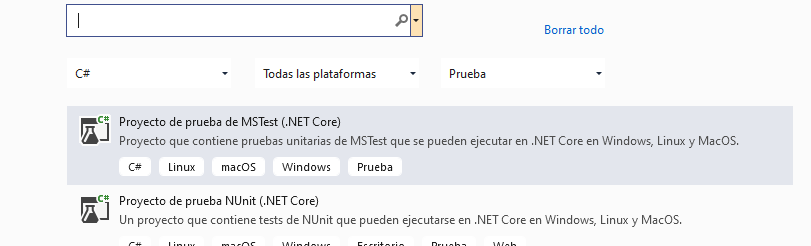
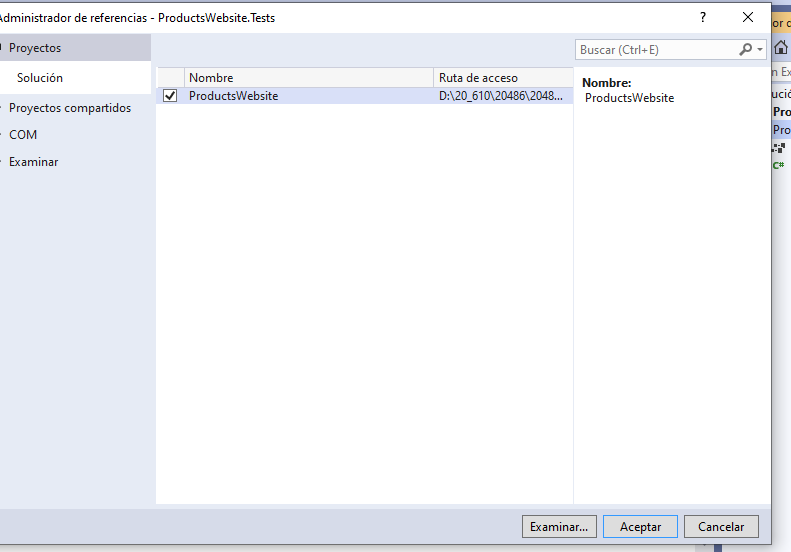
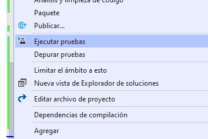
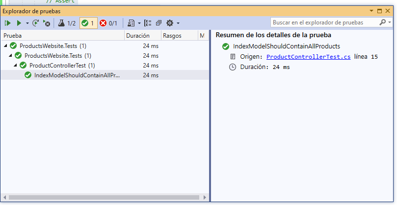
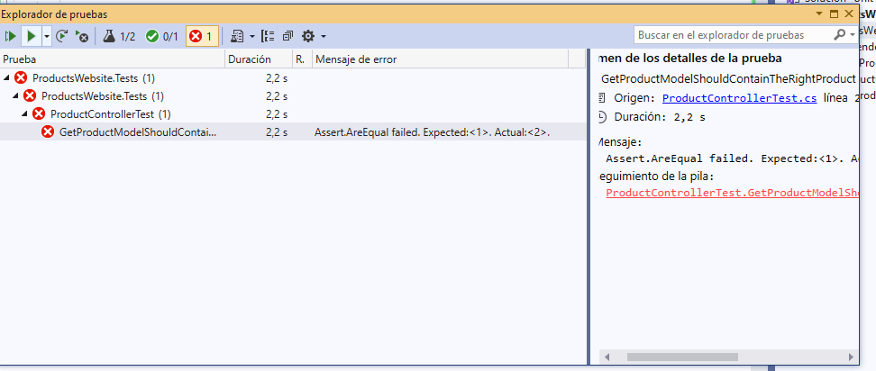
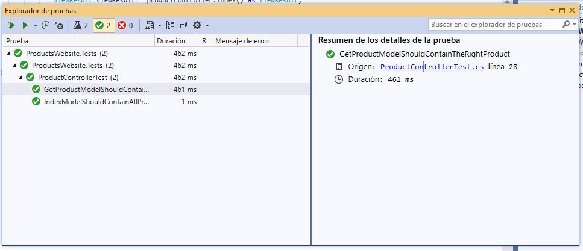

## Module 10: Testing and Troubleshooting

### Lesson 1: Testing MVC Applications

#### Demonstration: How to Run Unit Tests


Tenemos una aplicacion que utiliza una base de datos sql Productos unas rutas por defecto  Product/Index/id  

El Modelo Product`
````
  public class Product
    {
	public int Id { get; set; }
	public string Name { get; set; }
	public float BasePrice { get; set; }
	public string Description { get; set; }
	public string ImageName { get; set; }
	public string FormattedPrice
	{
		get
		{
			return BasePrice.ToString($"C2");
		}
	}
	}
````

un ProductContext que inserta 5 productos cuando crea la base de datos

un repositorio que solo implementa el metodo
````
 public IEnumerable<Product> GetProducts()
{
	return _context.Products.ToList();
}
````

el Controlador 
````
public IActionResult Index()
{
	var products = _repository.GetProducts();
	return View(products);
}

public IActionResult GetProduct(int id)
{
	var products = _repository.GetProducts();
	var product = products.Where(p => p.Id != id).FirstOrDefault();
	return View(product);
}

public IActionResult GetImage(string name)
{
	return File($@"images\{name}.png", "image/png");
}
````

y sus dos vistas Index y GetProduct..


y por lo que veo falla 

eh aqui el problema!!!
``````
        public IActionResult GetProduct(int id)
        {
            var products = _repository.GetProducts();
            var product = products.Where(p => p.Id != id).FirstOrDefault();
            return View(product);
        }
````


Pero para eso vamos a testear!

Creamos un proyecto de prueba MsTest



Agregamos la referencia al Proyecto que vamos a testear




Cambiamos el nombre al fichero UnitTest1.cs  por ProductControllerTest.cs


Instalamos Install-Package Microsoft.AspNetCore.Mvc -ProjectName ProductsWebsite.Tests desde la consola de Nuget  


creamos el FakeProductRepository
````

using System;
using System.Collections.Generic;
using System.Text;
using ProductsWebsite.Repositories;
using ProductsWebsite.Models;

namespace ProductsWebsite.Tests
{
    internal class FakeProductRepository : IProductRepository
    {
        public IEnumerable<Product> GetProducts()
        {
            return new List<Product>()
    {
        new Product{ Id = 1, Name = "Product1's name", BasePrice = 1.1F, Description = "A description for product 1.", ImageName = "image-name-1" },
        new Product{ Id = 2, Name = "Product2's name", BasePrice = 2.2F, Description = "A description for product 2.", ImageName = "image-name-2" },
        new Product{ Id = 3, Name = "Product3's name", BasePrice = 3.3F, Description = "A description for product 3.", ImageName = "image-name-3" }
    };
        }
    }
}
````


Una vez que tenemos el FakeRepository implementamos el ProductControllerTest
````


using Microsoft.VisualStudio.TestTools.UnitTesting;
using System.Collections.Generic;
using Microsoft.AspNetCore.Mvc;
using ProductsWebsite.Controllers;
using ProductsWebsite.Models;
using ProductsWebsite.Repositories;


namespace ProductsWebsite.Tests
{
    [TestClass]
    public class ProductControllerTest
    {
        [TestMethod]
        public void IndexModelShouldContainAllProducts()
        {
            // Arrange
            IProductRepository fakeProductRepository = new FakeProductRepository();
            ProductController productController = new ProductController(fakeProductRepository);
            // Act
            ViewResult viewResult = productController.Index() as ViewResult;
            List<Product> products = viewResult.Model as List<Product>;
            // Assert
            Assert.AreEqual(products.Count, 3);
        }

        [TestMethod]
        public void GetProductModelShouldContainTheRightProduct()
        {
            // Arrange
            var fakeProductRepository = new FakeProductRepository();
            var productController = new ProductController(fakeProductRepository);
            // Act
            var viewResult = productController.GetProduct(2) as ViewResult;
            Product product = viewResult.Model as Product;
            // Assert
            Assert.AreEqual(product.Id, 2);
        }
    }
}
````
Guardamos y Ejecutamos todas las pruebas  

  


nos aparece una prueba ok

  

y otra prueba fallida

  


Corregimos en el proyecto principal el fallo en el GetProduct del ProductController

var product = products.Where(p => p.Id == id).FirstOrDefault();


y volvemos a ejcutar las pruebas

  


		
