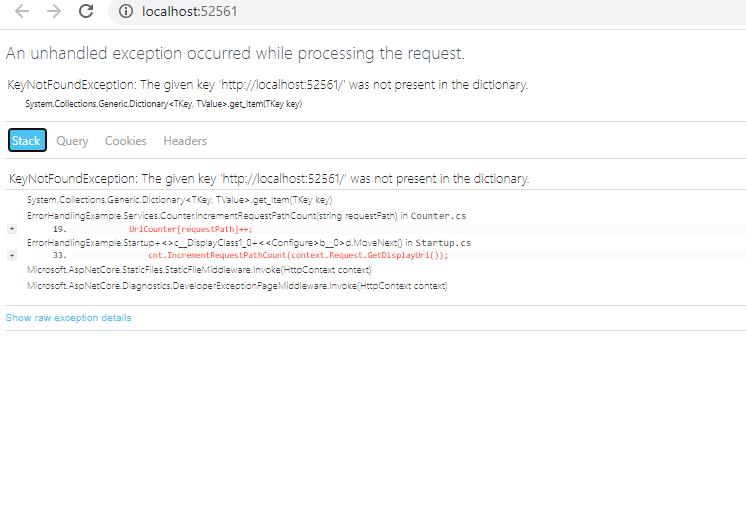
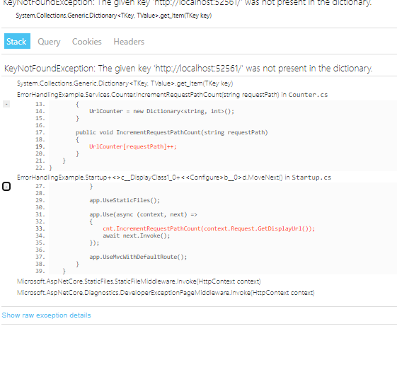
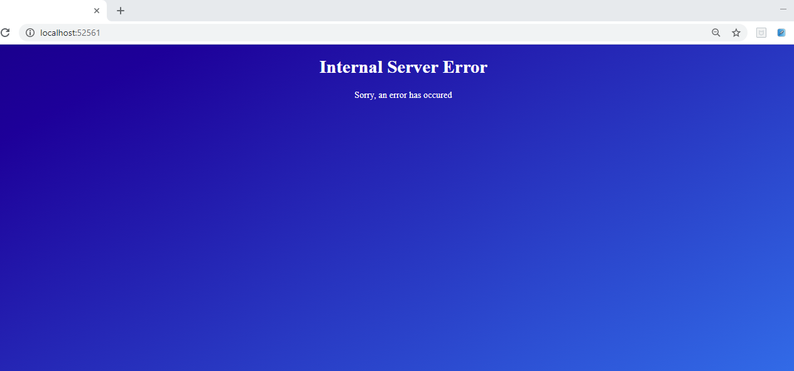
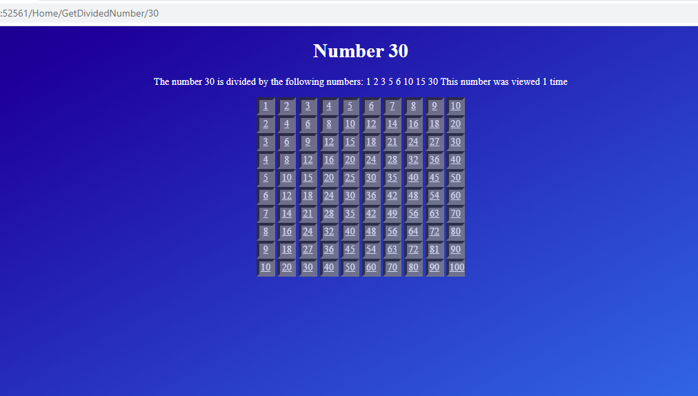

## Lesson 2: Implementing an Exception Handling Strategy

### Demonstration: How to Configure Exception Handling


Para esta demo utilizaremos el proyecto ErrorHandlingExample.sln.


Estudiamos el proyecto

````
{
  "iisSettings": {
    "windowsAuthentication": false,
    "anonymousAuthentication": true,
    "iisExpress": {
      "applicationUrl": "http://localhost:52561/",
      "sslPort": 0
    }
  },
  "profiles": {
    "Development": {
      "commandName": "IISExpress",
      "launchBrowser": true,
      "environmentVariables": {
        "ASPNETCORE_ENVIRONMENT": "Development"   <------- ummm !!
      }
    },
    "Production": {
      "commandName": "IISExpress",
      "launchBrowser": true,
      "environmentVariables": {
        "ASPNETCORE_ENVIRONMENT": "Production"
      }
    }
  }
}
``````


en este proyecto tenemos 2 services con sus repectivas Interfaces

```

namespace ErrorHandlingExample.Services
{
    public class DivisionCalculator : IDivisionCalculator
    {
        public DivisionResult GetDividedNumbers(int number)
        {
            DivisionResult divisionResult = new DivisionResult();

            divisionResult.DividedNumber = number;
            divisionResult.DividingNumbers = new List<int>();

            for (int i = 0; i < (number / 2) + 1; i++)
            {
                if (number % i == 0)
                {
                    divisionResult.DividingNumbers.Add(i);
                }
            }

            divisionResult.DividingNumbers.Add(number);

            return divisionResult;
        }
    }
}

using System;
using System.Collections.Generic;
using System.Linq;
using System.Threading.Tasks;

namespace ErrorHandlingExample.Services
{
    public class Counter : ICounter
    {
        public Dictionary<string, int> UrlCounter { get; set; }

        public Counter()
        {
            UrlCounter = new Dictionary<string, int>();
        }

        public void IncrementRequestPathCount(string requestPath)
        {
            UrlCounter[requestPath]++;
        }
    }
}

````


se le injectamos en el Startup.cs 

````
using Microsoft.AspNetCore.Builder;
using Microsoft.AspNetCore.Hosting;
using Microsoft.Extensions.DependencyInjection;
using ErrorHandlingExample.Services;
using Microsoft.AspNetCore.Http.Extensions;

namespace ErrorHandlingExample
{
    public class Startup
    {
        public void ConfigureServices(IServiceCollection services)
        {
            services.AddMvc();
            services.AddSingleton<ICounter, Counter>();
            services.AddSingleton<IDivisionCalculator, DivisionCalculator>();
        }

        public void Configure(IApplicationBuilder app, IHostingEnvironment env, ICounter cnt)
        {
            if (env.IsDevelopment())
            {
                app.UseDeveloperExceptionPage();
            }
            else
            {
                app.UseExceptionHandler("/error.html");
            }

            app.UseStaticFiles();

            app.Use(async (context, next) =>
            {
                cnt.IncrementRequestPathCount(context.Request.GetDisplayUrl());
                await next.Invoke();
            });

            app.UseMvcWithDefaultRoute();
        }
    }
}
`````

el modelo es el siguiente

````

namespace ErrorHandlingExample.Models
{
    public class DivisionResult
    {
        public int DividedNumber { get; set; }

        public List<int> DividingNumbers { get; set; }
    }
}

``````


el controloador

````````
  public class HomeController : Controller
    {
        IDivisionCalculator _numberCalculator;
        ICounter _counter;

        public HomeController(IDivisionCalculator numberCalculator, ICounter counter)
        {
            _numberCalculator = numberCalculator;
            _counter = counter;
        }

        public IActionResult Index()
        {
            ViewBag.NumberOfViews = _counter.UrlCounter[HttpContext.Request.GetDisplayUrl()];
            return View();
        }

        public IActionResult GetDividedNumber(int id)
        {
            ViewBag.NumberOfViews = _counter.UrlCounter[HttpContext.Request.GetDisplayUrl()];
            DivisionResult divisionResult = _numberCalculator.GetDividedNumbers(id);
            return View(divisionResult);
        }
    }
	
````````

y estas son los vistas


Index

````

@{
Layout = null;
}

<!DOCTYPE html>

<html>
  <head>
    <meta name="viewport" content="width=device-width" />
    <title>Index</title>
    <link href="~/css/style.css" rel="stylesheet" type="text/css" />
  </head>
  <body>
      <h1>Multiplication Table</h1>
      <p>
          Welcome to the multiplication table site.<br />
          The number of entrances to the welcome page is: @ViewBag.NumberOfViews
      </p>
      @await Html.PartialAsync("_NumberLinks")
  </body>
</html>
````

GetDividedNumber

````
@model ErrorHandlingExample.Models.DivisionResult
@{
    Layout = null;
}

<!DOCTYPE html>

<html>
<head>
    <meta name="viewport" content="width=device-width" />
    <title>GetDividedNumber</title>
    <link href="~/css/style.css" rel="stylesheet" type="text/css" />
</head>
<body>
    <h1>Number @Model.DividedNumber</h1>
    <p>
        The number @Model.DividedNumber is divided by the following numbers:
        @foreach (var item in @Model.DividingNumbers)
        {
            <span>@Html.DisplayFor(i => item)</span>
        }

        This number was viewed @ViewBag.NumberOfViews
        @if (ViewBag.NumberOfViews > 1)
        {
            @:times
        }
        else
        {
            @:time
        }
    </p>
    <div>
       @await Html.PartialAsync("_NumberLinks")
    </div>
</body>
</html>

````

y la partial _NumberLinks

````
<div>
    @for (int i = 1; i <= 10; i++)
    {
        <div>
            @for (int j = 1; j <= 10; j++)
            {
                <a href="@Url.Action("GetDividedNumber", new { id=(i * j) })">@(i * j)</a>
            }
        </div>
    }
</div>
````

bueno ahora que lo hemos estudiado lo ejecutamos

Pues si que empezamos bien 





podemos expandir los errores




si ejecutamos con el enterno de producción vemos que la pantalla es bastante más elegante




corregimos los errores

````
public void IncrementRequestPathCount(string requestPath)
        {
            //UrlCounter[requestPath]++;
            if (UrlCounter.ContainsKey(requestPath))
            {
                UrlCounter[requestPath]++;
            }
            else
            {
                UrlCounter.Add(requestPath, 1);
            }
        }
		
		
 public DivisionResult GetDividedNumbers(int number)
        {
            DivisionResult divisionResult = new DivisionResult();

            divisionResult.DividedNumber = number;
            divisionResult.DividingNumbers = new List<int>();

          ////  for (int i = 0; i < (number / 2) + 1; i++)
            for (int i = 1; i < (number / 2) + 1; i++)
            {
                if (number % i == 0)
                {
                    divisionResult.DividingNumbers.Add(i);
                }
            }

            divisionResult.DividingNumbers.Add(number);

            return divisionResult;
        }
````


y vemos que la aplicacion funciona




