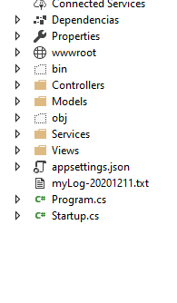
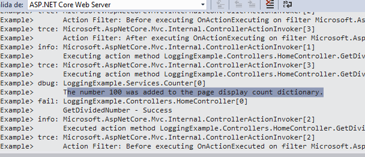

## Module 10: Testing and Troubleshooting

### Lesson 3: Logging MVC Applications

#### Demonstration: How to Log an MVC Application


En esta demo utilizaremos LoggingExample.sln del repositorio 03_LoggingExample_begin

La estuctura del proyecto es similar al proyecto anterior.


empecemos


modificamos program.cs
añadiendo al WebHost.CreateDefaultBuilder(args) la configuracion del logging


`````
namespace LoggingExample
{
    public class Program
    {
        public static void Main(string[] args)
        {
            CreateWebHostBuilder(args).Build().Run();
        }

        public static IWebHostBuilder CreateWebHostBuilder(string[] args) =>
            WebHost.CreateDefaultBuilder(args)
            .ConfigureLogging((hostingContext, logging) =>
            {
                var env = hostingContext.HostingEnvironment;
                var config = hostingContext.Configuration.GetSection("Logging");

                logging.ClearProviders();

                if (env.IsDevelopment())
                {
                    logging.AddConfiguration(config);
                    logging.AddConsole();
                }
                else
                {
                    logging.AddFile(config);
                }
            })
            .UseStartup<Startup>();
    }
}

`````

modificamos appsettings.json . appsettings.development.json

`````
 "Logging": {
    "LogLevel": {
      "Default": "Trace"
    }
 }
 `````
 
 modificamos appsettings.json . appsettings.production.json
 
 `````
 "Logging": {
   "PathFormat": "myLog.txt",
   "LogLevel": {
     "Default": "Warning"
   }
 }
 `````
 
 
 En el Homecontroller vamos a injectar ICounter _counter; y  ILogger _logger;
 para ello añadimos   using Microsoft.Extensions.Logging;    
 
 y modificamos 
 
````
    public class HomeController : Controller
    {
        IDivisionCalculator _numberCalculator;
        ICounter _counter;
        ILogger _logger;

        public HomeController(IDivisionCalculator numberCalculator, ICounter counter, ILogger<HomeController> logger)
        {
            _counter = counter;
            _numberCalculator = numberCalculator;
            _logger = logger;
        }
````
 
ademas modificamos GetDividedNumber

````
public IActionResult GetDividedNumber(int id)
        {
            ViewBag.CounterSucceeded = false;

            try  //añadimos el código siguiente 
            {
                _counter.IncrementNumberCount(id);
                ViewBag.NumberOfViews = _counter.NumberCounter[id];
                ViewBag.CounterSucceeded = true;
                _logger.LogError("GetDividedNumber - Success");
            }
            catch (Exception ex)
            {
                _logger.LogError(ex, $"An error occured while trying to increase or retrieve the page display count. Number parameter is: {id}");
            }
			// 
			
			
            DivisionResult divisionResult = _numberCalculator.GetDividedNumbers(id);
            return View(divisionResult);
        }
````

ejecutamos la app.

observa el fichero log creado



````
2020-12-11T01:13:52.3514555+01:00 0HM4TD6FAJNP3:00000003 [ERR] An error occured while trying to increase or retrieve the page display count. Number parameter is: 16 (d01e3e98)
System.Collections.Generic.KeyNotFoundException: The given key '16' was not present in the dictionary.
   at System.Collections.Generic.Dictionary`2.get_Item(TKey key)
   at LoggingExample.Services.Counter.IncrementNumberCount(Int32 number) in C:\Users\juan_\Desktop\Mod10\Democode\03_LoggingExample_begin\LoggingExample\Services\Counter.cs:line 23
   at LoggingExample.Controllers.HomeController.GetDividedNumber(Int32 id) in C:\Users\juan_\Desktop\Mod10\Democode\03_LoggingExample_begin\LoggingExample\Controllers\HomeController.cs:line 36

````


Bien modificamos el servicio Counter

````
 public void IncrementNumberCount(int number)
        {
          //  NumberCounter[number]++;

            if (NumberCounter.ContainsKey(number))
            {
                NumberCounter[number]++;
                _logger.LogDebug($"The number of times the page was displayed for the number {number} was increased to {NumberCounter[number]}.");
            }
            else
            {
                NumberCounter.Add(number, 1);
                _logger.LogDebug($"The number {number} was added to the page display count dictionary.");
            }
        }

````


y ejecutamos en desarrollo

examinamos la pestaña output


