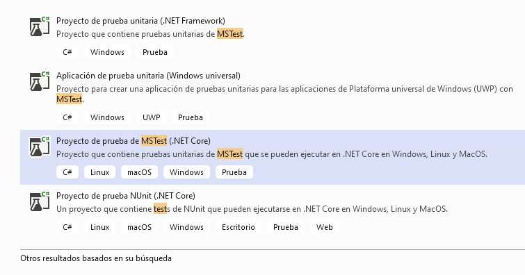
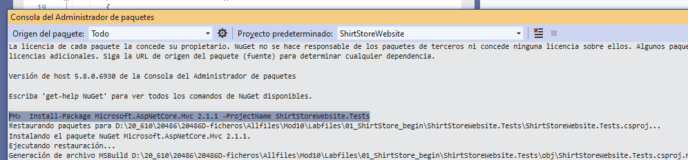

## Module 10: Testing and Troubleshooting

### Lab: Testing and Troubleshooting

#### Exercise 1: Testing a Mode

Cargamos el repositorio del repositorio 01_ShirtStore_begin, el proyecto the ShirtStore.sln.

Una vez revisado nos disponemos a realizar la práctica


#### Exercise 1: Testing a Model

Creamos el proyecto ShirtStoreWebsite.Tests



y le añadimos la referecia a ShirtStore.sln.


Movemos el fichero  UnitTest1.cs a Models/ y le renombramos como ShirtTest.cs con el siquiente código

````

using Microsoft.VisualStudio.TestTools.UnitTesting;
using ShirtStoreWebsite.Models;


namespace ShirtStoreWebsite.Tests
{
    [TestClass]
    public class ShirtTest
    {
        [TestMethod]
        public void IsGetFormattedTaxedPriceReturnsCorrectly()
        {
            Shirt shirt = new Shirt
            {
                Price = 10F,
                Tax = 1.2F
            };

            string taxedPrice = shirt.GetFormattedTaxedPrice();

            Assert.AreEqual("$12.00", taxedPrice);
        }
    }
}
````
y ejecutamos la prueba


Nos da una prueba fallida  


El código del Test es correcto por lo que corregimos el Modelo 


````
namespace ShirtStoreWebsite.Models
{
    public class Shirt
    {
        public int Id { get; set; }
        [Display(Name = "Size"), Required]
        public ShirtSize Size { get; set; }
        [Display(Name = "Color"), Required]
        public ShirtColor Color { get; set; }
        [Required]
        public float Price { get; set; }
        [Required]
        public float Tax { get; set; }

        public string GetFormattedTaxedPrice()
        {
            // return Price.ToString($"C2", CultureInfo.GetCultureInfo("en-US"));  // CODIGO ERRONEO 

            return (Price * Tax).ToString($"C2", CultureInfo.GetCultureInfo("en-US"));
        }
    }
}
````

Y volvemos a ejecutar la prueba  


#### Exercise 2: Testing a Controller using a Fake Repository

Creamos la interface ShirtStoreWebsite.Services IShirtRepository con el siguiente código

````

using System.Collections.Generic;
using ShirtStoreWebsite.Models;

namespace ShirtStoreWebsite.Services
{
    public interface IShirtRepository
    {
        IEnumerable<Shirt> GetShirts();
        bool AddShirt(Shirt shirt);
        bool RemoveShirt(int id);
    }
}

````
Implementamos la interface usando un fake repository

Para ello nos creamos la clase  ShirtStoreWebsite.Tests.FakeRepositories.FakeRepository

````
using System.Collections.Generic;
using ShirtStoreWebsite.Services;
using ShirtStoreWebsite.Models;

namespace ShirtStoreWebsite.Tests.FakeRepositories
{
    internal class FakeShirtRepository : IShirtRepository
    {
        public IEnumerable<Shirt> GetShirts() => new List<Shirt>()
            {
                new Shirt { Color = ShirtColor.Black, Size = ShirtSize.S, Price = 11F },
                new Shirt { Color = ShirtColor.Gray, Size = ShirtSize.M, Price = 12F },
                new Shirt { Color = ShirtColor.White, Size = ShirtSize.L, Price = 13F }
            };

        public bool AddShirt(Shirt shirt) => true;

        public bool RemoveShirt(int id) => true;
    }
}

````


Una vez creado el fake repository lo utilizamos en el controlador  ShirtController.cs. injectandolo

````
`........................
using ShirtStoreWebsite.Services;


namespace ShirtStoreWebsite.Controllers
{
    public class ShirtController : Controller
    {
        private IShirtRepository _repository;

        public ShirtController(IShirtRepository repository)
        {
            _repository = repository;
        }
..............
````

y finalmente escribimos el test para el controlador


Para ello ejecutamos desde la consola Nuget

```
PM>  Install-Package Microsoft.AspNetCore.Mvc 2.1.1 -ProjectName ShirtStoreWebsite.Tests
```




Creamos el controlador ShirtStoreWebsite.Tests.Controllers.ShirtControllerTest

```
using System.Collections.Generic;
using Microsoft.VisualStudio.TestTools.UnitTesting;
using Microsoft.AspNetCore.Mvc;
using ShirtStoreWebsite.Controllers;
using ShirtStoreWebsite.Models;
using ShirtStoreWebsite.Services;
using ShirtStoreWebsite.Tests.FakeRepositories;

namespace ShirtStoreWebsite.Tests.Controllers
{

    [TestClass]
        public class ShirtControllerTest
        {
            [TestMethod]
            public void IndexModelShouldContainAllShirts()
            {
                IShirtRepository fakeShirtRepository = new FakeShirtRepository();
                ShirtController shirtController = new ShirtController(fakeShirtRepository);
                ViewResult viewResult = shirtController.Index() as ViewResult;
                List<Shirt> shirts = viewResult.Model as List<Shirt>;
                Assert.AreEqual(shirts.Count, 3);
            }
        }

}
```

Ejecutamos las pruebas y fallam


Para que pase modicamos el controller

````
using Microsoft.AspNetCore.Mvc;
using ShirtStoreWebsite.Models;
using ShirtStoreWebsite.Services;
using System.Collections.Generic;

namespace ShirtStoreWebsite.Controllers
{
    public class ShirtController : Controller
    {
        private IShirtRepository _repository;

        public ShirtController(IShirtRepository repository)
        {
            _repository = repository;
        }


        public IActionResult Index()
        {
            IEnumerable<Shirt> shirts = _repository.GetShirts(); // Codigo para que pase la prueba
            return View(shirts);

           // return View();
        }

        public IActionResult AddShirt(Shirt shirt)
        {
            _repository.AddShirt(shirt); // Codigo para que pase la prueba
            return RedirectToAction("Index");
        }

        public IActionResult Delete(int id)
        {
            _repository.RemoveShirt(id); // Codigo para que pase la prueba
            return RedirectToAction("Index");
        }
    }
}
````


#### Exercise 3: Implementing a Repository in the MVC Project


Creamos la clase ShirtStoreWebsite.Services.ShirtRepository.cs

```
using System.Collections.Generic;
using System.Linq;
using ShirtStoreWebsite.Models;
using ShirtStoreWebsite.Data;

namespace ShirtStoreWebsite.Services
{
    public class ShirtRepository : IShirtRepository
    {
        private ShirtContext _context;

        public ShirtRepository(ShirtContext context) 
        {
            _context = context;
        }

        public IEnumerable<Shirt> GetShirts() => _context.Shirts.ToList();
       

        public bool AddShirt(Shirt shirt)
        {
            _context.Add(shirt);
            int entries = _context.SaveChanges();
            if (entries > 0)
            {
                return true;
            }
            else
            {
                return false;
            }
        }

        public bool RemoveShirt(int id)
        {
            var shirt = _context.Shirts.SingleOrDefault(m => m.Id == id);
            _context.Shirts.Remove(shirt);
            int entries = _context.SaveChanges();
            if (entries > 0)
            {
                return true;
            }
            else
            {
                return false;
            }
        }
    }
}
````

Pasamos al starup para registralo como servicio

(añadimos  using ShirtStoreWebsite.Services; y lo injectamos como servicio  services.AddScoped< IShirtRepository, ShirtRepository>(); 


y ejecutamos la aplicacion (ya tenemos metido el repositorio)


#### Exercise 4: Adding Exception Handling

Para agregar el manejo de excepciones en el Starup añadimos al procedimiento Configure la configuracion del manejo de excepciones según el entorno


````
 public void Configure(IApplicationBuilder app, IHostingEnvironment env, ShirtContext shirtContext)
 {
if (env.IsDevelopment())
 {
     app.UseDeveloperExceptionPage();
 }
 else
 {
     app.UseExceptionHandler("/error.html");
 }
````

Para probar creamos una excepción temporal modificando ShirtController.cs 

```
        public IActionResult Delete(int id)
        {
            //_repository.RemoveShirt(id);  

            _repository.RemoveShirt(-1); // código para excepción temoral

            return RedirectToAction("Index");
        }
```
Ejecutamos como IsDevelopment

  

y esta es la página de error


ejecutamos como isProduction


y esta es la página de error


#### Exercise 5: Adding Logging


Agregamos el fichero appsettings.development.json


````
 {
 "Logging": {
     "LogLevel": {
         "Default": "Trace"
     }
 }
````


lo mismo con appsettings.production.json

```` 
{
"Logging": {
  "PathFormat": "shirt_store_logs.txt",
  "LogLevel": {
    "Default": "Warning"
  }
}
```` 

Modificamos CreateWebHostBuilder de Program.cs.

```
public static IWebHostBuilder CreateWebHostBuilder(string[] args) =>
            WebHost.CreateDefaultBuilder(args)
            .ConfigureLogging((hostingContext, logging) =>
            {
                var env = hostingContext.HostingEnvironment;
                var config = hostingContext.Configuration.GetSection("Logging");

                logging.ClearProviders();

                if (env.IsDevelopment())
                {
                    logging.AddConfiguration(config);
                    logging.AddConsole();
                }
                else
                {
                    logging.AddFile(config);
                }
            })
             .UseStartup<Startup>();
````

añadimos using Microsoft.Extensions.Logging; al controlador y le injectamos logger  
y modificamos los metodos AddShirt y emoveShirt con la lógica de log  

```
.....

using Microsoft.Extensions.Logging;

namespace ShirtStoreWebsite.Controllers
{
public class ShirtController : Controller
{
	private IShirtRepository _repository;
	private ILogger _logger

	public ShirtController(IShirtRepository repository, ILogger<ShirtController> logger)
	{
		_repository = repository;
		_logger = logger;
	}
.....

	
	public IActionResult AddShirt(Shirt shirt)
	{
		_repository.AddShirt(shirt); // Codigo para que pase la prueba
		_logger.LogDebug($"A {shirt.Color.ToString()} shirt of size {shirt.Size.ToString()} with a price of {shirt.GetFormattedTaxedPrice()} was added successfully.");
		return RedirectToAction("Index");
	}

	public IActionResult Delete(int id)
	{
		try
		{
			_repository.RemoveShirt(id);
			_logger.LogDebug($"A shirt with id {id} was removed successfully.");
			return RedirectToAction("Index");
		}
		catch (Exception ex)
		{
			_logger.LogError(ex, $"An error occured while trying to delete shirt with id of {id}.");
			throw ex;
		}

	}
``````


##### Task 2: Test the controller by using a mocking framework


Instalamos en consola Nuget Install-Package Moq -Version 4.9.0 -ProjectName ShirtStoreWebsite.Tests

En el controlador ShirtStoreWebsite.Tests.ShirtControllerTest.cs

añadimos los using


 using Microsoft.Extensions.Logging;
 using Moq

 
 y modificamos el procemiento
 (Note: ShirtControllerTest must be updated because we added a parameter to the ShirtController constructor ILogger logger; following the update the test will pass correctly.)  
 
 ````
  public class ShirtControllerTest
        {
            [TestMethod]
            public void IndexModelShouldContainAllShirts()
            {
                IShirtRepository fakeShirtRepository = new FakeShirtRepository();
            
            // ShirtController shirtController = new ShirtController(fakeShirtRepository);
            Mock<ILogger<ShirtController>> mockLogger = new Mock<ILogger<ShirtController>>();
            ShirtController shirtController = new ShirtController(fakeShirtRepository, mockLogger.Object);

            ViewResult viewResult = shirtController.Index() as ViewResult;
                List<Shirt> shirts = viewResult.Model as List<Shirt>;
                Assert.AreEqual(shirts.Count, 3);
            }
        }
````

##### Task 3: Run the unit test


####   Run the application  


