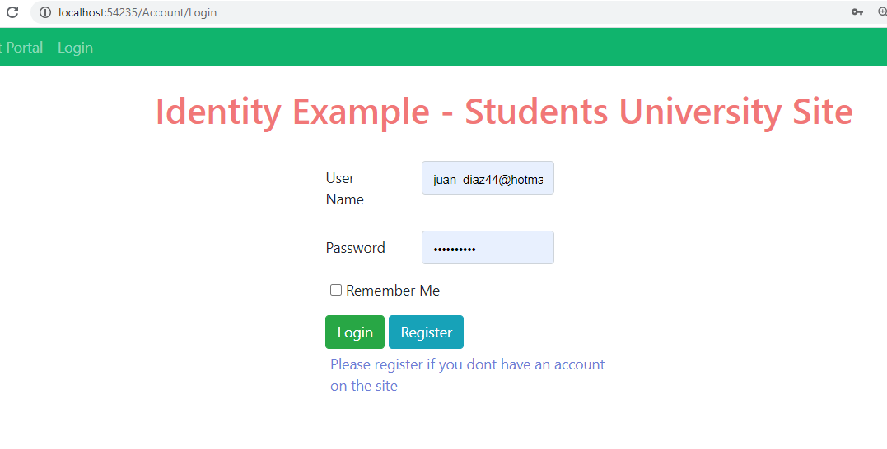

## Demo Module 11: Managing Security

### Lesson 1: Authentication in ASP.NET Core

#### Demonstration: How to use ASP.NET Core Identity

Abrimos la solución 01_IdentityExample_begin\IdentityExample

y ejecutamos npm install para instalar las dependencias 

````
{
  "version": "1.0.0",
  "name": "asp.net",
  "private": true,
  "devDependencies": {},
  "dependencies": {
    "jquery": "3.3.1",
    "jquery-validation": "1.17.0",
    "jquery-validation-unobtrusive": "3.2.10",
    "bootstrap": "4.3.1",
    "popper.js": "1.14.4"
  }
}
````

la estructura del program es la siguiente:  


observa


 el modelo en [ViewModels/LoginViewModel](IdentityExample/ViewModels/LoginViewModel.cs)
````
 public class LoginViewModel
    {
        [Display(Name = "User Name")]
        [Required(ErrorMessage = "Please enter your user name.")]
        public string UserName { get; set; }

        [Display(Name = "Password")]
        [Required(ErrorMessage = "Please enter your password.")]
        public string Password { get; set; }

        [Display(Name = "Remember Me")]
        public bool RememberMe { get; set; }
    }
````
 el modelo en [ViewModels/RegisterViewModel](IdentityExample/ViewModels/RegisterViewModel.cs) que hereda del anterior  
 
````
 public class RegisterViewModel : LoginViewModel
    {
        [Display(Name = "First Name")]
        [Required(ErrorMessage = "Please enter your first name")]
        public string FirstName { get; set; }

        [Display(Name = "Last Name")]
        [Required(ErrorMessage = "Please enter your last name")]
        public string LastName { get; set; }

        [Display(Name = "Phone Number")]
        [Required(ErrorMessage = "Please enter your phone number")]
        [DataType(DataType.PhoneNumber)]
        public string PhoneNumber { get; set; }

        [Required(ErrorMessage = "Please enter your email")]
        [DataType(DataType.EmailAddress)]
        public string Email { get; set; }
    }

````


y el [Models/Student](IdentityExample/Models/Student.cs) 

```c#
 public class Student : IdentityUser
	{
		public string FirstName { get; set; }

		public string LastName { get; set; }
	}
````


Lo primero modificamos [Startup.cs](IdentityExample/Startup.cs)


Añadiendo using IdentityExample.Models;

Modificando el ConfigureServices  añadiendo services.AddDefaultIdentity<Student>(options =....

y app.UseAuthentication();  

lo vemos y repasamos
````
using IdentityExample.Data;
using IdentityExample.Middleware;
using Microsoft.AspNetCore.Builder;
using Microsoft.AspNetCore.Hosting;
using Microsoft.EntityFrameworkCore;
using Microsoft.Extensions.DependencyInjection;
using IdentityExample.Models;

namespace IdentityExample
{
    public class Startup
    {
        public void ConfigureServices(IServiceCollection services)
        {
		
			// añadimos services.AddDefaultIdentity<Student> con las opciones de la Password y de mail y le indicamos que usará StudentContext
            services.AddDefaultIdentity<Student>(options =>        
            {
                options.Password.RequireDigit = true;
                options.Password.RequiredLength = 7;
                options.Password.RequireUppercase = true;

                options.User.RequireUniqueEmail = true;
            })
            .AddEntityFrameworkStores<StudentContext>();

			// aqui le indicamos el contextp y la base de datos (todavía no existe)
            services.AddDbContext<StudentContext>(options =>
                options.UseSqlite("Data Source=student.db"));

            services.AddMvc();
        }

        public void Configure(IApplicationBuilder app, IHostingEnvironment env, StudentContext studentContext)
        {
            studentContext.Database.EnsureDeleted();   //y aunque existiera la creamos cada vez
            studentContext.Database.EnsureCreated();

            app.UseStaticFiles();						// acceso a wwroot

            app.UseAuthentication();					// UseAuthentication


            app.UseNodeModules(env.ContentRootPath);    // acceso a nodemodules

			
			// especificamos la ruta plantilla controller}/{action}/{id?} por defecto Stundent/Index
            app.UseMvc(routes =>
            {
                routes.MapRoute(
                    name: "StudentRoute",
                    template: "{controller}/{action}/{id?}",
                    defaults: new { controller = "Student", action = "Index" },
                    constraints: new { id = "[0-9]+" });
            });
        }
    }
}
````

un buen momento para ver [Data/StudentContext](IdentityExample/Data/StudentContext.cs)
simplisimo   
````
public class StudentContext : IdentityDbContext<Student>  // no hereda de DbContext sino de IdentityDbContext
{
	public StudentContext(DbContextOptions<StudentContext> options)
		: base(options)
	{
	}

	public DbSet<Student> Students { get; set; }
}
````
 
 
 Bien pues vamos al [StudentController](IdentityExample/Controllers/StudentController.cs)

````
   public IActionResult Index()
   {
       if (!this.User.Identity.IsAuthenticated)
       {
           return RedirectToAction("Login", "Account");
       }
       return View();
   }
````   


Creamos el [AccountController](IdentityExample/Controllers/AccountController.cs)

con el siguiente código

```
using Microsoft.AspNetCore.Mvc;
using System.Threading.Tasks;
using IdentityExample.Models;
using IdentityExample.ViewModels;
using Microsoft.AspNetCore.Identity;


namespace IdentityExample.Controllers
{
    public class AccountController : Controller
    {
        private SignInManager<Student> _signInManager; //injeccion
        private UserManager<Student> _userManager;

        public AccountController(SignInManager<Student> signInManager, UserManager<Student> userManager)
        {
            _signInManager = signInManager;
            _userManager = userManager;
        }

        public IActionResult Login()
        {
            if (this.User.Identity.IsAuthenticated)
            {
                return RedirectToAction("Index", "Student");
            }
            return View();
        }
        [HttpPost]
        public async Task<IActionResult> Login(LoginViewModel loginModel)
        {
            if (ModelState.IsValid)
            {
                var result = await _signInManager.PasswordSignInAsync(loginModel.UserName, loginModel.Password, loginModel.RememberMe, false);
                if (result.Succeeded)
                {
                    return RedirectToAction("Index", "Student");
                }
            }
            ModelState.AddModelError("", "Failed to Login");
            return View();
        }
        public async Task<IActionResult> Logout()
        {
            await _signInManager.SignOutAsync();
            return RedirectToAction("Index", "Student");
        }
        public IActionResult Register()
        {
            return View();
        }
        [HttpPost]
        public async Task<IActionResult> Register(RegisterViewModel registerModel)
        {
            if (ModelState.IsValid)
            {
                Student student = new Student
                {
                    FirstName = registerModel.FirstName,
                    LastName = registerModel.LastName,
                    UserName = registerModel.UserName,
                    PhoneNumber = registerModel.PhoneNumber,
                    Email = registerModel.Email
                };

                var result = await _userManager.CreateAsync(student, registerModel.Password);
                if (result.Succeeded)
                {
                    return RedirectToAction("Login", "Account");
                }
                foreach (var error in result.Errors)
                {
                    ModelState.AddModelError("", error.Description);
                }
            }
            return View();
        }
    }
}
````

Bueno y ya estaría listo porque las vistas ya estan creadas.

[login](IdentityExample/Views/Account/Login.cshtml)   
[Register](IdentityExample/Views/Account/Register.cshtml)   

[_Layout](IdentityExample/Views/Shared/_Layout.cshtml)   


y listo para probar

  

  


vemos la base de datos  


