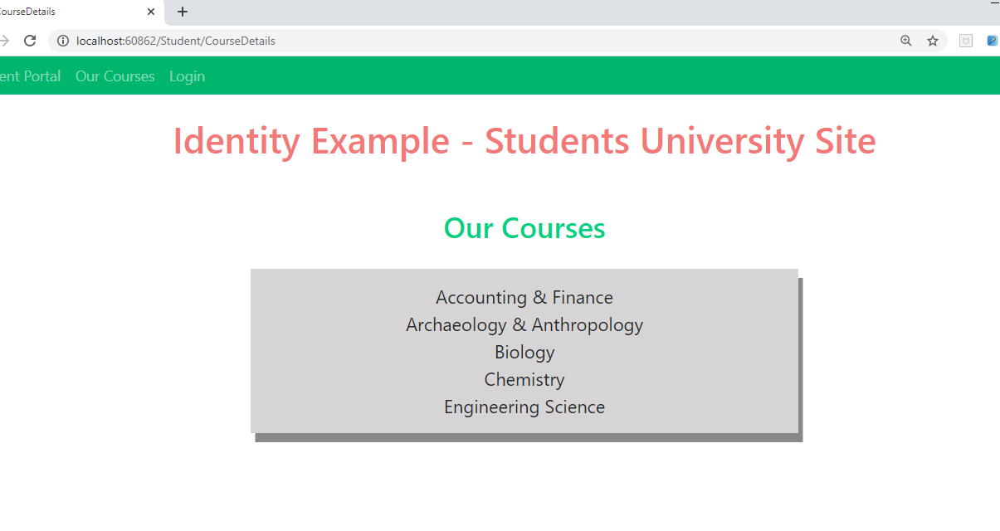
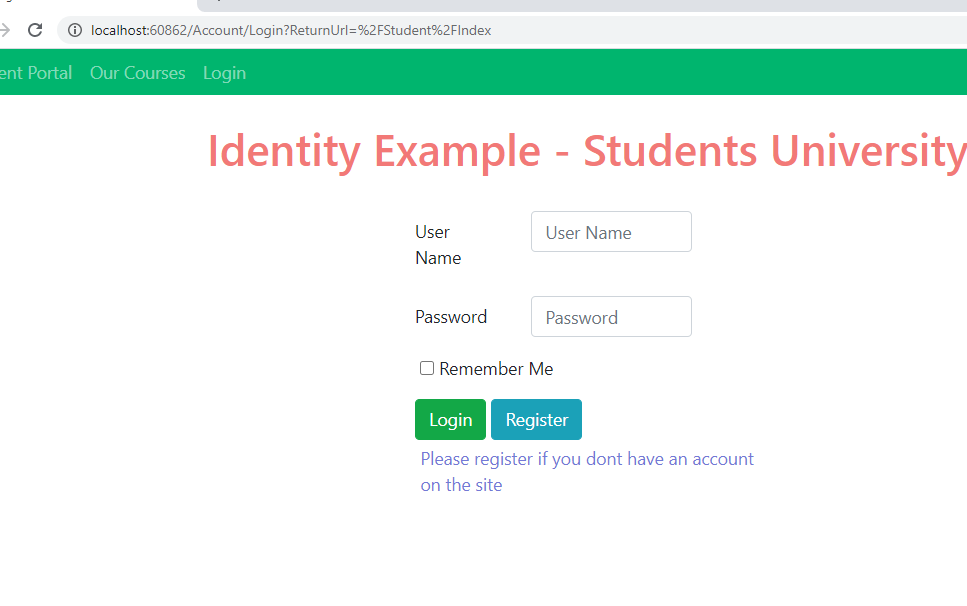
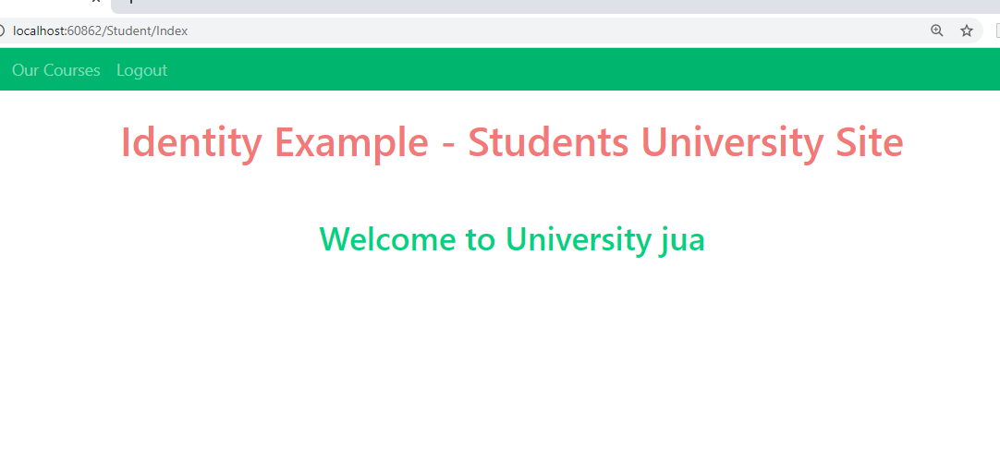

## Demo Module 11: Managing Security

### Lesson 2: Authorization in ASP.NET Core

#### Demonstration: How to Authorize Access to Controller Actions

Abrimos la solución 02_AuthorizeExample_begin\IdentityExample

y ejecutamos un npm install  

La aplicación es la misma con la que teniamos la demo anterior salvo que le han instalado una opcion más en el menu Our Courses


Lo primero es modificar el [startup](IdentityExample/Startup.cs)

Añadiendole using Microsoft.AspNetCore.Identity;

y modificando el servicio< Student> por services.AddIdentity< Student, IdentityRole>

````
 public void ConfigureServices(IServiceCollection services)
        {
            services.AddIdentity<Student, IdentityRole>(options =>
            {
               options.Password.RequireDigit = true;
               options.Password.RequiredLength = 7;
               options.Password.RequireUppercase = true;

               options.User.RequireUniqueEmail = true;
           })
            .AddEntityFrameworkStores<StudentContext>();

            services.AddDbContext<StudentContext>(options =>
                  options.UseSqlite("Data Source=student.db"));

            services.AddMvc();
        }
````


Ahora vamos al controlador [StudentController](IdentityExample/Controllers/StudentController.cs)

añadimos los using  
  using Microsoft.AspNetCore.Authorization;  
  using IdentityExample.Data;  
  
 injectamos el contexto
  
decoramos la Index con  [Authorize]

y insertamos [AllowAnonymous] IActionResult CourseDetails()

```
using System.Linq;
using Microsoft.AspNetCore.Mvc;
using Microsoft.AspNetCore.Authorization;
using IdentityExample.Data;

namespace IdentityExample.Controllers
{
    public class StudentController : Controller
    {


        private StudentContext _studentContext;

        public StudentController(StudentContext studentContext)
        {
            _studentContext = studentContext;
        }

        [Authorize]
        public IActionResult Index()
        {
            /*
             * No lo necetitamos porque ya se encarga [Authorize]
             if (!this.User.Identity.IsAuthenticated)
            {
                return RedirectToAction("Login", "Account");
            }
            */

            return View();
        }
        [AllowAnonymous]
        public IActionResult CourseDetails()
        {
            return View(_studentContext.Courses.ToList());
        }
    }
}
```


probamos a ejectutar

vemos que CourseDetails esta pertmito AllowAnonymous




Sin embargo si intentamos ir a /Login os redirecciona a Login



Nos registramos y logamos

y ya tenemos acceso



