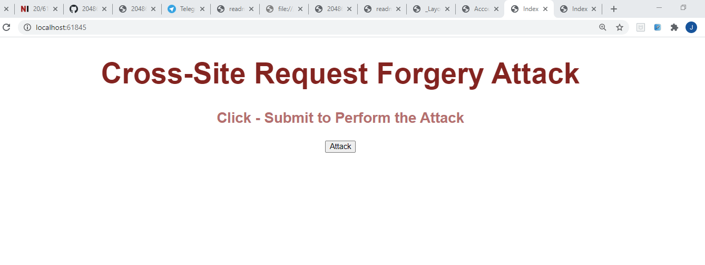
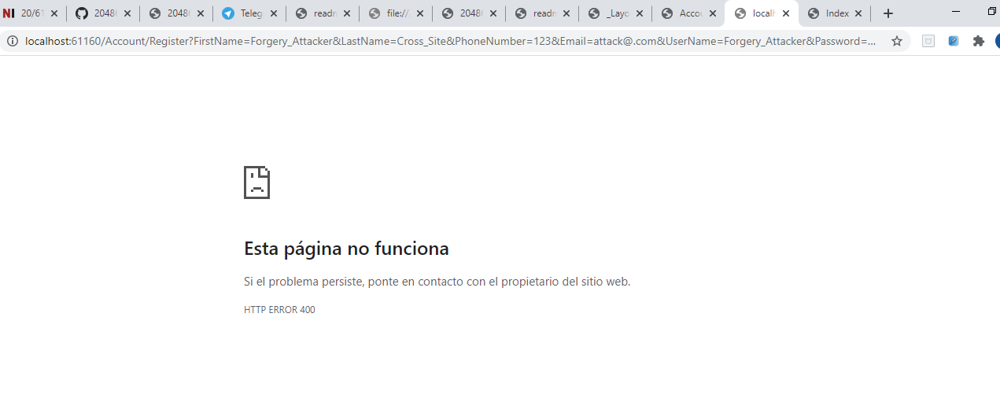
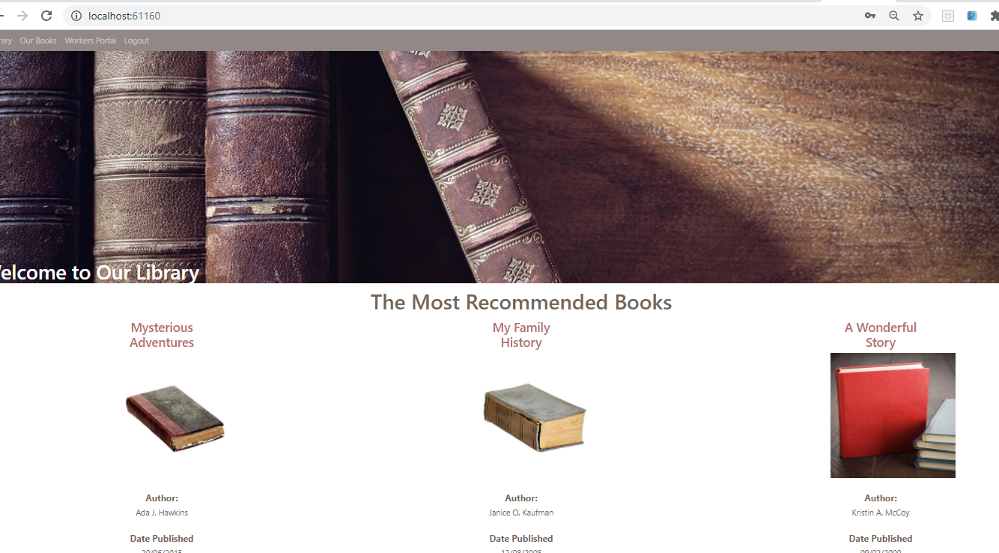
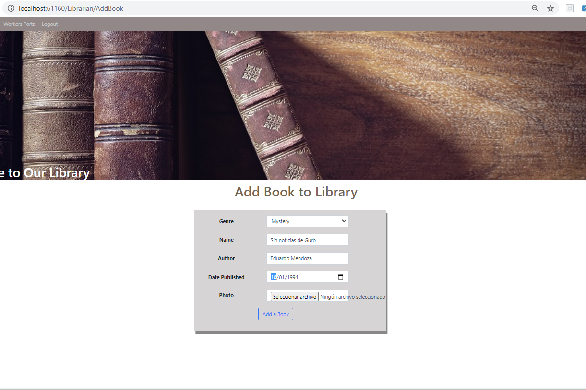
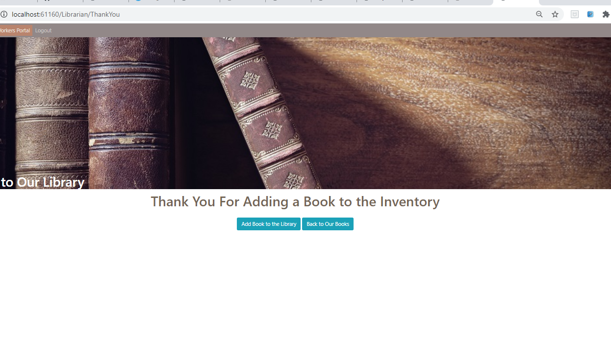
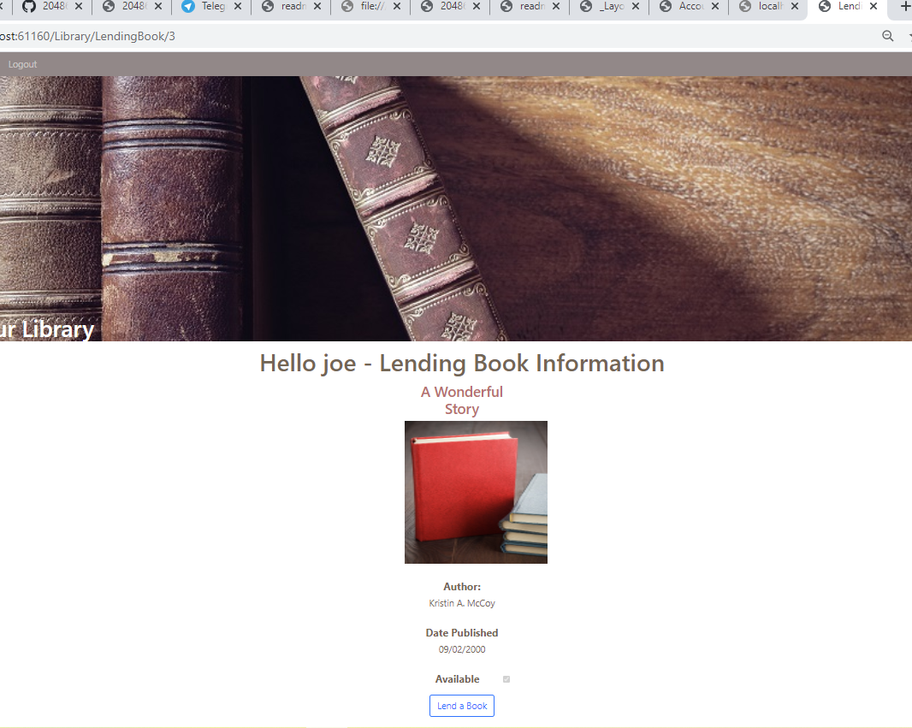

# Module 11: Managing Security

## Lab: Managing Security

Este laboratorio se ha desarrollado en clase


1.- Se instalan las depedencias mediante npm install 
```
	"bootstrap": "4.3.1",
	"jquery": "^3.5.1",
	"jquery-validation": "1.17.0",
	"jquery-validation-unobtrusive": "3.2.10",
	"popper.js": "1.14.4"
```


### Exercise 1: Use Identity

#### Task 1: Add the Entity Framework database context

2.- Modificamos [Models\User.cs](Library/Models/User.cs) añadiendole using Microsoft.AspNetCore.Identity; y haciendo que herede de  IdentityUser

3.- Modificamos [Data\LibraryContext.cs](Library/Data/LibraryContext.cs) reemplazando que en vez de herede de DbContext lo haga de IdentityDbContext< User>  

#### Task 2: Enable using Identity  


4.- Modificamos [Startup.cs](Library/Startup.cs)  


Añadiendo los usings Library.Models y Microsoft.AspNetCore.Identity;
Configurando el servicio  AddIdentity
````
services.AddIdentity<User, IdentityRole>(options =>
    {
        options.Password.RequireDigit = true;
        options.Password.RequiredLength = 7;
        options.Password.RequireUppercase = true;

        options.User.RequireUniqueEmail = true;
    })
     .AddEntityFrameworkStores<LibraryContext>();
	 
.......

app.UseAuthentication();
````


#### Task 3 y 4 : Add sign in logic and Add user registration logic

5.- creamos [AccountController](Library/Controllers/AccountController.cs) 

con los usings   Library.Models;  Library.ViewModels; Microsoft.AspNetCore.Identity;  
injectamos 
```
private SignInManager<User> _signInManager;
    private UserManager<User> _userManager;

    public AccountController(SignInManager<User> signInManager, UserManager<User> userManager)
    {
        _signInManager = signInManager;
        _userManager = userManager;
    }
````

y añadimos la acciones de Logut, Acces y tanto GET como Post de Login y Register


````
		public IActionResult Login()
        {
            if (this.User.Identity.IsAuthenticated)
            {
                return RedirectToAction("Index", "Library");
            }
            return View();
        }

        [HttpPost, ActionName("Login")]
        public async Task<IActionResult> LoginPost(LoginViewModel loginModel)
        {
            if (ModelState.IsValid)
            {
                var result = await _signInManager.PasswordSignInAsync(loginModel.UserName, loginModel.Password, loginModel.RememberMe, false);
                if (result.Succeeded)
                {
                    return RedirectToAction("Index", "Library");
                }
            }
            ModelState.AddModelError("", "Faild to Login");
            return View();
        }

        public async Task<IActionResult> Logout()
        {
            await _signInManager.SignOutAsync();
            return RedirectToAction("Index", "Library");
        }

        public IActionResult Register()
        {
            return View();
        }

        [HttpPost, ActionName("Register")]
        public async Task<IActionResult> RegisterPost(RegisterViewModel registerModel)
        {
            if (ModelState.IsValid)
            {
                User user = new User
                {
                    FirstName = registerModel.FirstName,
                    LastName = registerModel.LastName,
                    UserName = registerModel.UserName,
                    PhoneNumber = registerModel.PhoneNumber,
                    Email = registerModel.Email
                };

                var result = await _userManager.CreateAsync(user, registerModel.Password);
                 if (result.Succeeded)
                 {
                     var resultSignIn = await _signInManager.PasswordSignInAsync(registerModel.UserName, registerModel.Password, registerModel.RememberMe, false);
                     if (resultSignIn.Succeeded)
                     {
                         return RedirectToAction("Index", "Library");
                     }
                 }

                foreach (var error in result.Errors)
                {
                    ModelState.AddModelError("", error.Description);
                }
            }
            return View();
        }

        public IActionResult AccessDenied()
        {
            return View();
        }
````

#### Task 5: Retrieve data from the Identity property  


y tocamos finalemente las vistas  [Library/Views/Library/LendingBook.cshtml](Library/Views/Library/LendingBook.cshtml) con el encabezado Hello @User.Identity.Name - Lending Book Information  

y [Library/Views/Shared/_Layout.cshtml](Library/Views/Shared/_Layout.cshtml) 

````
@if (User.IsInRole("Administrator"))
    {
        <li class="nav-item">
            <a class="nav-link" href="@Url.Action("Index", "Librarian")">Workers Portal</a>
        </li>
    }
    @if (User.Identity.IsAuthenticated)
    {
        <li class="nav-item">
            <a class="nav-link" href="@Url.Action("Logout", "Account")">Logout</a>
        </li>
    }
    else
    {
        <li class="nav-item">
            <a class="nav-link" href="@Url.Action("Login", "Account")">Login</a>
        </li>
    }
````

Con ello ya tendríamos los login y el register


### Exercise 2: Add Authorization

Se trata de implemetar Roles 

#### Task 1: Add AuthorizeAttribute to an action

1. Modificamos [LibrarianController](Library/Controllers/LibrarianController.cs) 

verificamos los using Microsoft.AspNetCore.Authorization;

decoramos [AllowAnonymous]  al método public IActionResult GetBooksByGener()
decoramos [Authorize] al método public IActionResult GetBooksByGener()  
decoramos [Authorize] al método public async Task<IActionResult> LendingBookPost(int id)

Como ya esta bajo el control del Authorize eliminamos la condición this.User.Identity.IsAuthenticated al metodo  GetBooksByGener 
````c#
	//if (this.User.Identity.IsAuthenticated)
    //{
        var booksGenerQuery = from b in _context.Books
                              orderby b.Genre.Name
                              select b;

        return View(booksGenerQuery);
    //}
    //return RedirectToAction("Login", "Account"); 
	// se va a ir al no autorizade de forma automatica
```` 

#### Task 2: Add role-based policy authentication

2.- añadimos a [ViewModels/RegisterViewModel](Library/ViewModels/RegisterViewModel) un nuevo campo 

````
	[Display(Name = "Role Name")]
	[Required(ErrorMessage = "Please select a role")]
	public string RoleName { get; set; }
````

3.- se lo injectamos a [AccountController](Library/Controllers/AccountController) (_roleManager)
````
	private SignInManager<User> _signInManager;
    private UserManager<User> _userManager;
    private RoleManager<IdentityRole> _roleManager;  //  roleManager

    public AccountController(SignInManager<User> signInManager, UserManager<User> userManager, RoleManager<IdentityRole> roleManager)
    {
        _signInManager = signInManager;
        _userManager = userManager;
        _roleManager = roleManager;
    }
````

4.- y actualizamos RegisterPost con el nuevo campo 

````
public async Task<IActionResult> RegisterPost(RegisterViewModel registerModel)
        {
            if (ModelState.IsValid)
            {
                User user = new User
                {
                    FirstName = registerModel.FirstName,
                    LastName = registerModel.LastName,
                    UserName = registerModel.UserName,
                    PhoneNumber = registerModel.PhoneNumber,
                    Email = registerModel.Email
                };

                
                var result = await _userManager.CreateAsync(user, registerModel.Password);
                if (result.Succeeded)
                {
                    bool roleExists = await _roleManager.RoleExistsAsync(registerModel.RoleName);
                    if (!roleExists)
                    {
                        await _roleManager.CreateAsync(new IdentityRole(registerModel.RoleName));
                    }

                    if (!await _userManager.IsInRoleAsync(user, registerModel.RoleName))
                    {
                        await _userManager.AddToRoleAsync(user, registerModel.RoleName);
                    }

                   

                    var resultSignIn = await _signInManager.PasswordSignInAsync(registerModel.UserName, registerModel.Password, registerModel.RememberMe, false);
                    if (resultSignIn.Succeeded)
                    {
                        return RedirectToAction("Index", "Library");
                    }
                }

                foreach (var error in result.Errors)
                {
                    ModelState.AddModelError("", error.Description);
                }
            }
            return View();
        }
````

5.- campo que vendra de la vista [Register.cshtml]Library/Views/Account/Register.cshtml) 
````
  <div class="form-group row">
       <label asp-for="RoleName" class="col-sm-4 col-form-label"></label>
       <div class="col-sm-6">
           <select asp-for="RoleName" class="form-control">
               <option selected>Member</option>
               <option>Administrator</option>
           </select>
       </div>
   </div>
````

6.- Por último Decoraremos [LibrarianController](Library/Controllers/LibrarianController.cs)  con [Authorize(Roles = "Administrator")]


#### Task 3: Add claim-based policy authentication


1.- en el Startup añadimos el using y el servicio correspondiente
````
 services.AddMvc();
 .....
 
  services.AddAuthorization(options =>
    {
        options.AddPolicy("RequireEmail", policy => policy.RequireClaim(ClaimTypes.Email));
    });
````

2. en el  AccountController.c añadimos el using y modificamos el Post Register

````
using System.Security.Claims;
`.....
 
 var result = await _userManager.CreateAsync(user, registerModel.Password);
    if (result.Succeeded)
    {
        bool roleExists = await _roleManager.RoleExistsAsync(registerModel.RoleName);
        if (!roleExists)
        {
            await _roleManager.CreateAsync(new IdentityRole(registerModel.RoleName));
        }

        if (!await _userManager.IsInRoleAsync(user, registerModel.RoleName))
        {
            await _userManager.AddToRoleAsync(user, registerModel.RoleName);
        }

        if (!string.IsNullOrWhiteSpace(user.Email))
        {
            Claim claim = new Claim(ClaimTypes.Email, user.Email);
            await _userManager.AddClaimAsync(user, claim);
        }

        var resultSignIn = await _signInManager.PasswordSignInAsync(registerModel.UserName, registerModel.Password,registerModel.RememberMe,false);
        if (resultSignIn.Succeeded)
        {
            return RedirectToAction("Index", "Library");
        }
    }
 
 
 
 ````

 
 y en LibrarianController.cs decoramos con [Authorize(Policy = "RequireEmail")]
 
 
 
 
 ## Exercise 3: Avoid the Cross-Site Request Forgery Attack
 
 
 
1.- comprobamos que desde Post 

http://localhost:61160/Account/Register?FirstName=Forgery_Attacker&LastName=Cross_Site&PhoneNumber=123&Email=attack@@.com&UserName=Forgery_Attacker&Password=123qwe!!!QWE123&RoleName=Member

Tanto en Get como en Post funciona  !!! 


2.- comprobamos que CrossSiteRequestForgeryAttack también crea el usuario

3.- Insertamos [ValidateAntiForgeryToken] en todos los Metodos HttpPost y verificamos que tanto desde Postman cono desde CrossSiteRequestForgeryAttack nos da un 404















