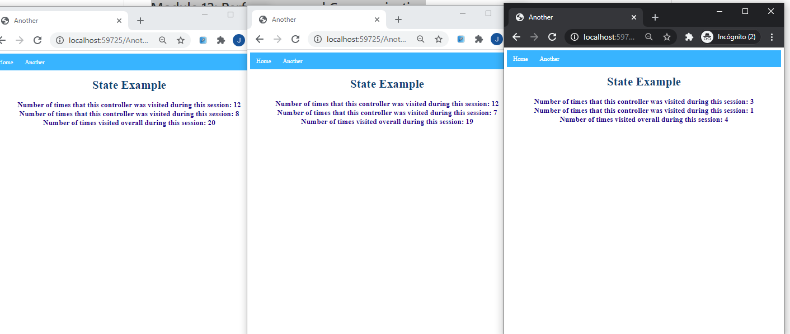

## Module 12: Performance and Communication

### Lesson 2: Managing State

###  Demonstration: How to Store and Retrieve State Information

Partimos del proyecto StateExample.sln  del repositorio 02_StateExample_begin

Este proyecto es simple tan sólo tiene dos controladores con sus repectivas vistas Index

y el Startup.cs contiene únicamente
````
        public void ConfigureServices(IServiceCollection services)
        {
            services.AddMvc();
        }
        
        public void Configure(IApplicationBuilder app)
        {
            app.UseStaticFiles();
            app.UseMvcWithDefaultRoute();
        }
````

lo primero es modificar este starup añadiendole y usando Session

````
        public void ConfigureServices(IServiceCollection services)
        {

            services.AddSession();
            services.AddMvc();
        }
        
        public void Configure(IApplicationBuilder app)
        {
            app.UseSession();
            app.UseStaticFiles();
            app.UseMvcWithDefaultRoute();
        }
````


despues añadirle a Index de HomeControllerr el siguiente código
````
  public IActionResult Index()
        {
            int? overallVisitsNumber = HttpContext.Session.GetInt32("Overall") ?? 0;
            int? controllerVisitsNumber = HttpContext.Session.GetInt32("Home") ?? 0;
            int? AnotherControllerVisitsNumber = HttpContext.Session.GetInt32("Another")??0;
 
			overallVisitsNumber++;
			controllerVisitsNumber++; // se refiere a si mismo 

            HttpContext.Session.SetInt32("Overall", overallVisitsNumber.Value);
            HttpContext.Session.SetInt32("Home", controllerVisitsNumber.Value);
            HttpContext.Session.SetInt32("Another", AnotherControllerVisitsNumber.Value);
            return View();
        }
````

despues añadirle a Index de AnotherController el siguiente código

```
 public IActionResult Index()
        {
            int? overallVisitsNumber = HttpContext.Session.GetInt32("Overall")??0;    // carga All
            int? controllerVisitsNumber = HttpContext.Session.GetInt32("Another")??0; // carga Another
           
		    overallVisitsNumber++;
            controllerVisitsNumber++; // se refiere a si mismo 
 
            HttpContext.Session.SetInt32("Overall", overallVisitsNumber.Value);      
            HttpContext.Session.SetInt32("Another", controllerVisitsNumber.Value);  // la suma la vuelca a Another

            return View();
        }
````

y en sus repectivas vistas el mismo código

````
<div class="info-panel">
    <div>Number of times that this controller was visited during this session: @Context.Session.GetInt32("Home")</div>
    <div>Number of times that this controller was visited during this session: @Context.Session.GetInt32("Another")</div>
    <div>Number of times visited overall during this session: @Context.Session.GetInt32("Overall")</div>
</div>
````


ejecutamos la aplicación y vemos que se actualiza por session no por aplicación

