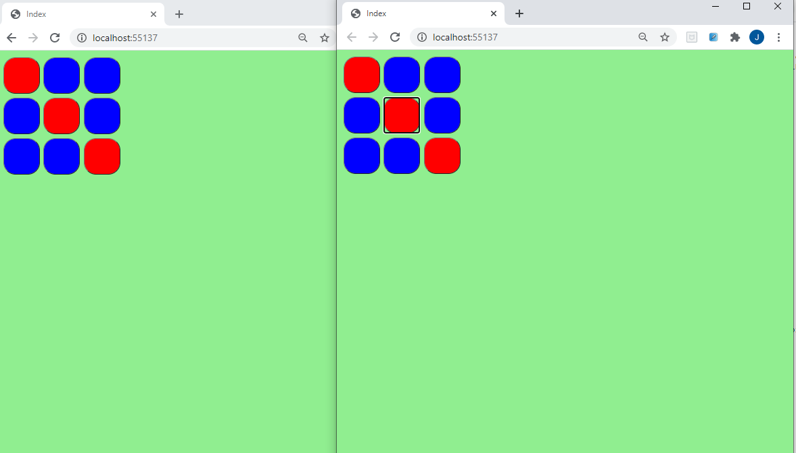

## Module 12: Performance and Communication

### Lesson 3: Two-Way Communication

#### Demonstration: How to Use SignalR


_Práctica hecha en clase_

Abrimos el proyecto SignalRExample.sln.

Ejecutamos npm install 

````
--- package.json
{
  "version": "1.0.0",
  "name": "asp.net",
  "private": true,
  "dependencies": {
    "@aspnet/signalr": "^1.0.0",
    "jquery": "3.5.0"
  },
  "devDependencies": {}
}
````

Modificamos el Startup.cs

````
using Microsoft.AspNetCore.Builder;
using Microsoft.AspNetCore.Hosting;
using Microsoft.AspNetCore.Http;
using Microsoft.Extensions.DependencyInjection;
using SignalRExample.Middleware;
using SignalRExample.Services;
using SignalRExample.Hubs;

namespace SignalRExample
{
    public class Startup
    {
        public void ConfigureServices(IServiceCollection services)
        {
            services.AddMvc();
            services.AddSingleton<ISquareManager, SquareManager>();
            services.AddSignalR();                                // <<<<<<<<<<<<<<<<<<<<<
        }
        
        public void Configure(IApplicationBuilder app, IHostingEnvironment env)
        {
            app.UseStaticFiles();

            app.UseNodeModules(env.ContentRootPath);

            app.UseSignalR(routes =>
            {
                routes.MapHub<SquaresHub>("/squareshub");     // <<<<<<<<<<<<<<<<<<<<< Las rutas SignalR se añaden en siguientes pasos
            });

                app.UseMvc(routes =>
            {
                routes.MapRoute(
                name: "Default",
                template: "{controller}/{action}",
                defaults: new { controller = "Square", action = "Index" });
            });                                                          
            
            app.Run(async (context) =>
            {
                await context.Response.WriteAsync("Hello World!");
            });
        }
    }
}
````

Creamos el ignalRExample.Hubs.SquaresHub.cs

````
using Microsoft.AspNetCore.SignalR;
using SignalRExample.Services;

namespace SignalRExample.Hubs
{
    public class SquaresHub : Hub
    {

        private ISquareManager _manager;

		public SquaresHub(ISquareManager manager)
        {
            _manager = manager;
        }

        public async Task SwapColor(int rowIndex, int columnIndex)
        {
            _manager.SwapColor(rowIndex, columnIndex);
            await Clients.Others.SendAsync("SwapSquareColor", rowIndex, columnIndex);
        }
    }
}
````

nota que en Starup tiene esta ruta routes.MapHub<SquaresHub>("/squareshub"); 


Moficamos wwwroot/js/square-events.js.

````
var connection = new signalR.HubConnectionBuilder()
    .withUrl("squareshub")
    .build();

connection.on("SwapSquareColor", (x, y) => {
    $('#' + x + y).toggleClass('blue red');
});

connection.start();

function onButtonClick(btn) {
    var x = $(btn).data('assigned-x');
    var y = $(btn).data('assigned-y');
    $(btn).toggleClass('blue red');
    connection.invoke("SwapColor", x, y);
}
````
`

Bin ahora tocamos index.cshtml 

````
@model string[,]
@{
    Layout = null;
}

<!DOCTYPE html>

<html>
<head>
    <meta name="viewport" content="width=device-width" />
    <title>Index</title>
    <link rel="stylesheet" type="text/css" href="~/css/style.css" />
</head>
<body>
    <div class="square-wrapper">
        @for (int i = 0; i < Model.GetLength(0); i++)
        {
            for (int j = 0; j < Model.GetLength(1); j++)
            {
					<Button id="@i@j" class="square @Model[i,j]" data-assigned-x="@i" data-assigned-y="@j" onclick="onButtonClick(this)"></Button>
			}
		}
    </div>
    <script src="~/node_modules/jquery/dist/jquery.min.js"></script>

    <script src="~/node_modules/@@aspnet/signalr/dist/browser/signalr.min.js"></script>
    <script src="~/js/square-events.js"></script>
</body>
</html>
``````




