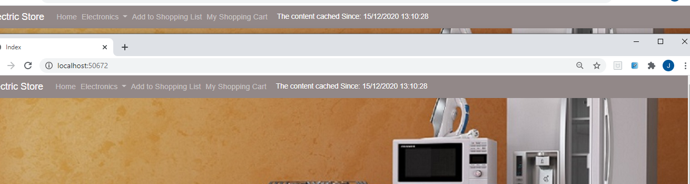
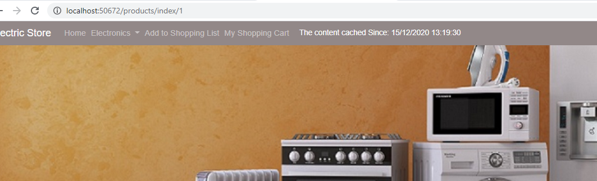
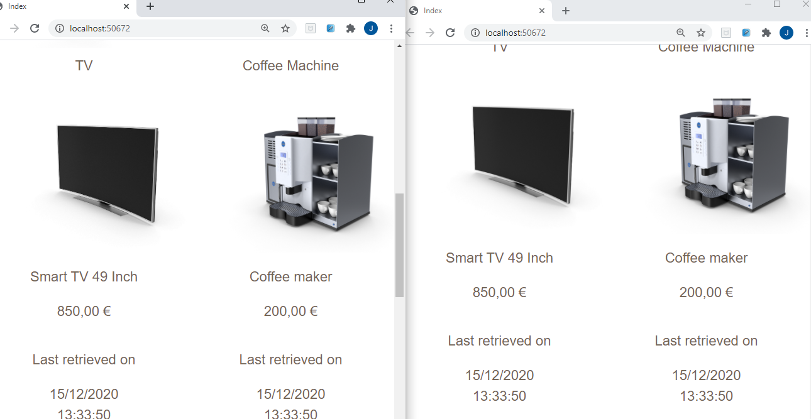
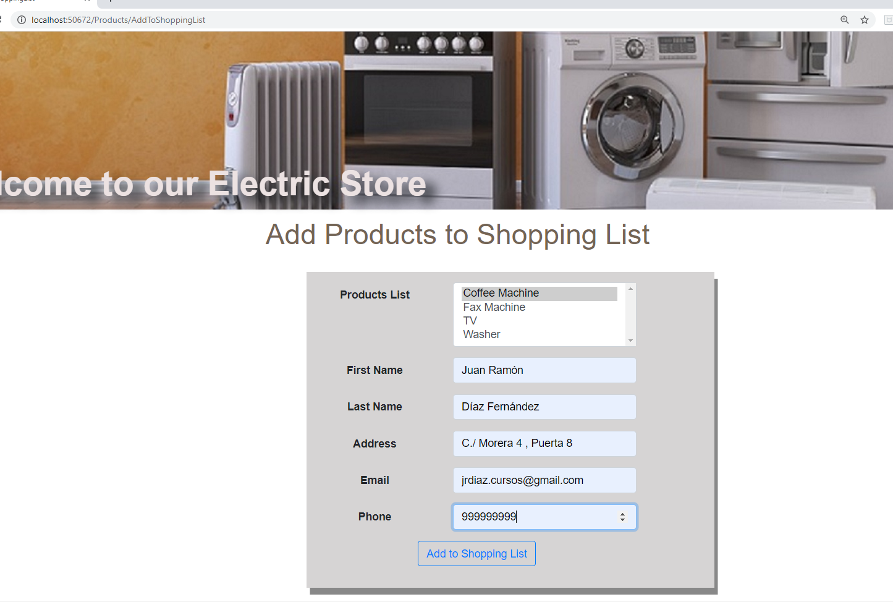
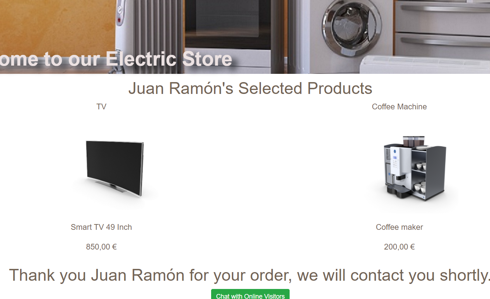
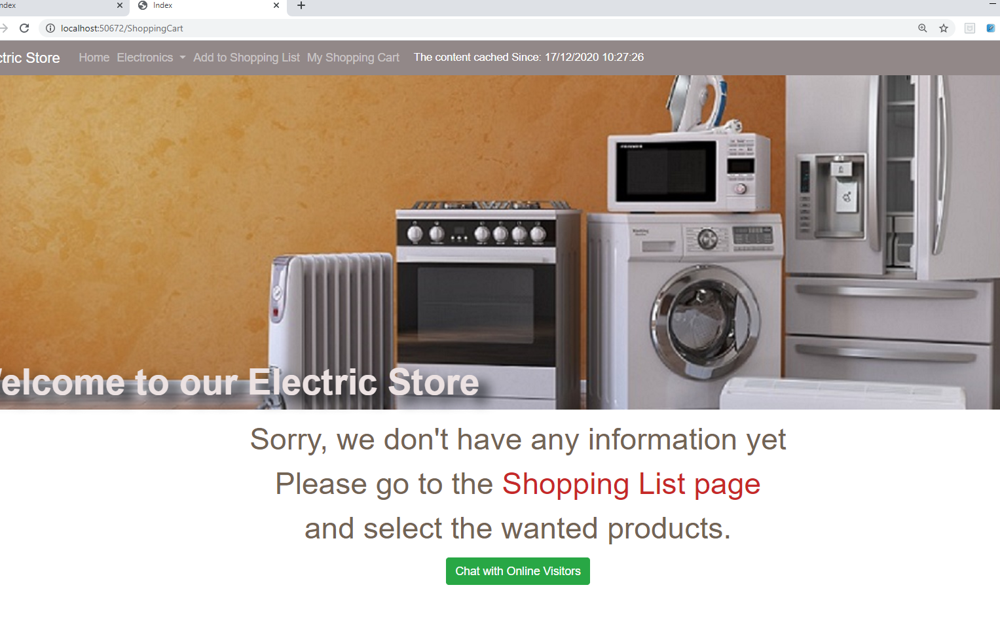

## Module 12: Performance and Communication

### Lab: Performance and Communication


Examinamos el proyecto


#### Exercise 1: Implementing a Caching Strategy

En el layout insertamos un cache tag helpper
````
<nav class="navbar navbar-expand-md navbar-dark navbar-custom p-1">
	<a class="navbar-brand" href="@Url.Action("Index", "Products")">Electric Store</a>
	<div class="collapse navbar-collapse" id="nav-content">
		<ul class="navbar-nav" id="nav-content">
			<cache vary-by-route="RefreshCache">
				@await Component.InvokeAsync("NavbarMenu")
			</cache>
		</ul>
	</div>
</nav>
````

nos creamos ViewComponents.NavbarMenuViewComponent.cs

````
using System;
using System.Collections.Generic;
using System.Linq;
using System.Threading.Tasks;
using ElectricStore.Data;
using Microsoft.AspNetCore.Mvc;

namespace ElectricStore.ViewComponents
{
    public class NavbarMenuViewComponent : ViewComponent
    {
        private StoreContext _context;

        public NavbarMenuViewComponent(StoreContext context)
        {
            _context = context;
        }

        public IViewComponentResult Invoke()
        {
            var categories = _context.menuCategories.OrderBy(c => c.Name).ToList();
            return View("MenuCategories", categories);
        }
    }
}
````


y la vista MenuCategories en Views/Shared/Components/NavbarMenu
````
@model IEnumerable<ElectricStore.Models.MenuCategory>

<li class="nav-item">
    <a class="nav-link" href="@Url.Action("Index", "Products")">Home<span class="sr-only">(current)</span></a>
</li>

<li class="nav-item dropdown">
    <a class="nav-link dropdown-toggle" href="#" id="navbarDropdownMenuLink" data-toggle="dropdown" aria-haspopup="true" aria-expanded="false">
        Electronics
    </a>
    <div class="dropdown-menu" aria-labelledby="navbarDropdownMenuLink">
        @foreach (var item in Model)
        {
            <a class="dropdown-item" asp-action="GetByCategory" asp-controller="Products" asp-route-id="@item.Id">@Html.DisplayFor(modelItem => item.Name)</a>
        }
    </div>
</li>

<li class="nav-item">
    <a class="nav-link" href="@Url.Action("AddToShoppingList", "Products")">Add to Shopping List</a>
</li>
<li class="nav-item">
    <a class="nav-link" href="@Url.Action("Index", "ShoppingCart")">My Shopping Cart</a>
</li>
<li class="nav-item">
    <div class="display-cached-time">The content cached Since: @DateTime.Now</div>
</li>
````

Ejecutamos la aplicación y vemos el navbar chacehado 





_Nota : La barra de menú de la aplicación se almacena en caché desde la hora mostrada en la barra de menú; el tiempo no es el mismo que el de las otras dos páginas de Microsoft Edge porque RefreshCache en la ruta activa una recarga del componente de vista._


##### insertar elementos en una memoria caché


Modicamos el controlador Products

````
using System;
using System.Collections.Generic;
using System.Linq;
using System.Threading.Tasks;
using System.IO;
using ElectricStore.Data;
using ElectricStore.Models;
using Microsoft.AspNetCore.Hosting;
using Microsoft.AspNetCore.Mvc;
using Microsoft.AspNetCore.Mvc.Rendering;
using Microsoft.EntityFrameworkCore;
using Microsoft.Extensions.Caching.Memory;   <<<<<<<<<<<<<<<<<<<<<


namespace ElectricStore.Controllers
{
    public class ProductsController : Controller
    {
        private StoreContext _context;
        private IHostingEnvironment _environment;
        private IMemoryCache _memoryCache;                 <<<<<<<<<<<<<<<<<<<<<<<
        private const string PRODUCT_KEY = "Products";     <<<<<<<<<<<<<<<<<<<<<<<

        public ProductsController(StoreContext context, IHostingEnvironment environment, IMemoryCache memoryCache)
        {
            _context = context;
            _environment = environment;      
            _memoryCache = memoryCache;                         <<<<<<<<<<<<<<<<<<<<<<<
        }

        public IActionResult Index()                            <<<<<<<<<<<<<<<<<<<<<<<
        {
            List<Product> products;
            if (!_memoryCache.TryGetValue(PRODUCT_KEY, out products))
            {
                products = _context.Products.ToList();
                products.Select(c => { c.LoadedFromDatabase = DateTime.Now; return c; }).ToList();
                MemoryCacheEntryOptions cacheOptions = new MemoryCacheEntryOptions();
                cacheOptions.SetPriority(CacheItemPriority.High);
                _memoryCache.Set(PRODUCT_KEY, products, cacheOptions);
            }
            return View(products);
        }
.......
.......
````

nos vamos a la vista  Index.cshtml y la modificamos así

````
@model IEnumerable<ElectricStore.Models.Product>

@{
    ViewData["Title"] = "Index";
}

<h2 class="title">
    
    <span class="span-col-s">Sale of the Day</span>
</h2>
<div class="page-container">
       @foreach (var item in Model)
       {
           <div class="item">
               <h3>
                   @Html.DisplayFor(modelItem => item.ProductName)
               </h3>
               @if (item.PhotoFileName != null)
               {
                   <div>
                       
                   </div>
               }
                   <div>
                       <p>
                           @Html.DisplayFor(model => item.Description)
                       </p>
                       <p>
                           @Html.DisplayFor(model => item.Price)
                       </p>
                   </div>
                   <div>
                       <p>
                           @Html.DisplayNameFor(model => item.LoadedFromDatabase)
                       </p>
                       <p>
                           @Html.DisplayFor(model => item.LoadedFromDatabase)
                       </p>
                   </div>
           </div>
       }
   </div>
````

Ejecutamos 



_Nota : Al examinar el contenido del navegador, puede ver que los productos en el contenido de la página "Venta del día" se almacenan en caché, ya que la hora que se muestra en los productos La última recuperación de datos es idéntica en ambas páginas de Microsoft Edge ._

##### Exercise 2: Managing State

En el startup.cs  añadimos al ConfigureServices
````
services.AddSession(options =>
	{
		options.IdleTimeout = TimeSpan.FromSeconds(60);
	});
````

y  al Configure
````
 app.UseSession();
````

Vamos a modicaficar ProductsController

Añadimos estos dos using  
. Microsoft.AspNetCore.Http;  
. using Newtonsoft.Json;  

y reemplazamos AddToShoppingListPost por

````
[HttpPost, ActionName("AddToShoppingList")]
 public IActionResult AddToShoppingListPost(Customer customer)
 {
	 if (ModelState.IsValid)
	 {
		 HttpContext.Session.SetString("CustomerFirstName", customer.FirstName);
		 HttpContext.Session.SetString("CustomerLastName", customer.LastName);
		 HttpContext.Session.SetString("CustomerEmail", customer.Email);
		 HttpContext.Session.SetString("CustomerAddress", customer.Address);
		 HttpContext.Session.SetInt32("CustomerPhoneNumber", customer.PhoneNumber);
		 if (HttpContext.Session.GetString("CustomerProducts") != null)
		 {
			 List<int> productsListId = JsonConvert.DeserializeObject<List<int>>(HttpContext.Session.GetString("CustomerProducts"));
			 customer.SelectedProductsList.AddRange(productsListId);
		 }
		 var serialisedDate = JsonConvert.SerializeObject(customer.SelectedProductsList);
		 HttpContext.Session.SetString("CustomerProducts", serialisedDate);
		 return RedirectToAction(nameof(Index));
	 }
	 PopulateProductsList(customer.SelectedProductsList);
	 return View(customer);
 }
````

y para recuperar los valores reemplazamos AddToShoppingList por 
````
[HttpGet]
public IActionResult AddToShoppingList()
{
	if (HttpContext.Session.GetString("CustomerFirstName") != null)
	{
		Customer sessionCustomer = new Customer()
		{
			FirstName = HttpContext.Session.GetString("CustomerFirstName"),
			LastName = HttpContext.Session.GetString("CustomerLastName"),
			Email = HttpContext.Session.GetString("CustomerEmail"),
			Address = HttpContext.Session.GetString("CustomerAddress"),
			PhoneNumber = HttpContext.Session.GetInt32("CustomerPhoneNumber").Value,
		};
		PopulateProductsList();
		return View(sessionCustomer);
	}
	PopulateProductsList();
	return View();
}
````

Tambien tocamos ShoppingCartController

````
using System;
using System.Collections.Generic;
using System.Linq;
using System.Threading.Tasks;
using Microsoft.AspNetCore.Mvc;
using ElectricStore.Data;
using ElectricStore.Models;
using Microsoft.AspNetCore.Http;
using Newtonsoft.Json;

namespace ElectricStore.Controllers
{
    public class ShoppingCartController : Controller
    {
        private StoreContext _context;
        private List<Product> products;
        private SessionStateViewModel sessionModel;

        public ShoppingCartController(StoreContext context)
        {
            _context = context;
        }

        public IActionResult Index()
        {
            if (!string.IsNullOrEmpty(HttpContext.Session.GetString("CustomerFirstName")) && !string.IsNullOrEmpty(HttpContext.Session.GetString("CustomerProducts")))
            {
                List<int> productsListId = JsonConvert.DeserializeObject<List<int>>(HttpContext.Session.GetString("CustomerProducts"));
                products = new List<Product>();
                foreach (var item in productsListId)
                {
                    var product = _context.Products.SingleOrDefault(p => p.Id == item);
                    products.Add(product);
                }
                sessionModel = new SessionStateViewModel
                {
                    CustomerName = HttpContext.Session.GetString("CustomerFirstName"),
                    SelectedProducts = products
                };
                return View(sessionModel);
            }
            return View();
        }
    }
}
````
`
Guardamos y ejecutamos






Sin embargo si abrimos una nueva pestaña __La lista de productos no se muestra porque está vacía. La sesión se guarda solo en el navegador original.__




#### Ejercicio 3: Comunicación bidireccional

Creamos el archivo ElectricStore.Hubs.ChatHub.cs

```
using System;
using System.Collections.Generic;
using System.Linq;
using System.Threading.Tasks;
using Microsoft.AspNetCore.SignalR;

namespace ElectricStore.Hubs
{
    public class ChatHub : Hub
    {
        public async Task SendMessageAll(string user, string message)
        {
            await Clients.All.SendAsync("NewMessage", user, message);
        }
    }
}
```

configuramos  SignalR en Starup.cs


Añadimos:  
using ElectricStore.Hubs;  
services.AddSignalR(); en ConfigureServices  

y añadimos el siguiente código en Configure()
app.UseSignalR(routes =>  
    {  
        routes.MapHub<ChatHub>("/chatHub");  
    });  

Añadimos una nueva dependencia a packag.json "@aspnet/signalr": "1.0.0"
````
{
  ......
  "dependencies": {
    "bootstrap": "4.3.1",
    "jquery": "3.3.1",
    "jquery-validation": "1.17.0",
    "jquery-validation-unobtrusive": "3.2.10",
    "popper.js": "1.14.4",
    "@aspnet/signalr": "1.0.0"
  }
}
````
	
Seguidamente insertamos la vista del chat  
Para ello creamos el metodo Chat en ShoppingCartController.cs  

````
    public IActionResult Chat()
        {
            return View();
        }
````

y agregamos su vista Views/ShoppingCart/Chat

```

@{
    ViewData["Title"] = "Chat";
}

<h2 class="title">
    <span>Chat with</span>
    <span class="chat-title">Online Site Visitors</span>
</h2>

<div class="chat">
    <div class="row justify-content-center">
        <div class="col-2 bcf">
            <div class="col-5">
                Name: <input type="text" id="inputUserName" />
            </div>
            <div class="col-sm-5">
                Message: <input type="text" id="inputMessage" />
            </div>
            <div class="col-sm-3">
                <input class="btn btn-info" type="submit" id="sendMessageBtn" value="Send Message" />
            </div>
        </div>
        <div class="col-2 bcs">
            <ul id="messagesList"></ul>
        </div>
    </div>
</div>


@section Scripts {
        <script src="~/node_modules/@@aspnet/signalr/dist/browser/signalr.js"></script>
        <script src="~/js/chat-hub.js"></script>
    }

````

Añadimos el boton de chat en la página views/ShoppingCart/Index 

````
button type="button" id="btnChat" class="btn btn-success" onclick="location.href='@Url.Action("Chat", "ShoppingCart")'">Chat with Online Visitors</button>
````


Ejecutamos la aplicación con dos ventanas y chateamos

