## DEMOS Module 13: Implementing Web APIs

### Lesson 2: Developing a Web API

####  Demonstration: How to Develop a Web API

Abrimos la solución  WebApiExample.sln.


Examinamos el proyecto

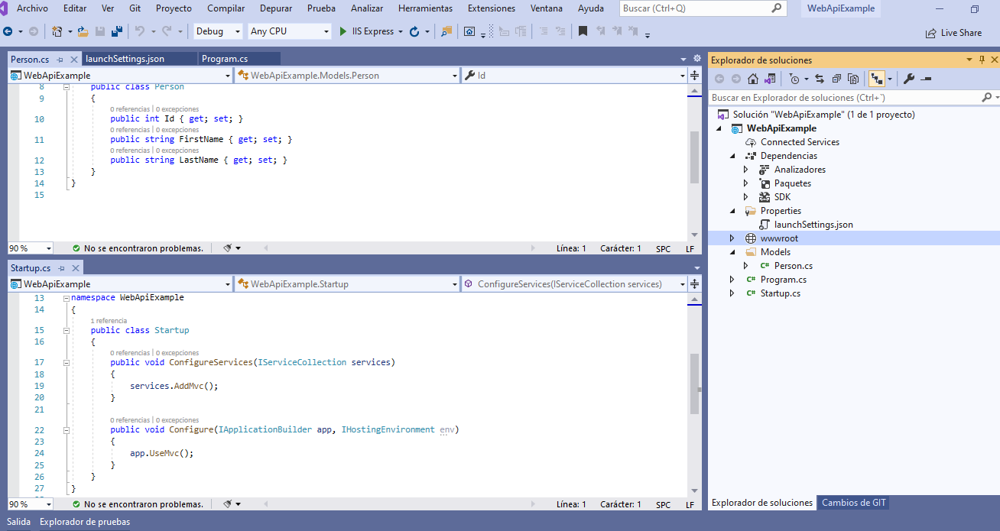


Se trata de crear una WEBAPI 


crearemos un Empty API Controller en Controllers llamado PersonController 

Observa que te crea una clase con

````
    [Route("api/[controller]")]
    [ApiController]
    public class PersonController : ControllerBase
````

Nuestra demo se va a apoyar de una List<Person> y trataremos de devolver información de esa lista

```
		private List<Person> _people = new List<Person>();

        public PersonController()
        {
            _people.Add(new Person() { Id = 1, FirstName = "James", LastName = "Sprayberry" });
            _people.Add(new Person() { Id = 2, FirstName = "Jason", LastName = "Mosley" });
            _people.Add(new Person() { Id = 3, FirstName = "Jennifer", LastName = "Dietz" });
            _people.Add(new Person() { Id = 4, FirstName = "Bessie", LastName = "Duppstadt" });
        }
````

lo primero que creamos es un método 

````
        public List<Person> GetAll()
        {
                return _people;
        }

````

y modificamos     "launchUrl": "api/person", en launchSettings.json

De esta manera añ ejecutar la apliación nos ejecuta el primer método HTTPGet que no tenga ruta, si hay más de uno da un página no encontrada o si todos tienen ruta  


![c1]imagenes/c1.PNG)

claro que si entonces intentamos ir a http://localhost:64921/api/person/GetAll nos dará un 404

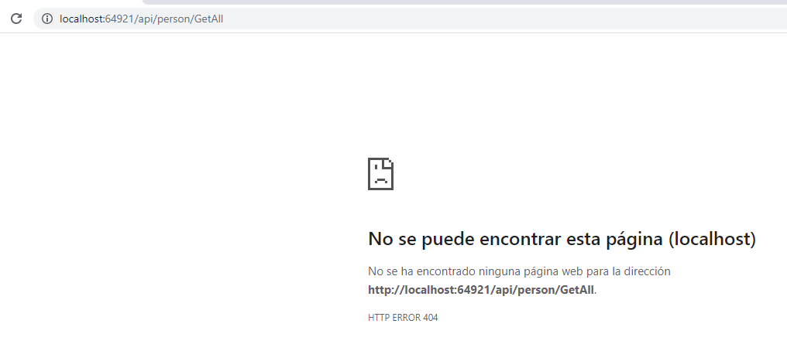


Ahora vamos a pasarle un parametro y que nos lo devuelva

````
		[HttpGet("GetId/{id}")]
        public string GetId(int id)
        {
            return "el parametro es " + id.ToString();
        }
````		

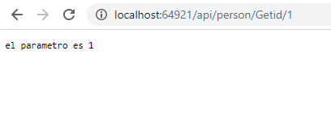

y funcionará por Post? si si le decoramos con   [HttpPost("GetId/{id}")]


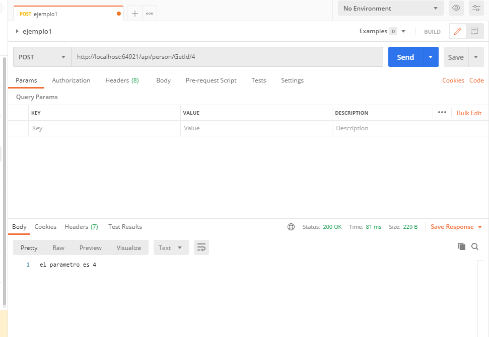

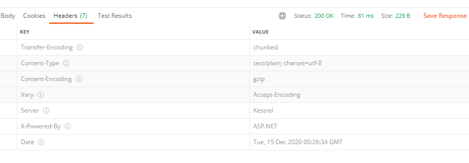


Vamos a devolver los datos (persona) de un id


````
      [HttpGet("GetPbyId/{id}")]
         public IActionResult GetPbyId(int id)
        {

            string json = default;
            var person = _people.FirstOrDefault(p => p.Id == id);
            if (person != null)
                json = JsonSerializer.Serialize(person);
            else
                 json = "{\"Id\":"+id + ", \"DirstName\":\"NOT FORUND\"}";
           // return Ok(json);
            return Content(json);
        }


        [HttpGet("GetPersonByID/{id}")]
        public ActionResult<Person> GetPersonByID(int id)
        {
            var person = _people.FirstOrDefault(p => p.Id == id);
            if (person == null)
                return NotFound();
            return Ok(person);
        }
````

En ambos caso retorna la misma información si lo encuentra (aunque en el caso ActionResult<Person> GetPersonByID(int id) si me identifica Json
(en el primero aunque es un json PostMan me los da como TEXT por defecto , aunque si le pones  [Produces("application/xml")] ya estáría) 


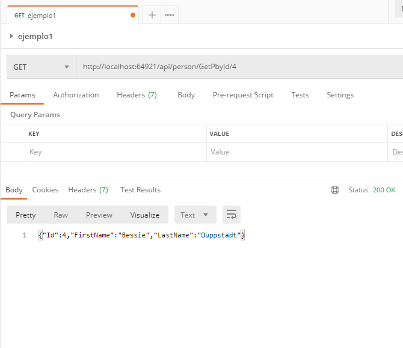

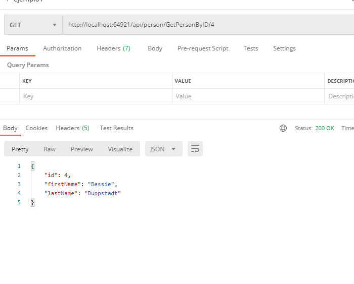


La difrencia  es en el caso de que no lo encuentre ya que una me da un 404 y otra un 200 con el mensaje de no encontrada


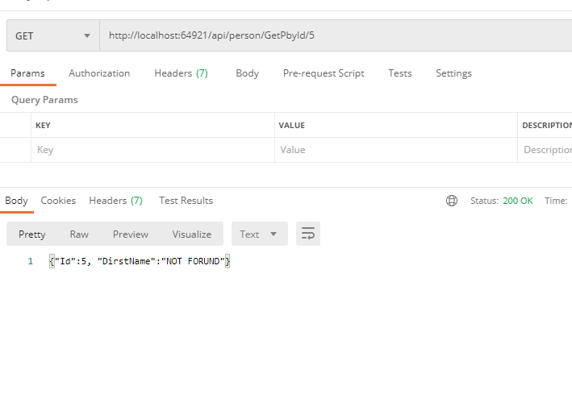

		
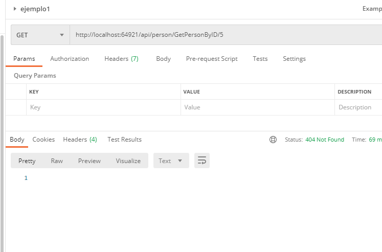


nota: Para utilizar using System.Text.Json; debes instalarla por Nuget 

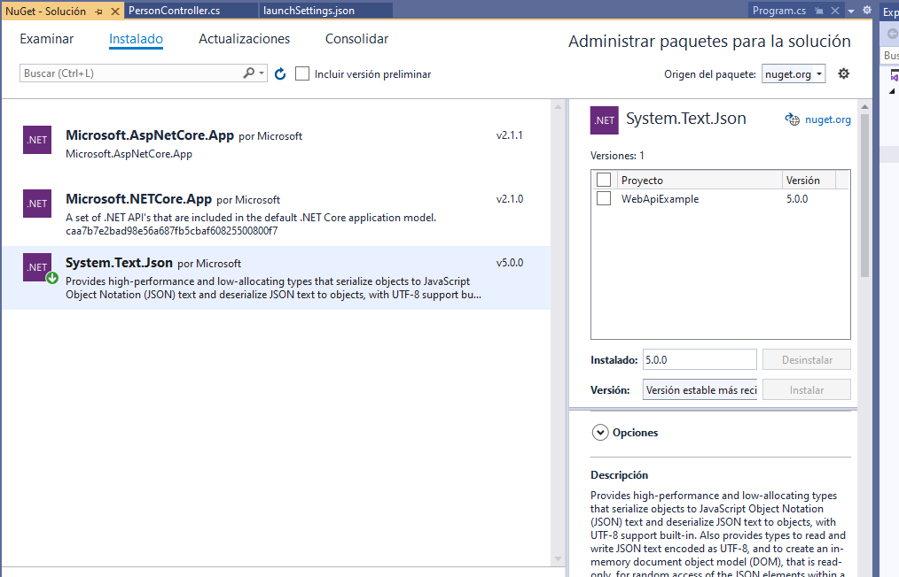


Bueno ya hemos visto que por defecto devuelve json para devolver xml es sencillo

Basta con instalar por nuget Microsoft.AspNetCore.Mvc.Formatters.Xml,  2.1.1,   (Ojo la versión es importante para la versión de NET CORE que estes utilizando, en este caso NET CORE 2.1


ahora la insertamos en el Startup 


````
        public void ConfigureServices(IServiceCollection services)
        {
            services.AddMvc().AddXmlSerializerFormatters();
            services.AddMvc();
        }
````

y nos creamos un metodo que devuelva un xml
````
        [HttpGet("GetAllXml")]
        [Produces("application/xml")]
        public List<Person> GetAllXml()
        {
            return _people;
        }
````


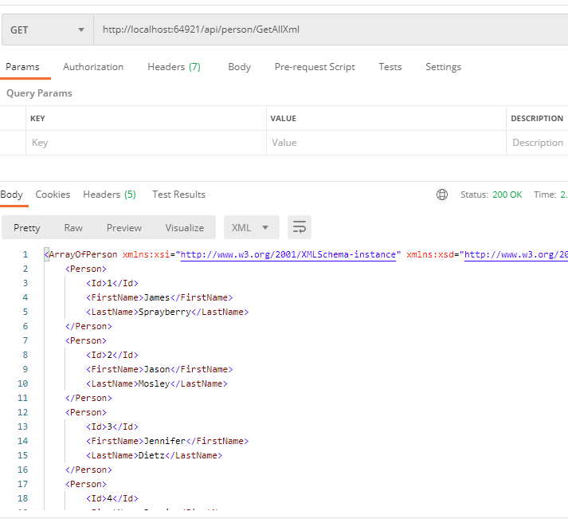


