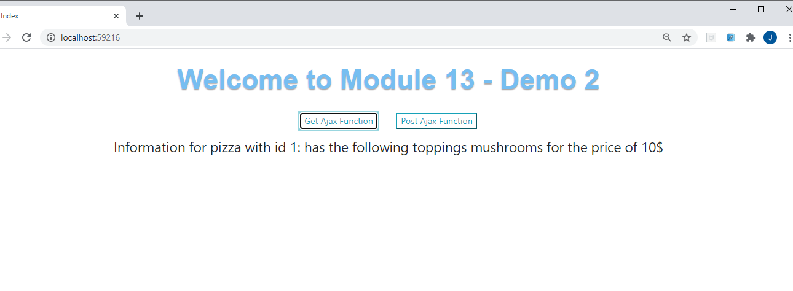
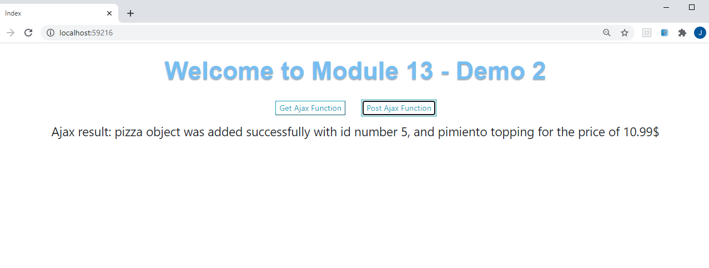
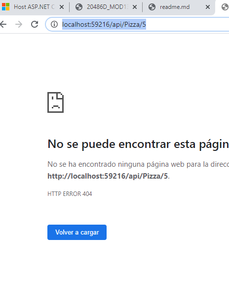
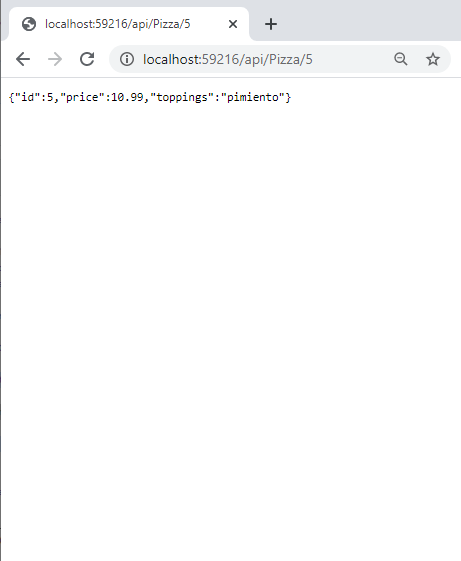

## DEMO Module 13: Implementing Web APIs

### Lesson 3: Calling a Web API

#### Demonstration: How to Call Web APIs by Using jQuery Code

Esta dEmo es muy sencillita , abrimos el JQueryExample.sln y lo examinamos 

Tenemos un Models.Pizza.cs
````
	public class Pizza
	{
		public int Id { get; set; }

		[DataType(DataType.Currency)]
		public float Price { get; set; }

		public string Toppings { get; set; }
	}
````

Un HomeController que solo llama a una vista Index

````

@{
    Layout = null;
}

<!DOCTYPE html>

<html>
<head>
    <meta name="viewport" content="width=device-width" />
    <title>Index</title>
    <link rel="stylesheet" href="https://stackpath.bootstrapcdn.com/bootstrap/4.1.0/css/bootstrap.min.css">
    <link href="~/css/style.css" rel="stylesheet" />
    <script src="https://code.jquery.com/jquery-3.3.1.min.js"></script>
    <script src="https://cdnjs.cloudflare.com/ajax/libs/popper.js/1.14.0/umd/popper.min.js"></script>
    <script src="https://stackpath.bootstrapcdn.com/bootstrap/4.1.0/js/bootstrap.min.js"></script>
</head>
<body>
</body>
</html>
````
`
y un startup simple

````
public class Startup
    {
        public void ConfigureServices(IServiceCollection services)
        {
            services.AddMvc();
        }

        public void Configure(IApplicationBuilder app, IHostingEnvironment env)
        {
            app.UseStaticFiles();
            app.UseMvcWithDefaultRoute();
        }
    }
````

La práctica consiste en crear un Api Controller con dos metodos un get que me devuelva un pizza y un post que me añada una

````
using Microsoft.AspNetCore.Http;
using Microsoft.AspNetCore.Mvc;
using System;
using System.Collections.Generic;
using System.Linq;
using System.Threading.Tasks;
using JQueryExample.Models;

namespace JQueryExample.Controllers
{
    [Route("api/[controller]")]
    [ApiController]
    public class PizzaController : ControllerBase
    {
        private List<Pizza> _pizzas = new List<Pizza>();

        public PizzaController()
        {

	`		_pizzas.Add(new Pizza() { Id = 1, Toppings = "mushrooms", Price = 10 });
            _pizzas.Add(new Pizza() { Id = 2, Toppings = "extra cheese", Price = 8 });
            _pizzas.Add(new Pizza() { Id = 3, Toppings = "black olives", Price = 9 });
            _pizzas.Add(new Pizza() { Id = 4, Toppings = "pineapple", Price = 12 });
        }

        [HttpGet("{id}")]
        public ActionResult<Pizza> GetById(int id)
        {
            Pizza pizza = _pizzas.SingleOrDefault(p => p.Id == id);
            if (pizza == null)
            {
                return NotFound();
            }
            return pizza;
        }

        [HttpPost]
        public ActionResult<Pizza> Post(Pizza pizza)
        {
            int pizzaMaxId = _pizzas.Max(i => i.Id);
            pizza.Id = ++pizzaMaxId;
            _pizzas.Add(pizza);
            return CreatedAtAction(nameof(GetById), new { id = pizza.Id }, pizza);
        }

    }
}
````

como lo vamos a llamar por jquery nos creamos los js correspondeintes 
````
---pizza-get.js 
$(function () {
    $(".btn-get").click(function (e) {
        e.preventDefault();
        $.ajax({
            type: "GET",
            url: "http://localhost:59216/api/Pizza/1",
            contentType: "application/json; charset=utf-8",
            dataType: "json"
        }).done(function (response) {
            $(".result").text('Information for pizza with id 1: ' + 'has the following toppings ' + response.toppings + ' for the price of ' + response.price + '$');
        }).fail(function () {
            alert('An error has occurred');
        });
    });
});
---pizza-post.js 
$(function () {
    $(".btn-post").click(function (e) {
        e.preventDefault();
        $.ajax({
            type: "POST",
            url: "http://localhost:59216/api/Pizza",
            data: JSON.stringify({
                toppings: "pimiento",
                price: 10.99
            }),
            contentType: "application/json;charset=utf-8"
        }).done(function (result) {
            $(".result").text('Ajax result: pizza object was added successfully with id number ' + result.id + ', and ' + result.toppings + ' topping for the price of ' + result.price + '$');
        }).fail(function () {
            alert('An error has occurred');
        });
    });
});

````


Ahora sólo falta añadir el script a la vista y los botones 

````

@{
    Layout = null;
}

<!DOCTYPE html>

<html>
<head>
    <meta name="viewport" content="width=device-width" />
    <title>Index</title>
    <link rel="stylesheet" href="https://stackpath.bootstrapcdn.com/bootstrap/4.1.0/css/bootstrap.min.css">
    <link href="~/css/style.css" rel="stylesheet" />
    <script src="https://code.jquery.com/jquery-3.3.1.min.js"></script>
    <script src="https://cdnjs.cloudflare.com/ajax/libs/popper.js/1.14.0/umd/popper.min.js"></script>
    <script src="https://stackpath.bootstrapcdn.com/bootstrap/4.1.0/js/bootstrap.min.js"></script>

</head>
<body>


    <h1>Welcome to Module 13 - Demo 2</h1>
    <button type="button" class="btn-get btn-outline-info">Get Ajax Function</button>
    <button type="button" class="btn-post btn-outline-info">Post Ajax Function</button>
    <div class="result"></div>

    <script src="~/js/pizza-get.js"></script>
    <script src="~/js/pizza-post.js"></script>
</body>

</html>
````







 Nos hemos dado cuenta que aunque lo crea no persiste ya que cada vez que creamos el controlador vuelve a crear la lista
 
 
 
 
 La forma de solucionarlo es Singleton
 
 creamos interfaz y clase  
 añadimos el services.AddSingleton<IT, T>();
 injectamos el Singleton en el controlador y lo utilizamos 
 
 
 
 ````
using System.Collections.Generic;
using JQueryExample.Models;
namespace JQueryExample.services
{
    public interface IDato
    {
        IEnumerable<Pizza> GetPizzas();
        Pizza GetPizza(int id);
        int addPizza(Pizza pizza);
     }
}


using JQueryExample.Models;
using System.Collections.Generic;
using System.Linq;


namespace JQueryExample.services
{
    public class Dato : IDato
    {
        private List<Pizza> _pizzas = new List<Pizza>();

        public Dato()
        {
            _pizzas.Add(new Pizza() { Id = 1, Toppings = "mushrooms", Price = 10 });
            _pizzas.Add(new Pizza() { Id = 2, Toppings = "extra cheese", Price = 8 });
            _pizzas.Add(new Pizza() { Id = 3, Toppings = "black olives", Price = 9 });
            _pizzas.Add(new Pizza() { Id = 4, Toppings = "pineapple", Price = 12 });
        }

        public int addPizza(Pizza pizza)
        {
            int pizzaMaxId = _pizzas.Max(i => i.Id);
            pizza.Id = ++pizzaMaxId;
            _pizzas.Add(pizza);
            return pizzaMaxId;

        }

        public IEnumerable<Pizza> GetPizzas() => _pizzas;

        public Pizza GetPizza(int id)
        {
            Pizza pizza = _pizzas.SingleOrDefault(p => p.Id == id);
            return pizza;
        }
    }
}


using Microsoft.AspNetCore.Builder;
using Microsoft.AspNetCore.Hosting;
using Microsoft.Extensions.DependencyInjection;
using JQueryExample.services;

namespace JQueryExample
{
    public class Startup
    {
        public void ConfigureServices(IServiceCollection services)
        {
            services.AddSingleton<IDato, Dato>();
            services.AddMvc();
        }

        public void Configure(IApplicationBuilder app, IHostingEnvironment env)
        {
            app.UseStaticFiles();
            app.UseMvcWithDefaultRoute();
        }
    }
}


using Microsoft.AspNetCore.Mvc;
using JQueryExample.Models;
using JQueryExample.services;

namespace JQueryExample.Controllers
{
    [Route("api/[controller]")]
    [ApiController]
    public class PizzaController : ControllerBase
    {
        private IDato _mypizzas;             //      injeccion de depencia

        public PizzaController(IDato mypizzas)
        {
            _mypizzas = mypizzas;
        }

        [HttpGet("{id}")]
        public ActionResult<Pizza> GetById(int id)
        {

            Pizza pizza = _mypizzas.GetPizza(id);
            if (pizza == null)
            {
                return NotFound();
            }
            return pizza;
        }

        [HttpPost]
        public ActionResult<Pizza> Post(Pizza pizza)
        {
            int pizzaMaxId =  _mypizzas.addPizza(pizza);

            return CreatedAtAction(nameof(GetById), new { id = pizza.Id },pizza);
        }

    }
}
*/
````

 
 