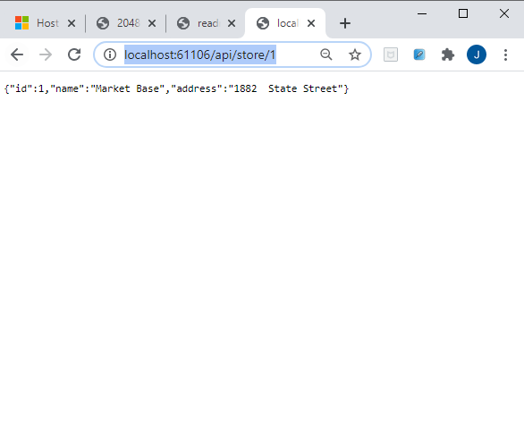
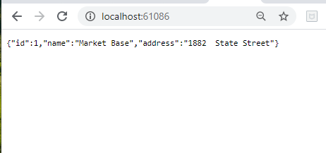
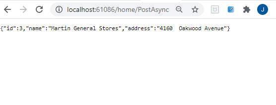

## DEMO Module 13: Implementing Web APIs

### Lesson 3: Calling a Web API

#### Demonstration: How to Call Web APIs by Using Server-Side Code


Abrimos ela solución  HttpClientExample.sln.

que contiene dos proyectos __ServerSide__

de él sólo nos centramos en el Model.GroceryStore

````
public class GroceryStore
{
	public int Id { get; set; }
	public string Name { get; set; }
	public string Address { get; set; }
}
````

y en el APi Controler

````
using System;
using System.Collections.Generic;
using System.Linq;
using System.Threading.Tasks;
using Microsoft.AspNetCore.Http;
using Microsoft.AspNetCore.Mvc;
using ServerSide.Models;

namespace ServerSide.Controllers
{
    [Route("api/[controller]")]
    [ApiController]
    public class StoreController : ControllerBase
    {
        private List<GroceryStore> _groceryStores = new List<GroceryStore>();

        public StoreController()
        {
            _groceryStores.Add(new GroceryStore() { Id = 1, Name = "Market Base", Address = "1882  State Street" });
            _groceryStores.Add(new GroceryStore() { Id = 2, Name = "Food Land", Address = "4122  Aaron Smith Drive" });
        }

        [HttpGet("{id}")]
        public ActionResult<GroceryStore> GetById(int id)
        {
            GroceryStore grocery = _groceryStores.SingleOrDefault(p => p.Id == id);
            if (grocery == null)
            {
                return NotFound();
            }
            return grocery;
        }

        [HttpPost]
        public ActionResult<GroceryStore> Create(GroceryStore groceryStore)
        {
            int groceryMaxId = _groceryStores.Max(g => g.Id);
            groceryStore.Id = ++groceryMaxId;
            _groceryStores.Add(groceryStore);
            return CreatedAtAction(nameof(GetById), new { id = groceryStore.Id }, groceryStore);
        }
    }
}
````

y despues esta el __ClientSide__

con un Startup.cs con ruta por defecto {controller=Home}/{action=GetByIdAsync}/{id?}"

El mismo modelo de dato


Modificciones el __ClientSide__ :


1.- Añadimos services.AddHttpClient() al Metodo ConfigureServices del Startup.cs

2.- Añadimos un Controlador HomeController

```c#
using Microsoft.AspNetCore.Mvc;
using System;
using System.Threading.Tasks;

using ClientSide.Models;
using System.Net.Http;


namespace ClientSide.Controllers
{
    public class HomeController : Controller
    {
        private IHttpClientFactory _httpClientFactory;
        public HomeController(IHttpClientFactory httpClientFactory)
        {
            _httpClientFactory = httpClientFactory;
        }


        public async Task<IActionResult> GetByIdAsync()
        {
            HttpClient httpClient = _httpClientFactory.CreateClient();
            httpClient.BaseAddress = new Uri("http://localhost:61086");
            HttpResponseMessage response = httpClient.GetAsync("http://localhost:61106/api/store/1").Result;
            if (response.IsSuccessStatusCode)
            {
                GroceryStore grocery = await response.Content.ReadAsAsync<GroceryStore>();
                return new ObjectResult(grocery);
            }
            else
            {
                return Content("An error has occurred");
            }
        }

        public async Task<IActionResult> PostAsync()
        {
            HttpClient httpClient = _httpClientFactory.CreateClient();
            httpClient.BaseAddress = new Uri("http://localhost:61086");
            GroceryStore newGrocery = new GroceryStore { Name = "Martin General Stores", Address = "4160  Oakwood Avenue" };
            HttpResponseMessage response = await httpClient.PostAsJsonAsync("http://localhost:61106/api/store", newGrocery);
            if (response.IsSuccessStatusCode)
            {
                GroceryStore grocery = await response.Content.ReadAsAsync<GroceryStore>();
                return new ObjectResult(grocery);
            }
            else
            {
                return Content("An error has occurred");
            }
        }
    }
}
```

3. Modificamos el  launchSettings.json.

```
"profiles": {
      "IIS Express": {
        "commandName": "IISExpress",
        "launchBrowser": false,         <=======================
        "environmentVariables": {
          "ASPNETCORE_ENVIRONMENT": "Development"
       }
   },
````

En el __ServerSide__ le marcamos como proyecto inicio y arrancamos 


Como no tiene metodo por defecto da 404 pero esta funcionando




Bien ahora hacemos lo mismo para arrancar el __ClienSide__







