## Module 13: Implementing Web APIs

### Lab: Implementing Web APIs


Abrimos la solucion 01_Restaurant_begin


Tenemos dos proyectos Client y Server.

Nos vamos a la carpeta Client y ejecutamos npm install
````json
{
  "version": "1.0.0",
  "name": "asp.net",
  "private": true,
  "devDependencies": {},
  "dependencies": {
    "jquery": "3.5.0",
    "jquery-validation": "1.17.0",
    "jquery-validation-unobtrusive": "3.2.10",
    "bootstrap": "4.3.1",
    "popper.js": "1.14.4"
  }
}
````

Y ejecutamos el proyecto Server, nos da un error de pagina no encontrada pero es normal, ya lo solucionaremos  http://localhost:54517/api/RestaurantBranches  

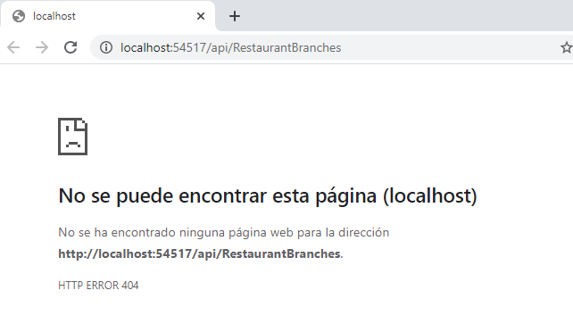

Examinamos Server 

[Startup.cs](01_Restaurant_begin/Server/Startup.cs):  
Base de datos sqlLite (restaurant.db) la eleimina y la crea cada vez que nos conectamos y permite Cors.

Models:  
[Models/EmployeeRequirements.cs](01_Restaurant_begin/Server/Models/EmployeeRequirements.cs)  
[Models/JobApplication.cs](01_Restaurant_begin/Server/Models/JobApplication.cs)  
[Models/OrderTable.cs](01_Restaurant_begin/Server/Models/OrderTable.cs)  
[Models/RestaurantBranch.cs](01_Restaurant_begin/Server/Models/RestaurantBranch.cs)  

El DBContext lo crea en [Data/RestaurantContext.cs](01_Restaurant_begin/Server/Data/RestaurantContext.cs)  con los 4 DBset y OnModelCreating que inserta datos en la base de datos  

Controladores:  
[Controllers/JobController.cs](01_Restaurant_begin/Server/Controllers/JobController.cs)    

con un Get(id)  y un Post que guarda jobApplication en bd y llama a Get() con el id recien creado.

[Controllers/RestaurantWantedAdController.cs](01_Restaurant_begin/Server/Controllers/RestaurantWantedAdController.cs)  

con un get que devuelve una lista con todos los EmployeesRequirements  

y echamos un vistazo a la db

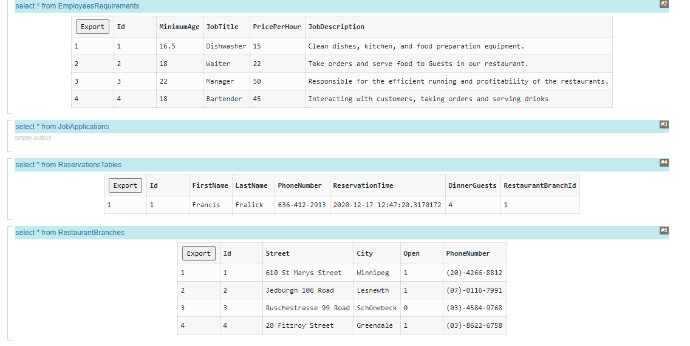

#### Exercise 1: Adding Actions and Calling them by using Microsoft Edge

Se trata de añadir resto de funcionalidad a la api web


Creamos un Controlador Api Vacio llamado [Controllers/RestaurantBranchesController.cs](01_Restaurant_begin/Server/Controllers/RestaurantBranchesController.cs)  

y le injectamos el context y le creamos un método Get

````c#
using Microsoft.AspNetCore.Http;
using Microsoft.AspNetCore.Mvc;
using System;
using System.Collections.Generic;
using System.Linq;
using System.Threading.Tasks;
using Server.Data;
using Server.Models;


namespace Server.Controllers
{
    [Route("api/[controller]")]
    [ApiController]
    public class RestaurantBranchesController : ControllerBase
    {
        private RestaurantContext _context;

        public RestaurantBranchesController(RestaurantContext context)
        {
            _context = context;
        }

        [HttpGet]
        public ActionResult<List<RestaurantBranch>> Get()
        {
            var branches = from r in _context.RestaurantBranches
                           orderby r.City
                           select r;
            return branches.ToList();
        }
    }
}
````


ejecutamos y probamos

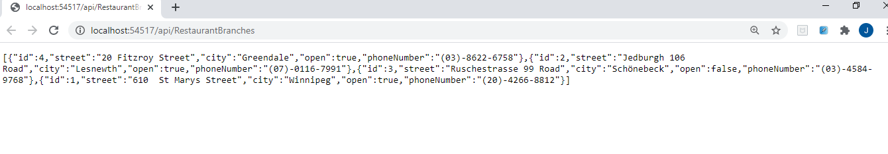


nota: va por defecto a esta action por el código de 
[Properties/launchSettings.json](01_Restaurant_begin/Server/Properties/launchSettings.json)  
````c#
"profiles": {
    "IIS Express": {
      "commandName": "IISExpress",
      "launchBrowser": true,
      "launchUrl": "api/RestaurantBranches",
      "environmentVariables": {
        "ASPNETCORE_ENVIRONMENT": "Development"
      }
    },
````

##### Tarea 3: agregar un controlador y una acción que obtiene un parámetro


Creamos un Controlador Api Vacio llamado [Controllers/ReservationController.cs](01_Restaurant_begin/Server/Controllers/ReservationController.cs)  
le injectamos el conetxto y le creamos el siguiente método
````c#
[Route("{id:int}")]
public ActionResult<OrderTable> GetById(int id)
{
	var order = _context.ReservationsTables.FirstOrDefault(p => p.Id == id);
	if (order == null)
	{
		return NotFound();
	}

	return order;
}
````

y lo probamos

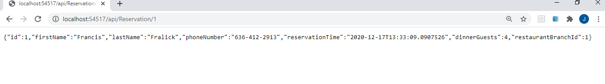

##### Tarea 5: Agregar una acción Publicar a una aplicación API web

Vamos a hacer el Create de una Reserva  aunque lo hacen a traves de HttpPost
````c#
[HttpPost]
public ActionResult<OrderTable> Create(OrderTable orderTable)
{
	_context.Add(orderTable);
	_context.SaveChanges();
	return CreatedAtAction(nameof(GetById), new { id = orderTable.Id }, orderTable);
}
````


Pues parace que funciona

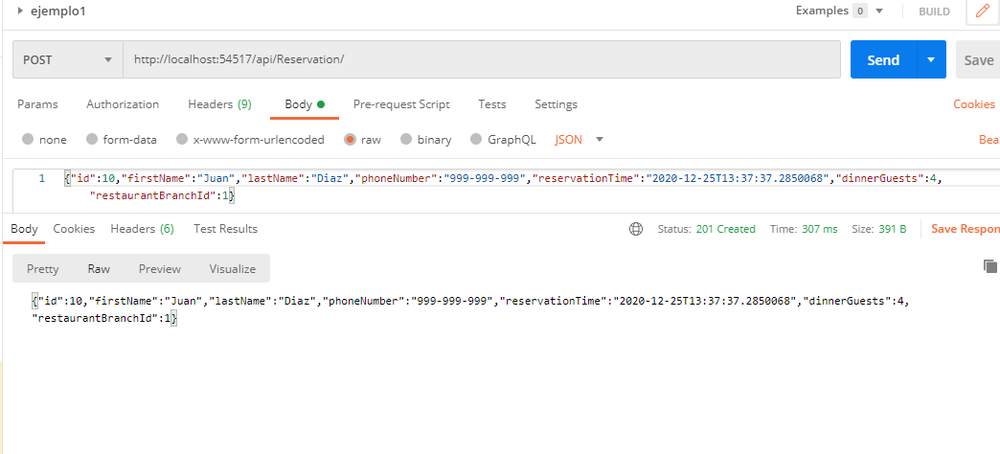


#### Exercise 2: Calling a Web API by using Server-Side Code


un vistazo al proyecto cliente
el [Startup.cs](01_Restaurant_begin/Client/Startup.cs) además de utilizar los static y los node _modules define las rutas y poco más
````c#
app.UseMvc(routes =>
{
	routes.MapRoute(
		 name: "RestaurantRoute",
		template: "{controller}/{action}/{id?}",
		defaults: new { controller = "RestaurantBranches", action = "Index" },
		constraints: new { id = "[0-9]+" });
});
````


Los mismos modelos, el MiddleWare para utilizar los nodemmodelues....

los controladores no están implementados pero si las vistas...

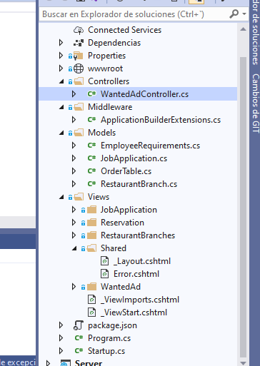

##### Tarea 1: Llamar a un método Get de API web

lo primero añadir al  [Startup.cs](01_Restaurant_begin/Client/Startup.cs)  services.AddHttpClient(); al método ConfigureService


agregamos [Controllers/RestaurantBranchesController.cs](01_Restaurant_begin/Client/Controllers/RestaurantBranchesController.cs) 

````c#
using Microsoft.AspNetCore.Mvc;
using System;
using System.Collections.Generic;
using System.Linq;
using System.Threading.Tasks;
using System.Net.Http;
using Client.Models;


namespace Client.Controllers
{
    public class RestaurantBranchesController : Controller
    {
        private IHttpClientFactory _httpClientFactory;

        public RestaurantBranchesController(IHttpClientFactory httpClientFactory)
        {
            _httpClientFactory = httpClientFactory;
        }

        public async Task<IActionResult> Index()
        {
            HttpClient httpClient = _httpClientFactory.CreateClient();
            httpClient.BaseAddress = new Uri("http://localhost:54517");
            HttpResponseMessage response = await httpClient.GetAsync("api/RestaurantBranches");
            if (response.IsSuccessStatusCode)
            {
                IEnumerable<RestaurantBranch> restaurantBranches = await response.Content.ReadAsAsync<IEnumerable<RestaurantBranch>>();
                return View(restaurantBranches);
            }
            else
            {
                return View("Error");
            }
        }
    }
}
````
Examinamos   
[Views/RestaurantBranches/Index.cshtml](01_Restaurant_begin/Client/Views/RestaurantBranches/Index.cshtml)

y ejecutamos


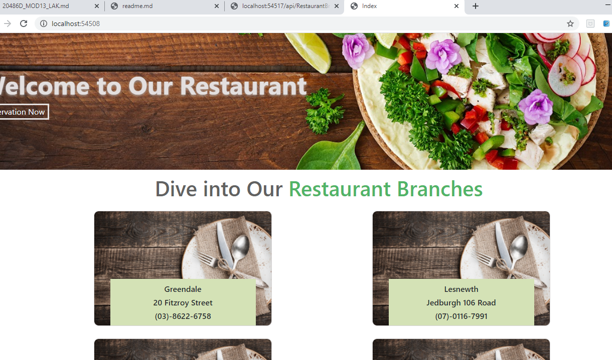


#### Exercise 3: Calling a Web API by Using jQuery


Se trata de hacer llamada a la Api usando Kquery

para ello nos crearemos un archivo js [wanted-ad-get.js](01_Restaurant_begin/Client/wwwroot/js/wanted-ad-get.js ) que va a tener una llamada get


_Le he añadido los console log para ver lo que trae_
````javascript
$(function () {
    $.ajax({
        type: "GET",
        url: "http://localhost:54517/api/RestaurantWantedAd",
        contentType: "application/json; charset=utf-8",
        dataType: "json"
    }).done(function (data) {
        console.log(data);
        $.each(data, function (index, item) {
            console.log(item);
            var html = `<div class="photo-index-card-data">
                             <div class="image-wrapper">
                                   
                             </div>
                             <div class="display-picture-data">
                                   <h6 class="display-title">Job title:</h6>
                                   <h6>${item.jobTitle}</h6>
                                   <h6 class="display-title">Hourly payment:</h6>
                                   <h6>$${item.pricePerHour}</h6>
                                   <h6 class="display-title">Job description:</h6>
                                   <h6>${item.jobDescription}</h6>
                             </div>
                       </div>`;
            $('.container').append(html);
        });
        $('.photo-display-img').attr('src', '/images/white-plate.jpg');

    }).fail(function () {
        alert('An error has occurred');
    });
````	

Añadimos los scripts de post a la página  [WantedAd/Index.cshtml](01_Restaurant_begin/Client/Views/WantedAd/Index.cshtml)
````html
 @section Scripts {
       <script src="~/js/wanted-ad-get.js"></script>
   }
````

y ejecutamos la aplicación. pulsa a we are Hiring


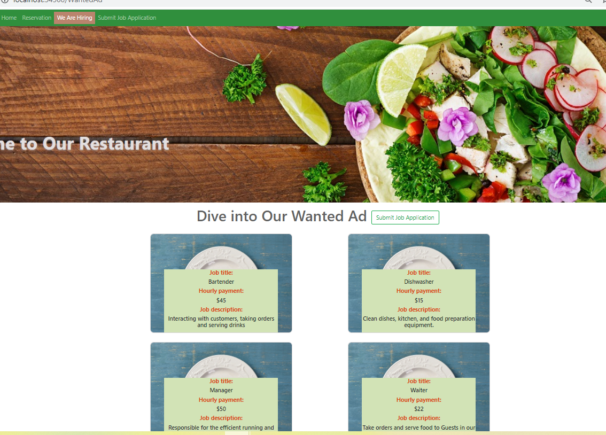

y si miras la consola 

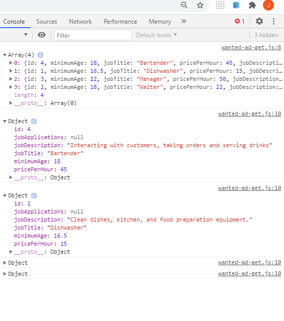


y otro un archivo js [wanted-ad-post.js](01_Restaurant_begin/Client/wwwroot/js/wanted-ad-post.js ) que va a tener una llamada post

````js
$(function () {
    $("#btn-post").click(function (e) {
        if ($('#submit-form').valid()) {
            var formData = {};
            $('#submit-form').serializeArray().map(function (item) {
                item.name = item.name[0].toLowerCase() + item.name.slice(1);
                if (formData[item.name]) {
                    if (formData[item.name] === "string") {
                        formData[item.name] = [formData[item.name]];
                    }
                    formData[item.name].push(item.value);
                } else {
                    formData[item.name] = item.value;
                }
            });
            e.preventDefault();
            console.log(JSON.stringify(formData));
            $.ajax({
                type: "POST",
                url: "http://localhost:54517/api/job",
                data: JSON.stringify(formData),
                contentType: "application/json;charset=utf-8"
            }).done(function () {
                location.href = 'http://localhost:54508/JobApplication/ThankYou';
            }).fail(function () {
                alert('An error has occurred');
            });
        }
    });
});
});
````

Nos creamos el controlador  [JobApplicationController](01_Restaurant_begin/Client/Controllers/JobApplicationController.cs) que no nos lo haviamos creado y que realiza llamadas GET por HttpClient y presenta vista Client

[Views/JobApplication/Create.cshtml](01_Restaurant_begin/Client/Views/JobApplication/Create.cshtml)

```c#

using Microsoft.AspNetCore.Mvc;
using System;
using System.Collections.Generic;
using System.Linq;
using System.Threading.Tasks;
using Microsoft.AspNetCore.Mvc.Rendering;
using System.Net.Http;
using Client.Models;

namespace Client.Controllers
{
    public class JobApplicationController : Controller
    {
        private IHttpClientFactory _httpClientFactory;

        public JobApplicationController(IHttpClientFactory httpClientFactory)
        {
            _httpClientFactory = httpClientFactory;
        }

        [HttpGet]
        public async Task<IActionResult> Create()
        {
            await PopulateEmployeeRequirementsDropDownListAsync();
            return View();
        }
        private async Task PopulateEmployeeRequirementsDropDownListAsync()
        {
            HttpClient httpClient = _httpClientFactory.CreateClient();
            httpClient.BaseAddress = new Uri("http://localhost:54517");
            HttpResponseMessage response = await httpClient.GetAsync("api/RestaurantWantedAd");
            if (response.IsSuccessStatusCode)
            {
                IEnumerable<EmployeeRequirements> employeeRequirements = await response.Content.ReadAsAsync<IEnumerable<EmployeeRequirements>>();
                ViewBag.EmployeeRequirements = new SelectList(employeeRequirements, "Id", "JobTitle");
            }
        }

        public IActionResult ThankYou()
        {
            return View();
        }
    }
}
```


Añadimos los scripts de post a la página  [JobApplication/Create.cshtml](01_Restaurant_begin/Client/Views/JobApplication/Create.cshtml)
````html
    @section Scripts{
          <script src="~/node_modules/jquery-validation/dist/jquery.validate.min.js"></script>
          <script src="~/node_modules/jquery-validation-unobtrusive/dist/jquery.validate.unobtrusive.min.js"></script>
          <script src="~/js/wanted-ad-post.js"></script>
    }
````


y ejecutamos la aplicacion

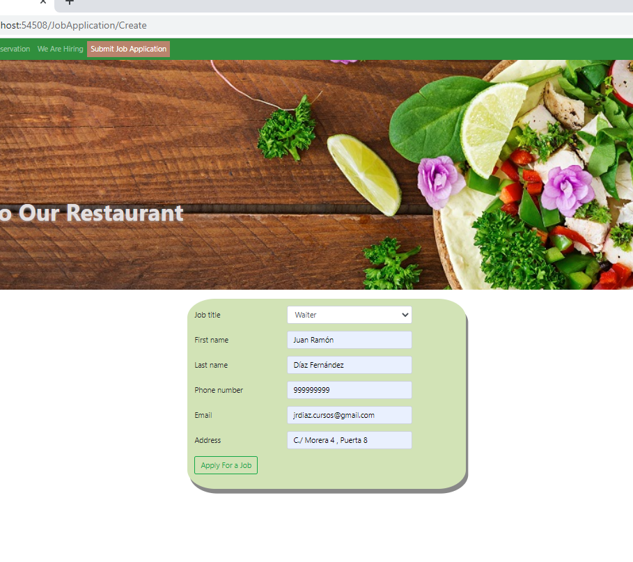


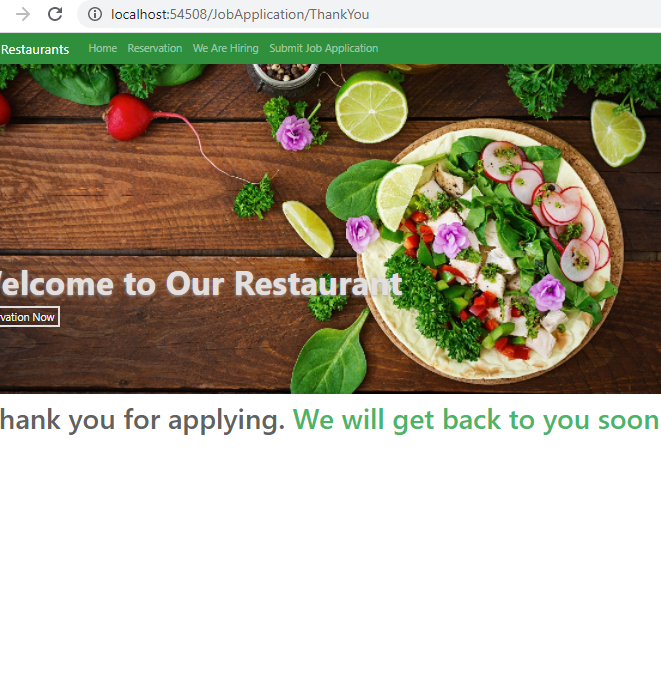


