Module 14: Hosting and Deployment

Lección 2: Implementación en Microsoft Azure

Demostración: Cómo implementar una aplicación web en Microsoft Azure

Vamos a subir una aplicación a Azure

Lo primero de todo ver si la aplicacion funciona en local

Abrimos 02_AzureStorageDemo_begin, ejecuamos el npm install y ejecutamos 

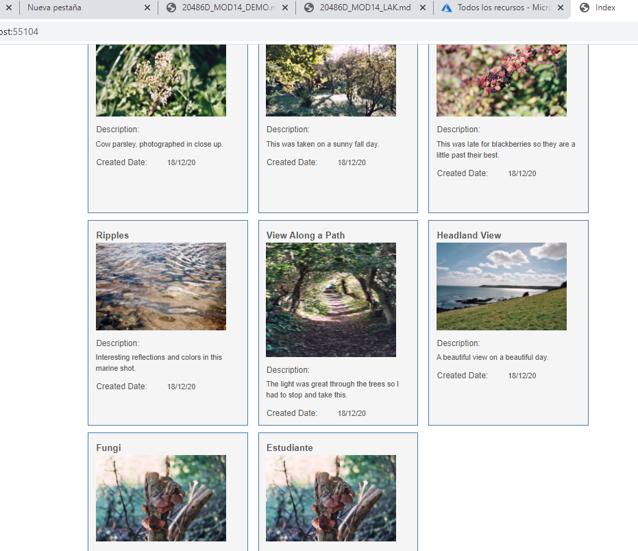


Por otro lado nos creamos el Storage Account  

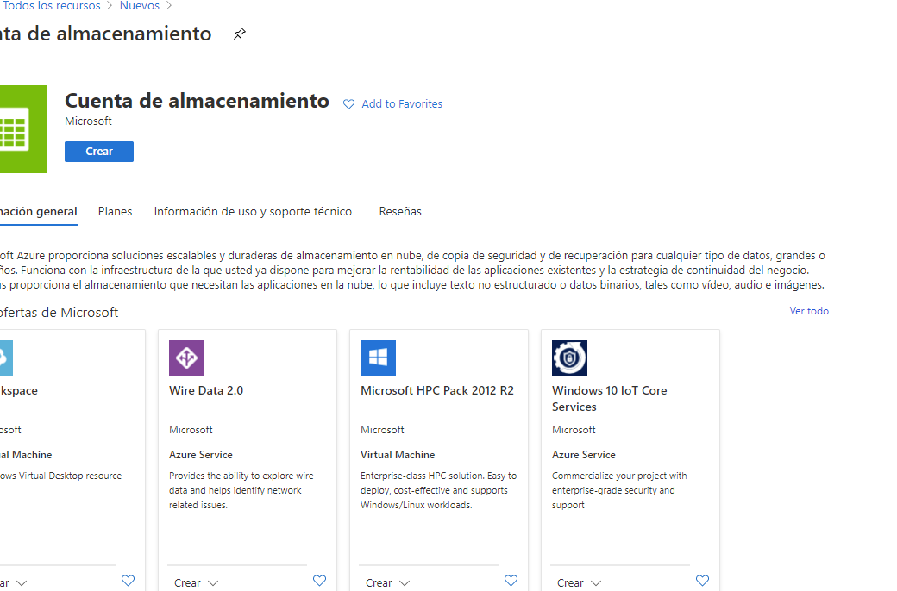

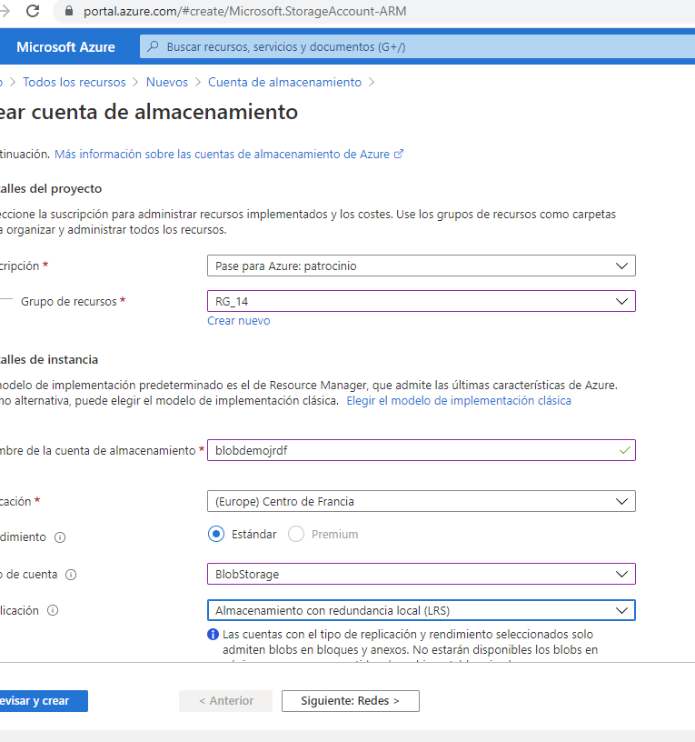

y un contenedor myfirstcontainer


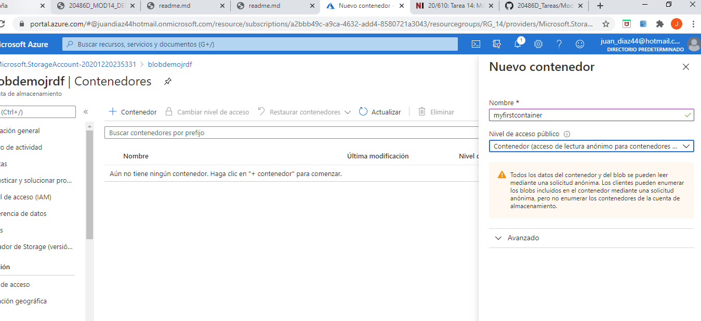


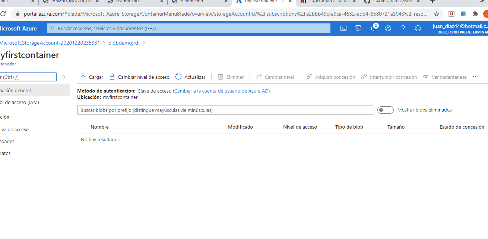


y como lo vamos a necesitar nos copiamos la cadena de conexión 

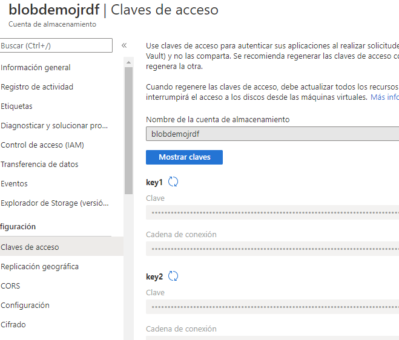

Esta cadena de conexxión la añadimos al appsettings.json con la clave 


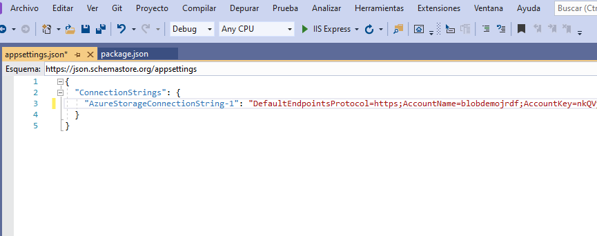


Modifcamos el BlobController añadiendole  la cadena de conexxion 

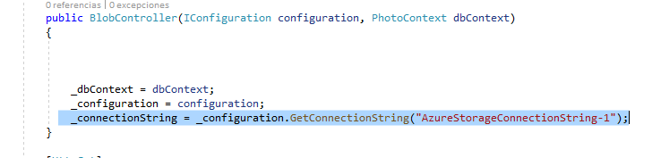

Instalamos con Nuget WindowsAzure.Storage 9.3.3.

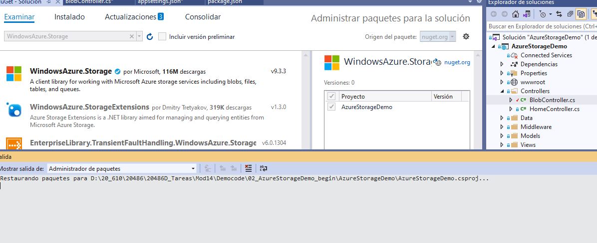


en el BlobController añadimos 

```c#
.......................
  using Microsoft.WindowsAzure.Storage;
   using Microsoft.WindowsAzure.Storage.Blob;
   
   ..............................
    public async Task UploadAsync(IFormFile photo)
   {
       CloudStorageAccount storageAccount = CloudStorageAccount.Parse(_connectionString);
       CloudBlobClient blobClient = storageAccount.CreateCloudBlobClient();
       CloudBlobContainer container = blobClient.GetContainerReference("myimagecontainer");

       if (await container.CreateIfNotExistsAsync())
       {
           await container.SetPermissionsAsync(
           new BlobContainerPermissions
          {
              PublicAccess = BlobContainerPublicAccessType.Blob
          });
       }
       CloudBlockBlob blob = container.GetBlockBlobReference(Path.GetFileName(photo.FileName));
       await blob.UploadFromStreamAsync(photo.OpenReadStream());
   }
  ```  
   
  .................
  ```c#
  y modificamos
  
          [HttpPost, ActionName("CreateImage")]
        public async Task<IActionResult> CreateImageAsync(Photo photo)
        {
            if (ModelState.IsValid)
            {
                photo.CreatedDate = DateTime.Today;
                if (photo.PhotoAvatar != null && photo.PhotoAvatar.Length > 0)
                {
                    photo.ImageMimeType = photo.PhotoAvatar.ContentType;
                    photo.ImageName = Path.GetFileName(photo.PhotoAvatar.FileName);
                    /* using (var memoryStream = new MemoryStream())
                     {
                         photo.PhotoAvatar.CopyTo(memoryStream);
                         photo.PhotoFile = memoryStream.ToArray();
                     }
                    */
                    await UploadAsync(photo.PhotoAvatar);

                    _dbContext.Add(photo);
                    _dbContext.SaveChanges();
                    return RedirectToAction("Index", "Home");
                }
                return View(photo);
            }
            return View(photo);
        }
  
```  
  
  
  Salavamos y ejecutamos
  
  
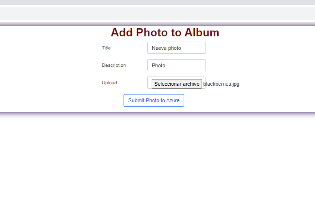


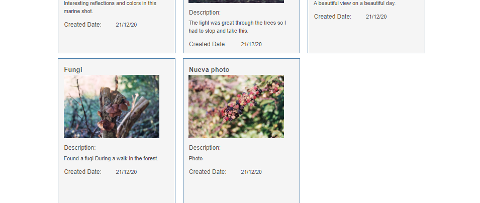


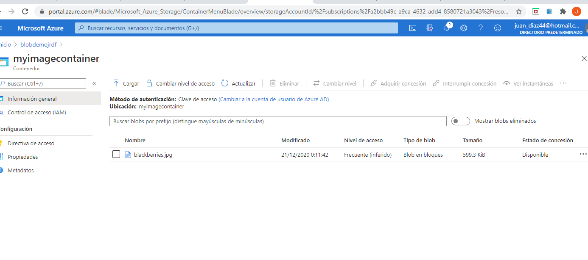
  