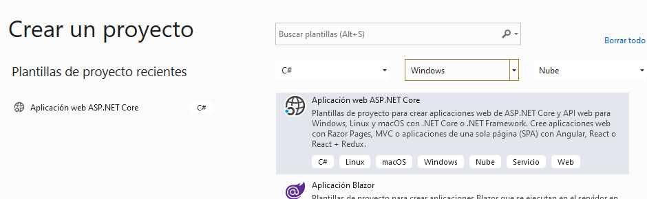
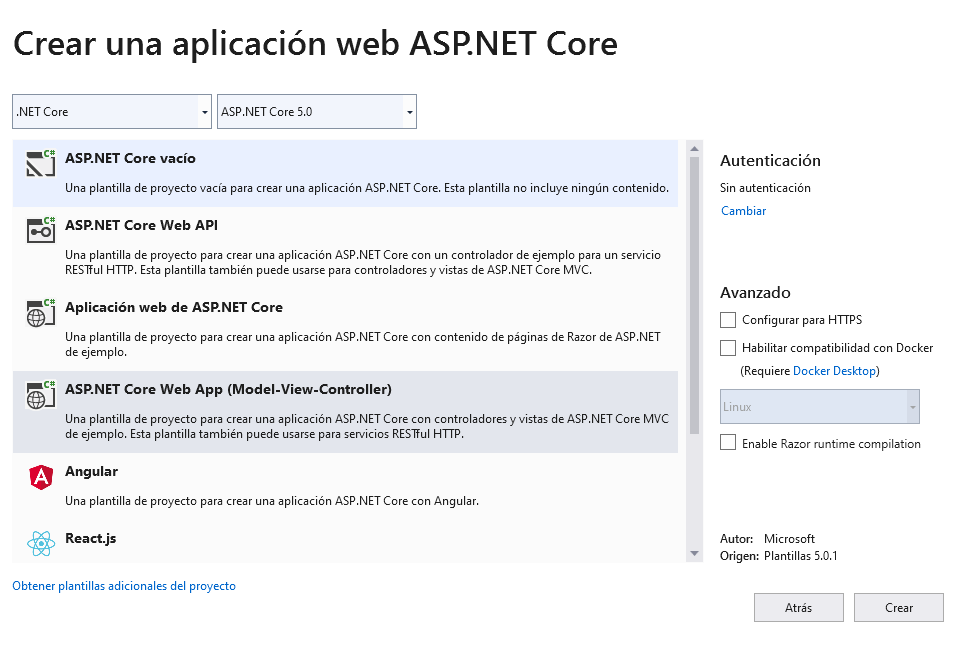
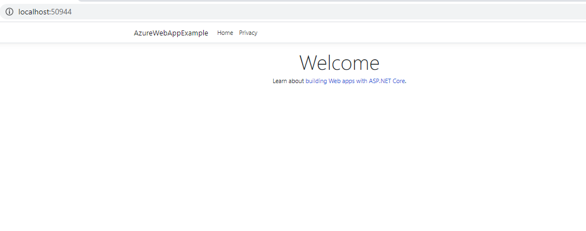
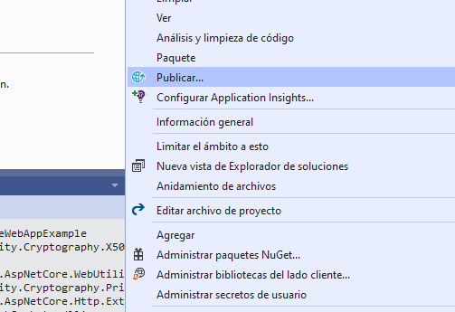
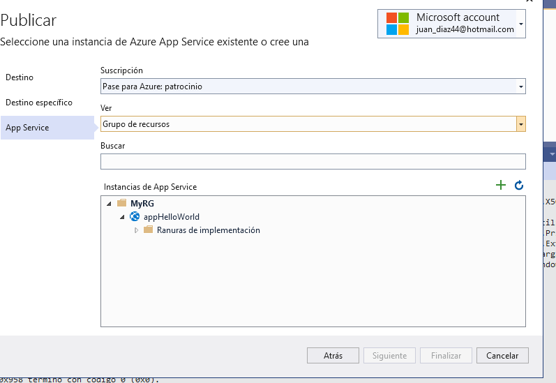
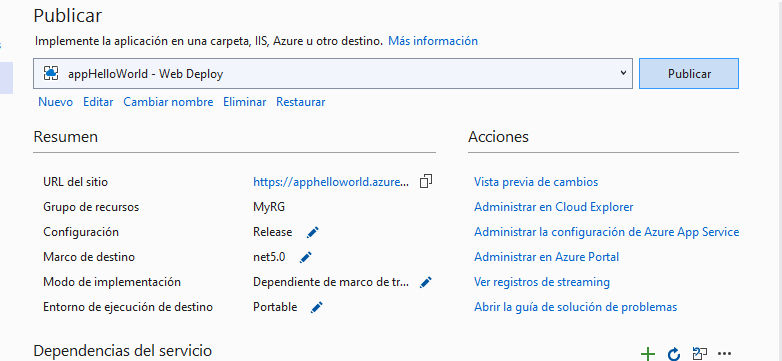
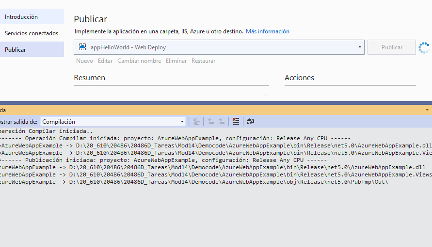
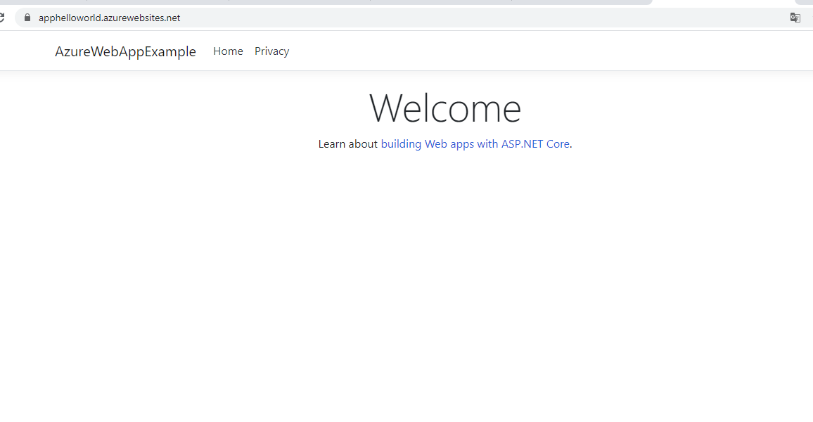

## Módulo 14: Alojamiento e implementación

### Lección 2: Implementación en Microsoft Azure

#### Demostración: Cómo implementar una aplicación web en Microsoft Azure

Seleccionamos plantilla Nube

Creamos un Aspnet core MVC

Probamos que funciona en local

Publicar..

En mi caso ya tengo un appServicie Paln creado de tipo F1

Una vez selccionado todo pulsamos a publicar

Esperamos....

y voala

